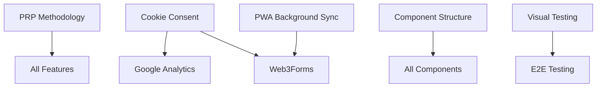

# Sprint 3 - Complete Specification

Generated: $(date)
Version: Sprint 3 Planning

---

## Table of Contents

1. [Original Constitution Analysis](#original-constitution-analysis)
2. [Sprint 3 Overview](#sprint-3-overview)
3. [PRP-Detailed Features](#prp-detailed-features)
4. [Additional Sprint 3 Features](#additional-sprint-3-features)
5. [Implementation Dependencies](#implementation-dependencies)
6. [Success Metrics](#success-metrics)

---

## 1. Original Constitution Analysis

### SpecKit Processing Output

Generated from: /workspace/constitution.md

## Overview

This specification outlines the implementation plan for Sprint-3-Planning.

## Input Document

# CRUDkit - Universal PWA Meta-Template Constitution v0.3.0

**Repository**: https://github.com/TortoiseWolfe/CRUDkit  
**Description**: Evolutionary meta-template with 32 themes, PWA, comprehensive testing, and AI-optimized patterns

## REFERENCE TEMPLATES

Learn from these implementations, improve upon them:

- **Punk_Stack**: Working app with 12 themes, modern stack (primary reference)
- **001_template**: PRP (Product Requirements Prompt) methodology, email providers, form patterns
- **000_Template**: Testing configs, validation loops, AI documentation
- **Punk_Stack_archived**: Advanced tooling, OKLCH scripts, monorepo patterns

## 1. FOUNDATION (Prerequisites)

- Docker-first infrastructure (see Punk_Stack docker-compose.yml) **[✅ COMPLETE]**
- Spec-kit compatible structure **[⚠️ Partial]**
- Git-based version control **[✅ COMPLETE]**
- Node.js 20+ and pnpm 10+ **[✅ COMPLETE]**

## 2. CORE PRINCIPLES

### Infrastructure

- **Docker**: All environments with health checks **[✅ Docker, ⚠️ basic health checks]**
- **PWA**: Offline-first, service workers, background sync **[✅ SW/manifest, ❌ background sync]**
- **Accessibility**: WCAG AA, colorblind support, keyboard nav **[⚠️ Basic controls, ❌ WCAG/colorblind]**

### Development Philosophy

- **PRP→Spec→Implementation**: Product Requirements Prompt first (Cole Medlin's context engineering) **[❌ NOT IMPLEMENTED - Sprint 3 Priority]**
- **Test-First Development**: TDD strongly encouraged **[✅ Vitest installed, 16% coverage]**
- **Performance Gates**: <100ms interactions, >90 Lighthouse **[✅ 92+ scores, ⚠️ manual only]**

## 3. DEVELOPMENT PIPELINE

1. **PRP Creation** - Generate Product Requirements Prompts **[❌ Sprint 3 Priority]**
2. **Spec Generation** - Design the solution **[⚠️ Partial - has spec.md]**
3. **Test Writing** - Validation first **[✅ Vitest + 111 tests]**
4. **Implementation** - Code second **[✅ Working]**
5. **Validation** - Quality checks **[✅ Husky hooks]**
6. **Documentation** - AI context, component docs **[✅ Storybook, ADRs]**

## 4. TECHNICAL STANDARDS

### Architecture

- **Atomic Design**: atoms → molecules → organisms → templates **[✅ Implemented]**
- **TypeScript-strict**: No any types, strict mode **[✅ Configured]**
- **Theme System**: Multiple themes, instant switching **[✅ 32 themes!]**
- **Component Structure**: 4 files per component **[⚠️ 2-3 files - Sprint 3 fix]**

### Quality Gates

- **Pre-commit**: Lint + Type check + Format **[✅ COMPLETE with Husky]**
- **Pre-push**: Unit tests pass **[✅ COMPLETE]**
- **PR Checks**: Full test suite + Build **[✅ GitHub Actions CI/CD]**
- **Main Branch**: Deploy **[✅ GitHub Pages]**

### Testing Strategy (Progressive Targets)

- **Initial Goal**: 25% coverage on critical paths **[⚠️ 16% actual]**
- **Next Goal**: 40% coverage **[❌ Sprint 3 target]**
- **Long-term Goal**: 60% coverage **[❌ Future]**
- **Accessibility**: Pa11y CI **[✅ Installed, ❌ not enforced]**
- **Visual**: Chromatic/Percy **[❌ Sprint 3 Priority]**

### Security Framework

- **Input Validation**: Zod schemas, sanitization **[✅ Zod implemented]**
- **CSP Headers**: Strict policies **[✅ Configured in next.config]**
- **Privacy-First**: GDPR compliant, minimal tracking **[❌ Sprint 3 Priority]**
- **Scanning Schedule**: Dependabot configured **[✅ COMPLETE]**

## 5. SPRINT 2 ACHIEVEMENTS (COMPLETE)

### ✅ What We Successfully Delivered (65/65 tasks - 100%)

#### Testing Foundation

- Vitest + React Testing Library (111 tests passing)
- Coverage reporting (16% actual, 15% threshold)
- Husky pre-commit/pre-push hooks
- GitHub Actions CI/CD pipeline

#### Developer Experience

- Prettier code formatting
- ESLint with Next.js rules
- Dependabot for dependency updates
- Error boundaries and handling
- Docker HMR fixes

#### Features

- Dice components (Dice, DraggableDice, DiceTray)
- Captain Ship & Crew game with NPC support
- Form validation with Zod schemas
- Comprehensive Storybook stories

#### Quality & Monitoring

- Pa11y accessibility testing installed
- Web Vitals performance monitoring
- ADRs (Architecture Decision Records)
- SECURITY.md documentation
- .env.example template

## 6. SPRINT 3: COMPLETE THE VISION (8 Weeks)

### Phase 1: Missing Core Features (Weeks 1-2)

Critical constitutional requirements never implemented:

- [ ] **PRP Methodology**: Implement Product Requirements Prompt workflow (Cole Medlin's context engineering)
- [ ] **PWA Background Sync**: Add offline form submission capability
- [ ] **WCAG AA Compliance**: Automate accessibility testing in CI
- [ ] **Colorblind Mode**: Add to accessibility controls

### Phase 2: Forms & Integrations (Weeks 3-4)

- [ ] **Web3Forms Integration**: Primary email provider
- [ ] **EmailJS Integration**: Backup email provider
- [ ] **Calendar Integration**: Calendly or Cal.com
- [ ] **Contact Form**: With validation and providers

### Phase 3: Privacy & Testing (Weeks 5-6)

- [ ] **Cookie Consent**: GDPR compliant modal
- [ ] **Privacy Controls**: Data export, deletion
- [ ] **Visual Regression**: Chromatic or Percy
- [ ] **E2E Testing**: Playwright framework
- [ ] **Test Coverage**: Increase to 40%

### Phase 4: Enhanced Features (Weeks 7-8)

Building on constitution Section 11 features:

- [ ] **Google Analytics**: With consent management
- [ ] **Font Switcher**: Mirror ThemeSwitcher pattern
- [ ] **Geolocation Map**: With permission handling
- [ ] **Component Structure**: Standardize 4-file pattern

## 7. IMPLEMENTATION STATUS

### 📊 Current Compliance Scores (Post-Sprint 2)

1. **FOUNDATION**: 85% ✅ (missing full spec-kit)
2. **CORE PRINCIPLES**: 50% ⚠️ (testing added, Product Requirements Prompts missing)
3. **DEVELOPMENT PIPELINE**: 65% ✅ (testing/validation working)
4. **TECHNICAL STANDARDS**: 70% ✅ (hooks working, coverage low)
5. **DEPLOYMENT**: 85% ✅ (GitHub Pages + Storybook live)

### Overall Progress: ~70% Complete

**Sprint 1**: Built foundation (40% of requirements)
**Sprint 2**: Added testing & quality (30% more)
**Sprint 3**: Will complete core features (remaining 30%)

## 8. DEPLOYMENT & MONITORING

### GitHub Pages ✅

- **Dual deployment**: App + Storybook working
- **Static optimization**: Next.js output export configured
- **Base path handling**: Subdirectory support active

### Monitoring ✅

- **Web Vitals**: Real-time tracking implemented
- **Lighthouse**: Manual testing via status page
- **Health Checks**: Basic Docker health monitoring
- **Deployment History**: Auto-generated tracking

## 9. COMPLETED INTEGRATIONS

### Core Features ✅

- **Storybook**: Component development and documentation
- **PWA**: Service worker, manifest, offline support (partial)
- **Testing**: Vitest, React Testing Library, Pa11y
- **Validation**: Zod schemas for forms

### Developer Tools ✅

- **GitHub Actions**: Full CI/CD pipeline
- **Husky**: Git hooks for quality
- **Prettier**: Code formatting
- **Dependabot**: Automated updates

## 10. GOVERNANCE

### Evolution Principles

- Learn from references, don't just copy
- Each generation should improve upon the last
- Document what was improved and why
- Track metrics to prove improvements

### Review Cycles

- Sprint retrospectives with documentation
- Update constitution after each sprint
- Capture learnings in ADRs
- Version control all changes

### Success Metrics

- Setup time: <30 minutes from clone to running ✅
- Performance: >90 Lighthouse scores ✅ (92 actual)
- Test coverage: Progressive targets (16% → 40% → 60%)
- Developer satisfaction: Measure and improve

## 11. PACKAGE MANAGEMENT STANDARD

### Official Package Manager: pnpm ✅

- **Why pnpm**: Faster installs, disk-efficient, strict dependencies
- **Corepack**: Automatically manages pnpm version in Docker
- **Lock file**: Only `pnpm-lock.yaml` (no package-lock.json)
- **Store**: Shared package store reduces duplication

---

**Version**: 0.3.0  
**Updated**: 2025-09-13  
**Foundation Status**: ~70% compliant with original constitution
**Philosophy**: Complete the constitutional vision

**What's New in v0.3.0**:

- Updated all status markers to reflect Sprint 2 completion
- Marked Sprint 2 achievements (65/65 tasks - 100%)
- Identified critical gaps for Sprint 3 (Product Requirements Prompts, PWA sync, forms, privacy)
- Reorganized Sprint 3 to prioritize overlooked constitutional requirements
- Updated compliance scores (70% overall vs 40% at Sprint 1 end)
- Added specific implementation targets for missing features
- Clarified what's complete vs what remains

**Sprint 3 Focus**: Complete the 30% of constitutional requirements that were never implemented, particularly:

- Product Requirements Prompt methodology (Cole Medlin's context engineering)
- Forms integration
- Privacy/GDPR features
- Visual regression testing
- E2E testing framework
- Remaining PWA features
- Accessibility compliance

## Generated Specification

Based on the input document, the following specification has been generated:

### Goals

- Implement features defined in the constitution
- Address technical requirements
- Follow established patterns

### Deliverables

- Implementation code
- Tests
- Documentation

### Timeline

- Sprint duration: 2 weeks
- Daily progress tracking
- Sprint review and retrospective

---

## 2. Sprint 3 Overview

Based on constitution analysis and SpecKit processing, Sprint 3 focuses on completing core features that were designed but never implemented:

### Phase 1: Missing Core Features (Weeks 1-2)

- PRP Methodology Implementation
- PWA Background Sync
- WCAG AA Compliance
- Colorblind Mode

### Phase 2: Forms & Integrations (Weeks 3-4)

- Web3Forms Integration
- EmailJS Integration
- Calendar Integration
- Contact Form

### Phase 3: Privacy & Testing (Weeks 5-6)

- Cookie Consent/GDPR
- Privacy Controls
- Visual Regression Testing
- E2E Testing Framework

### Phase 4: Enhanced Features (Weeks 7-8)

- Google Analytics
- Font Switcher
- Geolocation Map
- Component Structure (4-file pattern)

---

## 3. PRP-Detailed Features

The following features have comprehensive Product Requirements Prompts:

### 3.1 Calendar Integration

## 1. Product Requirements

### What We're Building

A calendar scheduling integration that embeds Calendly or Cal.com into the application, allowing users to book appointments directly. The implementation will support both providers with a clean abstraction layer and responsive embed design.

### Why We're Building It

- Constitutional requirement (Section 6, Phase 2: Calendar Integration)
- Essential for service-based businesses
- Reduces back-and-forth scheduling emails
- Professional appointment booking experience
- Both providers offer generous free tiers

### Success Criteria

- [ ] Calendar embed renders responsively
- [ ] Both Calendly and Cal.com supported
- [ ] Custom styling matches app theme
- [ ] Event types configurable
- [ ] UTM tracking for analytics
- [ ] Fallback for unsupported browsers
- [ ] GDPR compliant (consent required)
- [ ] Accessibility standards met
- [ ] Works across all 32 themes

### Out of Scope

- Custom calendar backend
- Direct calendar API integration
- Multi-calendar sync
- Payment processing (use provider's features)
- Custom availability rules

---

## 3. Technical Specifications

### Calendar Configuration

```typescript
// src/config/calendar.config.ts
export interface CalendarConfig {
  provider: 'calendly' | 'calcom';
  url: string;
  eventTypes?: string[];
  utm?: {
    source?: string;
    medium?: string;
    campaign?: string;
  };
  styles?: {
    height?: string;
    minHeight?: string;
    backgroundColor?: string;
  };
}

export const calendarConfig: CalendarConfig = {
  provider:
    (process.env.NEXT_PUBLIC_CALENDAR_PROVIDER as 'calendly' | 'calcom') ||
    'calendly',
  url: process.env.NEXT_PUBLIC_CALENDAR_URL || '',
  utm: {
    source: 'scripthammer',
    medium: 'embed',
    campaign: 'website',
  },
  styles: {
    height: '700px',
    minHeight: '500px',
  },
};
```

### Calendly Provider

```typescript
// src/components/calendar/providers/CalendlyProvider.tsx
import { InlineWidget, PopupWidget, useCalendlyEventListener } from 'react-calendly';
import { useEffect } from 'react';
import { useAnalytics } from '@/hooks/useAnalytics';

interface CalendlyProviderProps {
  url: string;
  mode: 'inline' | 'popup';
  utm?: Record<string, string>;
  styles?: Record<string, string>;
  prefill?: {
    name?: string;
    email?: string;
    customAnswers?: Record<string, string>;
  };
}

export function CalendlyProvider({
  url,
  mode = 'inline',
  utm,
  styles,
  prefill
}: CalendlyProviderProps) {
  const analytics = useAnalytics();

  // Track calendar events
  useCalendlyEventListener({
    onProfilePageViewed: () => analytics.track('calendar_viewed', 'Calendar', 'Calendly'),
    onDateAndTimeSelected: () => analytics.track('calendar_time_selected', 'Calendar', 'Calendly'),
    onEventScheduled: (e) => {
      analytics.track('calendar_scheduled', 'Calendar', 'Calendly', e.data.payload.invitee.name);
    }
  });

  // Apply theme-aware styles
  const theme = document.documentElement.getAttribute('data-theme');
  const isDark = ['dark', 'dracula', 'night', 'coffee', 'dim', 'sunset'].includes(theme || '');

  const pageSettings = {
    backgroundColor: isDark ? '1a1a1a' : 'ffffff',
    hideEventTypeDetails: false,
    hideLandingPageDetails: false,
    primaryColor: '00a2ff',
    textColor: isDark ? 'ffffff' : '000000'
  };

  if (mode === 'popup') {
    return (
      <PopupWidget
        url={url}
        utm={utm}
        prefill={prefill}
        pageSettings={pageSettings}
        text="Schedule a Meeting"
        className="btn btn-primary"
      />
    );
  }

  return (
    <InlineWidget
      url={url}
      utm={utm}
      prefill={prefill}
      pageSettings={pageSettings}
      styles={{
        height: styles?.height || '700px',
        minHeight: styles?.minHeight || '500px',
        ...styles
      }}
    />
  );
}
```

### Cal.com Provider

```typescript
// src/components/calendar/providers/CalComProvider.tsx
import Cal, { getCalApi } from '@calcom/embed-react';
import { useEffect } from 'react';
import { useAnalytics } from '@/hooks/useAnalytics';

interface CalComProviderProps {
  calLink: string;
  mode: 'inline' | 'popup';
  config?: {
    name?: string;
    email?: string;
    notes?: string;
    guests?: string[];
    theme?: 'light' | 'dark' | 'auto';
  };
  styles?: Record<string, string>;
}

export function CalComProvider({
  calLink,
  mode = 'inline',
  config,
  styles
}: CalComProviderProps) {
  const analytics = useAnalytics();

  useEffect(() => {
    (async function () {
      const cal = await getCalApi();

      // Listen for Cal.com events
      cal('on', {
        action: 'bookingSuccessful',
        callback: (e) => {
          analytics.track('calendar_scheduled', 'Calendar', 'Cal.com', e.detail.name);
        }
      });

      cal('on', {
        action: 'linkReady',
        callback: () => {
          analytics.track('calendar_viewed', 'Calendar', 'Cal.com');
        }
      });
    })();
  }, []);

  // Auto-detect theme
  const theme = document.documentElement.getAttribute('data-theme');
  const isDark = ['dark', 'dracula', 'night', 'coffee', 'dim', 'sunset'].includes(theme || '');

  if (mode === 'popup') {
    return (
      <button
        className="btn btn-primary"
        data-cal-link={calLink}
        data-cal-config={JSON.stringify({
          ...config,
          theme: isDark ? 'dark' : 'light'
        })}
      >
        Schedule a Meeting
      </button>
    );
  }

  return (
    <Cal
      calLink={calLink}
      style={{
        width: '100%',
        height: styles?.height || '700px',
        minHeight: styles?.minHeight || '500px',
        overflow: 'hidden',
        ...styles
      }}
      config={{
        ...config,
        theme: isDark ? 'dark' : 'light',
        branding: {
          brandColor: '#00a2ff'
        }
      }}
    />
  );
}
```

### Main Calendar Component

```typescript
// src/components/calendar/CalendarEmbed/CalendarEmbed.tsx
'use client';

import { useConsent } from '@/contexts/ConsentContext';
import { CalendlyProvider } from '../providers/CalendlyProvider';
import { CalComProvider } from '../providers/CalComProvider';
import { calendarConfig } from '@/config/calendar.config';
import CalendarConsent from '../CalendarConsent';

interface CalendarEmbedProps {
  mode?: 'inline' | 'popup';
  url?: string;
  provider?: 'calendly' | 'calcom';
  prefill?: {
    name?: string;
    email?: string;
  };
  className?: string;
}

export default function CalendarEmbed({
  mode = 'inline',
  url = calendarConfig.url,
  provider = calendarConfig.provider,
  prefill,
  className
}: CalendarEmbedProps) {
  const { consent } = useConsent();

  // Require functional consent for calendar embedding
  if (!consent.functional) {
    return (
      <CalendarConsent
        provider={provider}
        onAccept={() => {
          // Update consent will trigger re-render
        }}
      />
    );
  }

  if (!url) {
    return (
      <div className="alert alert-warning">
        <span>Calendar URL not configured. Please add NEXT_PUBLIC_CALENDAR_URL to environment.</span>
      </div>
    );
  }

  const containerClasses = `
    ${mode === 'inline' ? 'w-full rounded-lg overflow-hidden shadow-xl' : ''}
    ${className || ''}
  `;

  return (
    <div className={containerClasses}>
      {provider === 'calendly' ? (
        <CalendlyProvider
          url={url}
          mode={mode}
          utm={calendarConfig.utm}
          styles={calendarConfig.styles}
          prefill={prefill}
        />
      ) : (
        <CalComProvider
          calLink={url}
          mode={mode}
          config={prefill}
          styles={calendarConfig.styles}
        />
      )}
    </div>
  );
}
```

### Consent Component

```typescript
// src/components/calendar/CalendarConsent.tsx
interface CalendarConsentProps {
  provider: string;
  onAccept: () => void;
}

export default function CalendarConsent({ provider, onAccept }: CalendarConsentProps) {
  const { updateConsent } = useConsent();

  const handleAccept = () => {
    updateConsent('functional', true);
    onAccept();
  };

  return (
    <div className="card bg-base-200">
      <div className="card-body">
        <h3 className="card-title">Calendar Consent Required</h3>
        <p>
          To display the {provider} calendar, we need your consent to load third-party content.
          This will enable scheduling functionality.
        </p>
        <div className="card-actions justify-end">
          <button className="btn btn-primary" onClick={handleAccept}>
            Accept and Show Calendar
          </button>
        </div>
      </div>
    </div>
  );
}
```

### Schedule Page

```typescript
// app/schedule/page.tsx
import dynamic from 'next/dynamic';

const CalendarEmbed = dynamic(
  () => import('@/components/calendar/CalendarEmbed'),
  {
    ssr: false,
    loading: () => (
      <div className="flex items-center justify-center h-96">
        <span className="loading loading-spinner loading-lg"></span>
      </div>
    )
  }
);

export default function SchedulePage() {
  return (
    <div className="container mx-auto px-4 py-8">
      <div className="max-w-4xl mx-auto">
        <h1 className="text-4xl font-bold mb-6">Schedule a Meeting</h1>

        <div className="prose mb-8">
          <p>
            Book a time that works for you. We'll send a calendar invitation
            with all the details.
          </p>
        </div>

        <CalendarEmbed mode="inline" />

        <div className="mt-8 text-center text-sm opacity-60">
          <p>Powered by {process.env.NEXT_PUBLIC_CALENDAR_PROVIDER === 'calcom' ? 'Cal.com' : 'Calendly'}</p>
        </div>
      </div>
    </div>
  );
}
```

---

📄 [Full PRP Document](prp/inbox/calendar-integration-prp.md)

---

### 3.2 Colorblind Mode

## 1. Product Requirements

### What We're Building

A comprehensive colorblind mode system that provides filters and adjustments for all major types of color vision deficiencies. This will integrate with the existing accessibility controls and work across all 32 themes, ensuring the application is usable for the 8% of men and 0.5% of women with color vision deficiencies.

### Why We're Building It

- Constitutional requirement (Section 2: Accessibility - colorblind support)
- Currently marked as "❌ colorblind" not implemented
- Affects ~300 million people worldwide
- Essential for inclusive design
- Complements WCAG AA compliance

### Success Criteria

- [ ] Support for all major colorblind types
- [ ] CSS filters for real-time conversion
- [ ] Pattern overlays for critical UI elements
- [ ] Works with all 32 themes
- [ ] Persistent user preference
- [ ] Performance impact < 10ms
- [ ] Accessible toggle in UI
- [ ] Simulation mode for testing

### Out of Scope

- Hardware-level color correction
- Custom filter creation by users
- Real-time image recoloring
- Video content filtering
- External content adaptation

---

## 3. Technical Specifications

### Colorblind Types & Filters

```typescript
// src/utils/colorblind.ts
export enum ColorblindType {
  NONE = 'none',
  PROTANOPIA = 'protanopia', // Red-blind (1% of males)
  PROTANOMALY = 'protanomaly', // Red-weak (1% of males)
  DEUTERANOPIA = 'deuteranopia', // Green-blind (1% of males)
  DEUTERANOMALY = 'deuteranomaly', // Green-weak (5% of males)
  TRITANOPIA = 'tritanopia', // Blue-blind (0.001%)
  TRITANOMALY = 'tritanomaly', // Blue-weak (0.01%)
  ACHROMATOPSIA = 'achromatopsia', // Complete colorblind (0.003%)
  ACHROMATOMALY = 'achromatomaly', // Partial colorblind
}

export const colorblindFilters: Record<ColorblindType, string> = {
  [ColorblindType.NONE]: 'none',
  [ColorblindType.PROTANOPIA]: 'url(#protanopia)',
  [ColorblindType.PROTANOMALY]: 'url(#protanomaly)',
  [ColorblindType.DEUTERANOPIA]: 'url(#deuteranopia)',
  [ColorblindType.DEUTERANOMALY]: 'url(#deuteranomaly)',
  [ColorblindType.TRITANOPIA]: 'url(#tritanopia)',
  [ColorblindType.TRITANOMALY]: 'url(#tritanomaly)',
  [ColorblindType.ACHROMATOPSIA]: 'url(#achromatopsia)',
  [ColorblindType.ACHROMATOMALY]: 'url(#achromatomaly)',
};
```

### SVG Filter Definitions

```tsx
// src/components/accessibility/ColorblindFilters.tsx
export default function ColorblindFilters() {
  return (
    <svg className="hidden">
      <defs>
        {/* Protanopia (Red-Blind) */}
        <filter id="protanopia">
          <feColorMatrix
            type="matrix"
            values="0.567, 0.433, 0,     0, 0
                    0.558, 0.442, 0,     0, 0
                    0,     0.242, 0.758, 0, 0
                    0,     0,     0,     1, 0"
          />
        </filter>

        {/* Deuteranopia (Green-Blind) */}
        <filter id="deuteranopia">
          <feColorMatrix
            type="matrix"
            values="0.625, 0.375, 0,   0, 0
                    0.7,   0.3,   0,   0, 0
                    0,     0.3,   0.7, 0, 0
                    0,     0,     0,   1, 0"
          />
        </filter>

        {/* Tritanopia (Blue-Blind) */}
        <filter id="tritanopia">
          <feColorMatrix
            type="matrix"
            values="0.95, 0.05,  0,     0, 0
                    0,    0.433, 0.567, 0, 0
                    0,    0.475, 0.525, 0, 0
                    0,    0,     0,     1, 0"
          />
        </filter>

        {/* Achromatopsia (Complete Color Blindness) */}
        <filter id="achromatopsia">
          <feColorMatrix
            type="matrix"
            values="0.299, 0.587, 0.114, 0, 0
                    0.299, 0.587, 0.114, 0, 0
                    0.299, 0.587, 0.114, 0, 0
                    0,     0,     0,     1, 0"
          />
        </filter>

        {/* Additional filters for other types... */}
      </defs>
    </svg>
  );
}
```

### Colorblind Mode Hook

```typescript
// src/hooks/useColorblindMode.ts
import { useState, useEffect } from 'react';
import { ColorblindType, colorblindFilters } from '@/utils/colorblind';

const STORAGE_KEY = 'colorblind-mode';

export function useColorblindMode() {
  const [mode, setMode] = useState<ColorblindType>(ColorblindType.NONE);
  const [patternsEnabled, setPatternsEnabled] = useState(false);

  useEffect(() => {
    // Load saved preference
    const saved = localStorage.getItem(STORAGE_KEY);
    if (saved) {
      const { mode, patterns } = JSON.parse(saved);
      setMode(mode);
      setPatternsEnabled(patterns);
      applyColorblindMode(mode, patterns);
    }
  }, []);

  const applyColorblindMode = (type: ColorblindType, patterns: boolean) => {
    const root = document.documentElement;

    // Apply SVG filter
    root.style.setProperty('--colorblind-filter', colorblindFilters[type]);

    // Apply to body
    document.body.style.filter = `var(--colorblind-filter)`;

    // Enable patterns for better distinction
    if (patterns) {
      root.classList.add('colorblind-patterns');
    } else {
      root.classList.remove('colorblind-patterns');
    }

    // Save preference
    localStorage.setItem(
      STORAGE_KEY,
      JSON.stringify({
        mode: type,
        patterns,
      })
    );
  };

  const setColorblindMode = (type: ColorblindType) => {
    setMode(type);
    applyColorblindMode(type, patternsEnabled);
  };

  const togglePatterns = () => {
    const newPatternsState = !patternsEnabled;
    setPatternsEnabled(newPatternsState);
    applyColorblindMode(mode, newPatternsState);
  };

  return {
    mode,
    setColorblindMode,
    patternsEnabled,
    togglePatterns,
  };
}
```

### Colorblind Toggle Component

```typescript
// src/components/accessibility/ColorblindToggle/ColorblindToggle.tsx
'use client';

import { useColorblindMode } from '@/hooks/useColorblindMode';
import { ColorblindType } from '@/utils/colorblind';
import { Eye, EyeOff } from 'lucide-react';

export default function ColorblindToggle() {
  const { mode, setColorblindMode, patternsEnabled, togglePatterns } = useColorblindMode();

  const colorblindOptions = [
    { value: ColorblindType.NONE, label: 'Normal Vision' },
    { value: ColorblindType.PROTANOPIA, label: 'Protanopia (Red-Blind)' },
    { value: ColorblindType.DEUTERANOPIA, label: 'Deuteranopia (Green-Blind)' },
    { value: ColorblindType.TRITANOPIA, label: 'Tritanopia (Blue-Blind)' },
    { value: ColorblindType.ACHROMATOPSIA, label: 'Achromatopsia (No Color)' },
  ];

  return (
    <div className="dropdown dropdown-end">
      <label tabIndex={0} className="btn btn-ghost gap-2">
        {mode === ColorblindType.NONE ? <Eye /> : <EyeOff />}
        <span className="hidden sm:inline">Color Vision</span>
      </label>

      <div tabIndex={0} className="dropdown-content card card-compact w-80 p-4 shadow bg-base-100">
        <div className="card-body">
          <h3 className="font-bold text-lg">Color Vision Settings</h3>

          <div className="form-control">
            <label className="label">
              <span className="label-text">Color Vision Type</span>
            </label>
            <select
              className="select select-bordered w-full"
              value={mode}
              onChange={(e) => setColorblindMode(e.target.value as ColorblindType)}
            >
              {colorblindOptions.map(option => (
                <option key={option.value} value={option.value}>
                  {option.label}
                </option>
              ))}
            </select>
          </div>

          {mode !== ColorblindType.NONE && (
            <div className="form-control mt-4">
              <label className="label cursor-pointer">
                <span className="label-text">Enable Patterns</span>
                <input
                  type="checkbox"
                  className="toggle toggle-primary"
                  checked={patternsEnabled}
                  onChange={togglePatterns}
                />
              </label>
              <span className="label-text-alt">
                Adds patterns to help distinguish colors
              </span>
            </div>
          )}

          <div className="alert alert-info mt-4">
            <svg xmlns="http://www.w3.org/2000/svg" fill="none" viewBox="0 0 24 24" className="stroke-current shrink-0 w-6 h-6">
              <path strokeLinecap="round" strokeLinejoin="round" strokeWidth="2" d="M13 16h-1v-4h-1m1-4h.01M21 12a9 9 0 11-18 0 9 9 0 0118 0z"></path>
            </svg>
            <span className="text-sm">
              {mode === ColorblindType.NONE
                ? 'Select a color vision type to apply filters'
                : `Simulating ${colorblindOptions.find(o => o.value === mode)?.label}`}
            </span>
          </div>
        </div>
      </div>
    </div>
  );
}
```

### Pattern Overlays CSS

```css
/* src/styles/colorblind-patterns.css */
.colorblind-patterns {
  /* Success/Error Distinction */
  .alert-success::before {
    content: '✓';
    position: absolute;
    left: 1rem;
    font-size: 1.5rem;
    opacity: 0.3;
  }

  .alert-error::before {
    content: '✗';
    position: absolute;
    left: 1rem;
    font-size: 1.5rem;
    opacity: 0.3;
  }

  /* Button States */
  .btn-primary {
    background-image: repeating-linear-gradient(
      45deg,
      transparent,
      transparent 10px,
      rgba(255, 255, 255, 0.05) 10px,
      rgba(255, 255, 255, 0.05) 20px
    );
  }

  .btn-secondary {
    background-image: repeating-linear-gradient(
      -45deg,
      transparent,
      transparent 10px,
      rgba(0, 0, 0, 0.05) 10px,
      rgba(0, 0, 0, 0.05) 20px
    );
  }

  /* Badge Patterns */
  .badge-success {
    background-image: radial-gradient(
      circle,
      transparent 20%,
      rgba(255, 255, 255, 0.1) 20%
    );
    background-size: 10px 10px;
  }

  .badge-error {
    background-image: linear-gradient(
      45deg,
      rgba(255, 255, 255, 0.1) 25%,
      transparent 25%
    );
    background-size: 10px 10px;
  }
}
```

### Integration with Accessibility Page

```typescript
// app/accessibility/page.tsx
import ColorblindToggle from '@/components/accessibility/ColorblindToggle';
import ColorblindFilters from '@/components/accessibility/ColorblindFilters';

export default function AccessibilityPage() {
  return (
    <>
      <ColorblindFilters /> {/* Hidden SVG filters */}

      <div className="container mx-auto p-4">
        <h1 className="text-3xl font-bold mb-6">Accessibility Controls</h1>

        <div className="grid gap-6">
          {/* Existing controls */}

          <div className="card bg-base-100 shadow-xl">
            <div className="card-body">
              <h2 className="card-title">Color Vision</h2>
              <p>Adjust the display for different types of color vision.</p>
              <ColorblindToggle />
            </div>
          </div>
        </div>
      </div>
    </>
  );
}
```

---

📄 [Full PRP Document](prp/inbox/colorblind-mode-prp.md)

---

### 3.3 Component Structure

## 1. Product Requirements

### What We're Building

A standardization initiative to ensure all components follow the constitutional 4-file pattern. This includes an audit tool, automated scaffolding, and migration of existing components to the proper structure.

### Why We're Building It

- Constitutional requirement (Section 4: Component Structure - 4 files per component)
- Currently marked as "⚠️ 2-3 files" - needs fixing
- Ensures consistency across the codebase
- Improves developer experience
- Enables better tooling and automation

### Success Criteria

- [ ] All components follow 4-file pattern
- [ ] Audit script identifies non-compliant components
- [ ] Scaffolding tool generates proper structure
- [ ] Migration completed for existing components
- [ ] CI validation enforces structure
- [ ] Documentation updated
- [ ] VSCode snippets created
- [ ] 100% compliance achieved

### Out of Scope

- Changing component functionality
- Refactoring component logic
- Adding new features to components
- Changing atomic design hierarchy

---

## 3. Technical Specifications

### Audit Script

```javascript
// scripts/audit-components.js
const fs = require('fs');
const path = require('path');
const glob = require('glob');

const REQUIRED_FILES = [
  'index.tsx',
  '{name}.tsx',
  '{name}.test.tsx',
  '{name}.stories.tsx',
];

function auditComponents() {
  const componentDirs = glob.sync('src/components/**/', {
    ignore: ['**/node_modules/**'],
  });

  const report = {
    compliant: [],
    nonCompliant: [],
    details: {},
  };

  componentDirs.forEach((dir) => {
    // Skip non-component directories
    if (dir.includes('/__') || dir.endsWith('/components/')) return;

    const componentName = path.basename(dir);
    const files = fs.readdirSync(dir);
    const missing = [];

    // Check for required files
    const hasIndex = files.includes('index.tsx');
    const hasComponent = files.includes(`${componentName}.tsx`);
    const hasTest = files.includes(`${componentName}.test.tsx`);
    const hasStory = files.includes(`${componentName}.stories.tsx`);

    if (!hasIndex) missing.push('index.tsx');
    if (!hasComponent) missing.push(`${componentName}.tsx`);
    if (!hasTest) missing.push(`${componentName}.test.tsx`);
    if (!hasStory) missing.push(`${componentName}.stories.tsx`);

    if (missing.length === 0) {
      report.compliant.push(componentName);
    } else {
      report.nonCompliant.push(componentName);
      report.details[componentName] = {
        path: dir,
        missing,
        existing: files,
      };
    }
  });

  // Generate report
  console.log('\n📊 Component Structure Audit Report\n');
  console.log('='.repeat(50));
  console.log(`✅ Compliant: ${report.compliant.length} components`);
  console.log(`❌ Non-compliant: ${report.nonCompliant.length} components`);
  console.log(
    `📈 Compliance Rate: ${Math.round((report.compliant.length / (report.compliant.length + report.nonCompliant.length)) * 100)}%`
  );

  if (report.nonCompliant.length > 0) {
    console.log('\n⚠️  Non-compliant Components:\n');
    report.nonCompliant.forEach((name) => {
      console.log(`\n  ${name}:`);
      console.log(`    Path: ${report.details[name].path}`);
      console.log(`    Missing: ${report.details[name].missing.join(', ')}`);
    });
  }

  // Save report to file
  fs.writeFileSync(
    'component-audit-report.json',
    JSON.stringify(report, null, 2)
  );

  console.log('\n📄 Full report saved to component-audit-report.json\n');

  return report;
}

module.exports = auditComponents;

if (require.main === module) {
  auditComponents();
}
```

### Migration Script

```javascript
// scripts/migrate-components.js
const fs = require('fs');
const path = require('path');
const audit = require('./audit-components');

function generateIndexFile(componentName) {
  return `export { default } from './${componentName}';
export type { ${componentName}Props } from './${componentName}';
`;
}

function generateTestFile(componentName) {
  return `import { render, screen } from '@testing-library/react';
import { describe, it, expect } from 'vitest';
import ${componentName} from './${componentName}';

describe('${componentName}', () => {
  it('renders without crashing', () => {
    render(<${componentName} />);
    expect(screen.getByRole('generic')).toBeInTheDocument();
  });
  
  // TODO: Add more specific tests
});
`;
}

function generateStoryFile(componentName, category) {
  return `import type { Meta, StoryObj } from '@storybook/react';
import ${componentName} from './${componentName}';

const meta: Meta<typeof ${componentName}> = {
  title: 'Components/${category}/${componentName}',
  component: ${componentName},
  parameters: {
    layout: 'centered',
  },
  tags: ['autodocs'],
};

export default meta;
type Story = StoryObj<typeof meta>;

export const Default: Story = {
  args: {},
};
`;
}

function migrateComponents() {
  const report = audit();
  let migrated = 0;

  console.log('\n🔄 Starting Component Migration\n');

  report.nonCompliant.forEach((componentName) => {
    const details = report.details[componentName];
    const componentPath = details.path;

    console.log(`\n  Migrating ${componentName}...`);

    details.missing.forEach((file) => {
      const filePath = path.join(componentPath, file);

      if (file === 'index.tsx') {
        fs.writeFileSync(filePath, generateIndexFile(componentName));
        console.log(`    ✅ Created ${file}`);
      } else if (file.endsWith('.test.tsx')) {
        fs.writeFileSync(filePath, generateTestFile(componentName));
        console.log(`    ✅ Created ${file}`);
      } else if (file.endsWith('.stories.tsx')) {
        // Determine category from path
        const category = componentPath.includes('subatomic')
          ? 'Subatomic'
          : componentPath.includes('atomic')
            ? 'Atomic'
            : componentPath.includes('molecular')
              ? 'Molecular'
              : 'Other';
        fs.writeFileSync(filePath, generateStoryFile(componentName, category));
        console.log(`    ✅ Created ${file}`);
      }
    });

    migrated++;
  });

  console.log(`\n✅ Migration complete! ${migrated} components updated.\n`);
}

module.exports = migrateComponents;

if (require.main === module) {
  migrateComponents();
}
```

### Plop Generator Configuration

```javascript
// plopfile.js
module.exports = function (plop) {
  plop.setGenerator('component', {
    description: 'Create a new component with 4-file structure',
    prompts: [
      {
        type: 'input',
        name: 'name',
        message: 'Component name:',
      },
      {
        type: 'list',
        name: 'category',
        message: 'Component category:',
        choices: ['subatomic', 'atomic', 'molecular', 'organisms', 'templates'],
      },
      {
        type: 'confirm',
        name: 'hasProps',
        message: 'Will this component have props?',
        default: true,
      },
    ],
    actions: [
      {
        type: 'add',
        path: 'src/components/{{category}}/{{pascalCase name}}/index.tsx',
        templateFile: 'plop-templates/component/index.tsx.hbs',
      },
      {
        type: 'add',
        path: 'src/components/{{category}}/{{pascalCase name}}/{{pascalCase name}}.tsx',
        templateFile: 'plop-templates/component/Component.tsx.hbs',
      },
      {
        type: 'add',
        path: 'src/components/{{category}}/{{pascalCase name}}/{{pascalCase name}}.test.tsx',
        templateFile: 'plop-templates/component/Component.test.tsx.hbs',
      },
      {
        type: 'add',
        path: 'src/components/{{category}}/{{pascalCase name}}/{{pascalCase name}}.stories.tsx',
        templateFile: 'plop-templates/component/Component.stories.tsx.hbs',
      },
    ],
  });
};
```

### CI Validation Script

```javascript
// scripts/validate-structure.js
const audit = require('./audit-components');

function validateStructure() {
  const report = audit();

  if (report.nonCompliant.length > 0) {
    console.error('\n❌ Component structure validation failed!\n');
    console.error('The following components do not follow the 4-file pattern:');
    report.nonCompliant.forEach((name) => {
      console.error(`  - ${name}`);
    });
    console.error('\nRun "npm run migrate:components" to fix.\n');
    process.exit(1);
  }

  console.log('\n✅ All components follow the 4-file pattern!\n');
  process.exit(0);
}

if (require.main === module) {
  validateStructure();
}
```

### Package.json Scripts

```json
{
  "scripts": {
    "audit:components": "node scripts/audit-components.js",
    "migrate:components": "node scripts/migrate-components.js",
    "validate:structure": "node scripts/validate-structure.js",
    "generate:component": "plop component",
    "precommit": "npm run validate:structure"
  }
}
```

### VSCode Snippets

```json
// .vscode/component.code-snippets
{
  "React Component with 4-File Structure": {
    "prefix": "rfc4",
    "body": [
      "// ${1:ComponentName}.tsx",
      "import React from 'react';",
      "",
      "export interface ${1:ComponentName}Props {",
      "  children?: React.ReactNode;",
      "}",
      "",
      "export default function ${1:ComponentName}({ children }: ${1:ComponentName}Props) {",
      "  return (",
      "    <div>",
      "      {children}",
      "    </div>",
      "  );",
      "}"
    ]
  }
}
```

---

📄 [Full PRP Document](prp/inbox/component-structure-prp.md)

---

### 3.4 Cookie Consent Gdpr

## 1. Product Requirements

### What We're Building

A comprehensive cookie consent and GDPR compliance system that provides users with transparent control over their data. This includes a consent modal, privacy controls, data export/deletion capabilities, and cookie management.

### Why We're Building It

- Constitutional requirement (Section 4: Privacy-First, GDPR compliant)
- Currently marked as "❌ Sprint 3 Priority" in constitution
- Legal requirement for EU users
- Builds trust through transparency
- Demonstrates privacy-first architecture

### Success Criteria

- [ ] Cookie consent modal appears on first visit
- [ ] User preferences persist across sessions
- [ ] Granular control over cookie categories
- [ ] Data export functionality works
- [ ] Data deletion request handling
- [ ] GDPR-compliant privacy policy page
- [ ] Cookie policy documentation
- [ ] Accessibility compliant (keyboard nav, screen readers)

### Out of Scope

- Third-party consent management platforms
- Server-side user database
- Automated data deletion (manual process ok)
- Cookie scanning/discovery tools

---

## 3. Technical Specifications

### Cookie Categories

```typescript
// src/utils/consent.ts
export enum CookieCategory {
  NECESSARY = 'necessary', // Always enabled
  FUNCTIONAL = 'functional', // Theme, language preferences
  ANALYTICS = 'analytics', // Google Analytics, Web Vitals
  MARKETING = 'marketing', // Future: advertising, remarketing
}

export interface ConsentState {
  necessary: boolean; // Always true
  functional: boolean;
  analytics: boolean;
  marketing: boolean;
  timestamp: number;
  version: string;
}
```

### Consent Context

```typescript
// src/contexts/ConsentContext.tsx
import { createContext, useContext, useState, useEffect } from 'react';

interface ConsentContextType {
  consent: ConsentState;
  updateConsent: (category: CookieCategory, enabled: boolean) => void;
  acceptAll: () => void;
  rejectAll: () => void;
  showBanner: boolean;
  setShowBanner: (show: boolean) => void;
}

const CONSENT_KEY = 'cookie-consent';
const CONSENT_VERSION = '1.0.0';
```

### Data Export Format

```typescript
// src/utils/privacy.ts
export interface UserDataExport {
  timestamp: string;
  consent: ConsentState;
  localStorage: Record<string, string>;
  sessionStorage: Record<string, string>;
  cookies: string[];
  webVitals?: any[];
  preferences: {
    theme: string;
    fontSize: string;
    spacing: string;
  };
}
```

### Performance Requirements

- Banner render: < 100ms
- Consent save: Immediate (localStorage)
- Data export: < 2 seconds
- No impact on Core Web Vitals

---

📄 [Full PRP Document](prp/inbox/cookie-consent-gdpr-prp.md)

---

### 3.5 E2e Testing Framework

## 1. Product Requirements

### What We're Building

A comprehensive end-to-end testing framework using Playwright that tests critical user journeys across all major browsers. This will validate complete workflows including form submissions, theme switching, PWA installation, and accessibility features.

### Why We're Building It

- Constitutional requirement (Section 4: E2E Testing - Playwright framework)
- Currently marked as "❌ Sprint 3 Priority" in constitution
- Validates complete user journeys
- Ensures cross-browser compatibility
- Tests PWA features that unit tests can't cover
- Complements existing Vitest unit tests

### Success Criteria

- [ ] Playwright installed and configured
- [ ] Tests run in Chrome, Firefox, Safari
- [ ] Critical user journeys covered
- [ ] PWA installation flow tested
- [ ] Form submissions validated E2E
- [ ] Theme switching tested across pages
- [ ] Accessibility features tested
- [ ] CI/CD integration complete
- [ ] Tests run in Docker environment

### Out of Scope

- Mobile app testing (web only)
- Load/performance testing
- Visual regression (handled by Chromatic)
- API testing (UI flows only)

---

## 3. Technical Specifications

### Playwright Configuration

```typescript
// playwright.config.ts
import { defineConfig, devices } from '@playwright/test';

export default defineConfig({
  testDir: './e2e/tests',
  fullyParallel: true,
  forbidOnly: !!process.env.CI,
  retries: process.env.CI ? 2 : 0,
  workers: process.env.CI ? 1 : undefined,
  reporter: 'html',

  use: {
    baseURL: process.env.BASE_URL || 'http://localhost:3000/CRUDkit',
    trace: 'on-first-retry',
    screenshot: 'only-on-failure',
    video: 'retain-on-failure',
  },

  projects: [
    {
      name: 'chromium',
      use: { ...devices['Desktop Chrome'] },
    },
    {
      name: 'firefox',
      use: { ...devices['Desktop Firefox'] },
    },
    {
      name: 'webkit',
      use: { ...devices['Desktop Safari'] },
    },
    {
      name: 'Mobile Chrome',
      use: { ...devices['Pixel 5'] },
    },
  ],

  webServer: {
    command: 'pnpm run dev',
    url: 'http://localhost:3000/CRUDkit',
    reuseExistingServer: !process.env.CI,
  },
});
```

### Test Patterns

```typescript
// e2e/tests/theme-switching.spec.ts
import { test, expect } from '@playwright/test';

const themes = ['light', 'dark', 'synthwave', 'cyberpunk'];

test.describe('Theme Switching', () => {
  test.beforeEach(async ({ page }) => {
    await page.goto('/');
  });

  for (const theme of themes) {
    test(`should switch to ${theme} theme`, async ({ page }) => {
      // Open theme switcher
      await page.click('[data-testid="theme-switcher"]');

      // Select theme
      await page.click(`[data-theme="${theme}"]`);

      // Verify theme applied
      await expect(page.locator('html')).toHaveAttribute('data-theme', theme);

      // Verify persistence
      await page.reload();
      await expect(page.locator('html')).toHaveAttribute('data-theme', theme);
    });
  }
});
```

### PWA Testing

```typescript
// e2e/tests/pwa.spec.ts
import { test, expect } from '@playwright/test';

test.describe('PWA Features', () => {
  test('should show install prompt', async ({ page, context }) => {
    // Navigate to app
    await page.goto('/');

    // Wait for service worker
    await page.evaluate(() => navigator.serviceWorker.ready);

    // Check manifest
    const manifest = await page.evaluate(() => {
      const link = document.querySelector('link[rel="manifest"]');
      return fetch(link.href).then((r) => r.json());
    });

    expect(manifest.name).toBe('CRUDkit');
    expect(manifest.display).toBe('standalone');
  });

  test('should work offline', async ({ page, context }) => {
    // Load page first
    await page.goto('/');
    await page.waitForLoadState('networkidle');

    // Go offline
    await context.setOffline(true);

    // Navigate should still work
    await page.reload();
    await expect(page.locator('h1')).toBeVisible();
  });
});
```

### Form Testing

```typescript
// e2e/tests/forms.spec.ts
test('should submit contact form', async ({ page }) => {
  await page.goto('/contact');

  // Fill form
  await page.fill('[name="name"]', 'Test User');
  await page.fill('[name="email"]', 'test@example.com');
  await page.fill('[name="message"]', 'Test message');

  // Submit
  await page.click('[type="submit"]');

  // Verify success
  await expect(page.locator('.alert-success')).toBeVisible();
});
```

### Performance Requirements

- Test execution: < 5 minutes for full suite
- Parallel execution: 4 workers max
- CI execution: < 10 minutes
- Local execution: < 3 minutes

---

📄 [Full PRP Document](prp/inbox/e2e-testing-framework-prp.md)

---

### 3.6 Emailjs Integration

## 1. Product Requirements

### What We're Building

A backup email service integration using EmailJS that provides redundancy for Web3Forms. This will implement a fallback pattern where if the primary provider (Web3Forms) fails, EmailJS automatically takes over, ensuring zero message loss.

### Why We're Building It

- Constitutional requirement (Section 6, Phase 2: EmailJS Integration)
- Provides redundancy for critical contact forms
- Zero-downtime email delivery
- No server-side email configuration needed
- Demonstrates failover patterns

### Success Criteria

- [ ] EmailJS configured as backup provider
- [ ] Automatic failover when Web3Forms fails
- [ ] Retry logic with exponential backoff
- [ ] Success/failure tracking for both providers
- [ ] User unaware of provider switching
- [ ] Email templates match between providers
- [ ] Rate limiting respected for both services
- [ ] Error logging for debugging

### Out of Scope

- Custom SMTP server integration
- Email tracking/analytics
- Bulk email sending
- Email scheduling
- Rich HTML templates

---

## 3. Technical Specifications

### EmailJS Provider Implementation

```typescript
// src/utils/email/providers/emailjs.ts
import emailjs from '@emailjs/browser';
import { ContactFormData, EmailProvider, EmailResult } from '../types';

const EMAILJS_SERVICE_ID = process.env.NEXT_PUBLIC_EMAILJS_SERVICE_ID!;
const EMAILJS_TEMPLATE_ID = process.env.NEXT_PUBLIC_EMAILJS_TEMPLATE_ID!;
const EMAILJS_PUBLIC_KEY = process.env.NEXT_PUBLIC_EMAILJS_PUBLIC_KEY!;

export class EmailJSProvider implements EmailProvider {
  name = 'EmailJS';
  priority = 2; // Backup provider

  async isAvailable(): Promise<boolean> {
    return Boolean(
      EMAILJS_SERVICE_ID && EMAILJS_TEMPLATE_ID && EMAILJS_PUBLIC_KEY
    );
  }

  async send(data: ContactFormData): Promise<EmailResult> {
    try {
      // Initialize EmailJS
      emailjs.init(EMAILJS_PUBLIC_KEY);

      // Map data to EmailJS template format
      const templateParams = {
        from_name: data.name,
        from_email: data.email,
        subject: data.subject,
        message: data.message,
        to_name: 'CRUDkit Team',
        reply_to: data.email,
      };

      const response = await emailjs.send(
        EMAILJS_SERVICE_ID,
        EMAILJS_TEMPLATE_ID,
        templateParams
      );

      return {
        success: response.status === 200,
        provider: this.name,
        messageId: response.text,
        timestamp: new Date().toISOString(),
      };
    } catch (error) {
      console.error('EmailJS error:', error);
      throw new Error(`EmailJS failed: ${error.message}`);
    }
  }

  async validateConfig(): Promise<boolean> {
    try {
      // Test connection with a minimal request
      emailjs.init(EMAILJS_PUBLIC_KEY);
      return true;
    } catch {
      return false;
    }
  }
}
```

### Email Service Orchestrator

```typescript
// src/utils/email/email-service.ts
import { Web3FormsProvider } from './providers/web3forms';
import { EmailJSProvider } from './providers/emailjs';
import { ContactFormData, EmailProvider, EmailResult } from './types';

export class EmailService {
  private providers: EmailProvider[] = [];
  private failureLog: Map<string, number> = new Map();

  constructor() {
    // Register providers in priority order
    this.providers = [
      new Web3FormsProvider(), // Priority 1
      new EmailJSProvider(), // Priority 2
    ];
  }

  async send(data: ContactFormData): Promise<EmailResult> {
    const availableProviders = await this.getAvailableProviders();

    if (availableProviders.length === 0) {
      throw new Error('No email providers available');
    }

    // Try each provider in order
    for (const provider of availableProviders) {
      try {
        console.log(`Attempting to send via ${provider.name}`);

        const result = await this.sendWithRetry(provider, data);

        // Reset failure count on success
        this.failureLog.delete(provider.name);

        return result;
      } catch (error) {
        console.error(`${provider.name} failed:`, error);

        // Track failures
        const failures = (this.failureLog.get(provider.name) || 0) + 1;
        this.failureLog.set(provider.name, failures);

        // Continue to next provider
        continue;
      }
    }

    // All providers failed
    throw new Error('All email providers failed. Please try again later.');
  }

  private async sendWithRetry(
    provider: EmailProvider,
    data: ContactFormData,
    retries = 2,
    delay = 1000
  ): Promise<EmailResult> {
    try {
      return await provider.send(data);
    } catch (error) {
      if (retries <= 0) throw error;

      console.log(`Retrying ${provider.name} in ${delay}ms...`);
      await new Promise((resolve) => setTimeout(resolve, delay));

      return this.sendWithRetry(provider, data, retries - 1, delay * 2);
    }
  }

  private async getAvailableProviders(): Promise<EmailProvider[]> {
    const available = [];

    for (const provider of this.providers) {
      const isAvailable = await provider.isAvailable();
      const recentFailures = this.failureLog.get(provider.name) || 0;

      // Skip providers with too many recent failures
      if (isAvailable && recentFailures < 3) {
        available.push(provider);
      }
    }

    return available.sort((a, b) => a.priority - b.priority);
  }

  async getStatus() {
    const statuses = [];

    for (const provider of this.providers) {
      const available = await provider.isAvailable();
      const failures = this.failureLog.get(provider.name) || 0;

      statuses.push({
        name: provider.name,
        priority: provider.priority,
        available,
        failures,
        healthy: available && failures < 3,
      });
    }

    return statuses;
  }
}

// Singleton instance
export const emailService = new EmailService();
```

### React Hook

```typescript
// src/hooks/useEmailService.ts
import { useState } from 'react';
import { emailService } from '@/utils/email/email-service';
import { ContactFormData } from '@/schemas/contact.schema';

interface UseEmailServiceReturn {
  send: (data: ContactFormData) => Promise<void>;
  loading: boolean;
  error: string | null;
  success: boolean;
  provider: string | null;
  reset: () => void;
}

export function useEmailService(): UseEmailServiceReturn {
  const [state, setState] = useState({
    loading: false,
    error: null as string | null,
    success: false,
    provider: null as string | null,
  });

  const send = async (data: ContactFormData) => {
    setState({ loading: true, error: null, success: false, provider: null });

    try {
      const result = await emailService.send(data);

      setState({
        loading: false,
        error: null,
        success: true,
        provider: result.provider,
      });
    } catch (error) {
      setState({
        loading: false,
        error: error.message,
        success: false,
        provider: null,
      });
      throw error;
    }
  };

  const reset = () => {
    setState({
      loading: false,
      error: null,
      success: false,
      provider: null,
    });
  };

  return {
    ...state,
    send,
    reset,
  };
}
```

### Contact Form Integration

```typescript
// src/components/forms/ContactForm/ContactForm.tsx
import { useForm } from 'react-hook-form';
import { zodResolver } from '@hookform/resolvers/zod';
import { contactSchema, ContactFormData } from '@/schemas/contact.schema';
import { useEmailService } from '@/hooks/useEmailService';
import { useBackgroundSync } from '@/hooks/useBackgroundSync';

export default function ContactForm() {
  const { send, loading, error, success, provider, reset } = useEmailService();
  const { queueFormSubmission } = useBackgroundSync();

  const {
    register,
    handleSubmit,
    formState: { errors },
    reset: resetForm
  } = useForm<ContactFormData>({
    resolver: zodResolver(contactSchema)
  });

  const onSubmit = async (data: ContactFormData) => {
    try {
      if (!navigator.onLine) {
        // Queue for background sync if offline
        await queueFormSubmission(data);
        // Show offline message
        return;
      }

      await send(data);
      resetForm();
    } catch (error) {
      console.error('Form submission failed:', error);
    }
  };

  return (
    <form onSubmit={handleSubmit(onSubmit)} className="space-y-4">
      {/* Form fields */}

      {success && (
        <div className="alert alert-success">
          <span>Message sent successfully via {provider}!</span>
        </div>
      )}

      {error && (
        <div className="alert alert-error">
          <span>{error}</span>
        </div>
      )}

      <button
        type="submit"
        className="btn btn-primary"
        disabled={loading}
      >
        {loading ? (
          <><span className="loading loading-spinner"></span> Sending...</>
        ) : (
          'Send Message'
        )}
      </button>
    </form>
  );
}
```

### Environment Configuration

```bash
# .env.local
# Web3Forms (Primary)
NEXT_PUBLIC_WEB3FORMS_ACCESS_KEY=your_web3forms_key

# EmailJS (Backup)
NEXT_PUBLIC_EMAILJS_SERVICE_ID=your_service_id
NEXT_PUBLIC_EMAILJS_TEMPLATE_ID=your_template_id
NEXT_PUBLIC_EMAILJS_PUBLIC_KEY=your_public_key
```

---

📄 [Full PRP Document](prp/inbox/emailjs-integration-prp.md)

---

### 3.7 Font Switcher

## 1. Product Requirements

### What We're Building

A font switching system that mirrors the ThemeSwitcher pattern, allowing users to dynamically change typography across the entire application. This enhances accessibility and user preference customization alongside the existing 32-theme system.

### Why We're Building It

- Constitutional requirement (Section 6, Phase 4: Enhanced Features)
- Accessibility improvement for users with dyslexia or visual preferences
- Complements the existing theme system
- Demonstrates extensible architecture patterns
- Minimal implementation effort using existing patterns

### Success Criteria

- [ ] Font switcher component mirrors ThemeSwitcher UI
- [ ] At least 6 font options available
- [ ] Font preference persists across sessions
- [ ] Seamless integration with all 32 themes
- [ ] No layout shift when switching fonts
- [ ] Accessibility-friendly font options included
- [ ] Storybook documentation complete
- [ ] Works with print stylesheets

### Out of Scope

- Custom font upload by users
- Per-component font overrides
- Variable font weight controls
- Font size controls (handled by AccessibilityContext)

---

## 3. Technical Specifications

### Font Configuration

```typescript
// src/config/fonts.ts
export interface FontConfig {
  id: string;
  name: string;
  stack: string;
  category: 'sans-serif' | 'serif' | 'monospace' | 'display';
  description: string;
  accessibility?: 'dyslexia-friendly' | 'high-readability';
}

export const fonts: FontConfig[] = [
  {
    id: 'system',
    name: 'System Default',
    stack:
      'system-ui, -apple-system, BlinkMacSystemFont, "Segoe UI", sans-serif',
    category: 'sans-serif',
    description: "Uses your operating system's default font",
  },
  {
    id: 'inter',
    name: 'Inter',
    stack: '"Inter", system-ui, sans-serif',
    category: 'sans-serif',
    description: 'Modern, highly legible font designed for screens',
  },
  {
    id: 'opendyslexic',
    name: 'OpenDyslexic',
    stack: '"OpenDyslexic", sans-serif',
    category: 'sans-serif',
    description: 'Designed to help with dyslexia',
    accessibility: 'dyslexia-friendly',
  },
  {
    id: 'atkinson',
    name: 'Atkinson Hyperlegible',
    stack: '"Atkinson Hyperlegible", system-ui, sans-serif',
    category: 'sans-serif',
    description: 'Designed for maximum legibility',
    accessibility: 'high-readability',
  },
  {
    id: 'georgia',
    name: 'Georgia',
    stack: 'Georgia, "Times New Roman", serif',
    category: 'serif',
    description: 'Classic serif font for long-form reading',
  },
  {
    id: 'jetbrains',
    name: 'JetBrains Mono',
    stack: '"JetBrains Mono", "SF Mono", Monaco, monospace',
    category: 'monospace',
    description: 'Developer-friendly monospace font',
  },
];
```

### FontSwitcher Component

```typescript
// src/components/FontSwitcher/FontSwitcher.tsx
'use client';

import { useEffect, useState } from 'react';
import { fonts } from '@/config/fonts';

export default function FontSwitcher() {
  const [currentFont, setCurrentFont] = useState('system');
  const [isOpen, setIsOpen] = useState(false);

  useEffect(() => {
    // Load saved preference
    const savedFont = localStorage.getItem('font-family');
    if (savedFont) {
      applyFont(savedFont);
      setCurrentFont(savedFont);
    }
  }, []);

  const applyFont = (fontId: string) => {
    const font = fonts.find(f => f.id === fontId);
    if (font) {
      document.documentElement.style.setProperty('--font-family', font.stack);
      document.body.style.fontFamily = 'var(--font-family)';
    }
  };

  const handleFontChange = (fontId: string) => {
    setCurrentFont(fontId);
    localStorage.setItem('font-family', fontId);
    applyFont(fontId);
    setIsOpen(false);
  };

  const currentFontConfig = fonts.find(f => f.id === currentFont);

  return (
    <div className="dropdown dropdown-end">
      <label tabIndex={0} className="btn btn-ghost gap-2">
        <svg className="w-5 h-5" fill="none" stroke="currentColor">
          {/* Font icon */}
        </svg>
        <span className="hidden sm:inline">{currentFontConfig?.name}</span>
      </label>

      <ul tabIndex={0} className="dropdown-content menu p-2 shadow bg-base-100 rounded-box w-72 max-h-96 overflow-y-auto">
        {fonts.map((font) => (
          <li key={font.id}>
            <button
              onClick={() => handleFontChange(font.id)}
              className={`flex flex-col items-start ${
                currentFont === font.id ? 'active' : ''
              }`}
              style={{ fontFamily: font.stack }}
            >
              <span className="font-semibold">{font.name}</span>
              <span className="text-xs opacity-60">{font.description}</span>
              {font.accessibility && (
                <span className="badge badge-sm badge-success mt-1">
                  {font.accessibility}
                </span>
              )}
            </button>
          </li>
        ))}
      </ul>
    </div>
  );
}
```

### CSS Implementation

```css
/* src/styles/fonts.css */
@import url('https://fonts.googleapis.com/css2?family=Inter:wght@300;400;500;600;700&display=swap');
@import url('https://fonts.googleapis.com/css2?family=Atkinson+Hyperlegible:wght@400;700&display=swap');
@import url('https://fonts.googleapis.com/css2?family=JetBrains+Mono:wght@400;600&display=swap');

/* OpenDyslexic local font */
@font-face {
  font-family: 'OpenDyslexic';
  src: url('/fonts/OpenDyslexic-Regular.woff2') format('woff2');
  font-weight: 400;
  font-display: swap;
}

:root {
  --font-family: system-ui, -apple-system, sans-serif;
}

body {
  font-family: var(--font-family);
}

/* Ensure consistent rendering */
* {
  font-feature-settings:
    'kern' 1,
    'liga' 1;
  -webkit-font-smoothing: antialiased;
  -moz-osx-font-smoothing: grayscale;
}
```

### Performance Requirements

- Font loading: Use font-display: swap
- Initial load: < 50ms (system fonts)
- Web fonts: Lazy load on selection
- Storage: < 1KB for preference

---

📄 [Full PRP Document](prp/inbox/font-switcher-prp.md)

---

### 3.8 Geolocation Map

## 1. Product Requirements

### What We're Building

An interactive map component with geolocation features that requests user permission properly, displays their location, and provides a rich mapping experience. This will use Leaflet for a lightweight, open-source solution without API key requirements.

### Why We're Building It

- Constitutional requirement (Section 6, Phase 4: Geolocation Map)
- Demonstrates proper permission handling patterns
- Useful for location-based features
- Progressive enhancement example
- No vendor lock-in with open-source solution

### Success Criteria

- [ ] Map renders without geolocation permission
- [ ] Permission request follows best practices
- [ ] User location displayed when permitted
- [ ] Fallback for denied permissions
- [ ] Works offline with cached tiles
- [ ] Responsive across all viewports
- [ ] Keyboard navigation supported
- [ ] Custom markers and popups work
- [ ] < 100KB bundle size impact

### Out of Scope

- Route planning/directions
- Geocoding/address search
- Real-time location tracking
- Custom map tiles hosting
- 3D map views

---

## 3. Technical Specifications

### Geolocation Hook

```typescript
// src/hooks/useGeolocation.ts
import { useState, useEffect, useCallback } from 'react';

interface GeolocationState {
  loading: boolean;
  error: GeolocationPositionError | null;
  position: GeolocationPosition | null;
  permission: PermissionState;
}

export function useGeolocation(options?: PositionOptions) {
  const [state, setState] = useState<GeolocationState>({
    loading: false,
    error: null,
    position: null,
    permission: 'prompt',
  });

  // Check permission status
  useEffect(() => {
    if ('permissions' in navigator) {
      navigator.permissions.query({ name: 'geolocation' }).then((result) => {
        setState((prev) => ({ ...prev, permission: result.state }));
        result.addEventListener('change', () => {
          setState((prev) => ({ ...prev, permission: result.state }));
        });
      });
    }
  }, []);

  const getCurrentPosition = useCallback(() => {
    if (!navigator.geolocation) {
      setState((prev) => ({
        ...prev,
        error: new Error('Geolocation not supported') as any,
      }));
      return;
    }

    setState((prev) => ({ ...prev, loading: true }));

    navigator.geolocation.getCurrentPosition(
      (position) => {
        setState({
          loading: false,
          error: null,
          position,
          permission: 'granted',
        });
      },
      (error) => {
        setState((prev) => ({
          ...prev,
          loading: false,
          error,
          permission: error.code === 1 ? 'denied' : prev.permission,
        }));
      },
      options || {
        enableHighAccuracy: true,
        timeout: 5000,
        maximumAge: 0,
      }
    );
  }, [options]);

  return {
    ...state,
    getCurrentPosition,
  };
}
```

### Map Component

```typescript
// src/components/map/Map/Map.tsx
'use client';

import { useEffect, useRef } from 'react';
import L from 'leaflet';
import { MapContainer, TileLayer, Marker, Popup, useMap } from 'react-leaflet';
import { useGeolocation } from '@/hooks/useGeolocation';
import LocationButton from '../LocationButton';

// Fix Leaflet icon issue in Next.js
import 'leaflet/dist/leaflet.css';
import icon from 'leaflet/dist/images/marker-icon.png';
import iconShadow from 'leaflet/dist/images/marker-shadow.png';

let DefaultIcon = L.icon({
  iconUrl: icon.src,
  shadowUrl: iconShadow.src,
  iconSize: [25, 41],
  iconAnchor: [12, 41]
});

L.Marker.prototype.options.icon = DefaultIcon;

interface MapProps {
  center?: [number, number];
  zoom?: number;
  height?: string;
  showUserLocation?: boolean;
  markers?: Array<{
    position: [number, number];
    popup?: string;
  }>;
}

function LocationMarker() {
  const { position, permission } = useGeolocation();
  const map = useMap();

  useEffect(() => {
    if (position) {
      const { latitude, longitude } = position.coords;
      map.flyTo([latitude, longitude], 15);
    }
  }, [position, map]);

  if (!position || permission !== 'granted') return null;

  const { latitude, longitude } = position.coords;

  return (
    <Marker position={[latitude, longitude]}>
      <Popup>You are here!</Popup>
    </Marker>
  );
}

export default function Map({
  center = [51.505, -0.09], // Default to London
  zoom = 13,
  height = '400px',
  showUserLocation = true,
  markers = []
}: MapProps) {
  const { getCurrentPosition, permission } = useGeolocation();

  return (
    <div className="relative" style={{ height }}>
      <MapContainer
        center={center}
        zoom={zoom}
        className="w-full h-full rounded-lg"
        scrollWheelZoom={false}
      >
        <TileLayer
          attribution='&copy; <a href="https://www.openstreetmap.org/copyright">OpenStreetMap</a>'
          url="https://{s}.tile.openstreetmap.org/{z}/{x}/{y}.png"
        />

        {showUserLocation && <LocationMarker />}

        {markers.map((marker, index) => (
          <Marker key={index} position={marker.position}>
            {marker.popup && <Popup>{marker.popup}</Popup>}
          </Marker>
        ))}
      </MapContainer>

      {showUserLocation && permission !== 'granted' && (
        <LocationButton
          onClick={getCurrentPosition}
          permission={permission}
          className="absolute top-4 right-4 z-[1000]"
        />
      )}
    </div>
  );
}
```

### Location Button

```typescript
// src/components/map/LocationButton/LocationButton.tsx
import { MapPin, MapPinOff, Loader2 } from 'lucide-react';

interface LocationButtonProps {
  onClick: () => void;
  permission: PermissionState;
  loading?: boolean;
  className?: string;
}

export default function LocationButton({
  onClick,
  permission,
  loading,
  className
}: LocationButtonProps) {
  const getButtonContent = () => {
    if (loading) {
      return (
        <>
          <Loader2 className="w-4 h-4 animate-spin" />
          <span>Getting location...</span>
        </>
      );
    }

    if (permission === 'denied') {
      return (
        <>
          <MapPinOff className="w-4 h-4" />
          <span>Location blocked</span>
        </>
      );
    }

    return (
      <>
        <MapPin className="w-4 h-4" />
        <span>Show my location</span>
      </>
    );
  };

  return (
    <button
      onClick={onClick}
      disabled={permission === 'denied' || loading}
      className={`btn btn-primary btn-sm gap-2 ${className}`}
      aria-label="Get current location"
    >
      {getButtonContent()}
    </button>
  );
}
```

### Usage Example

```typescript
// app/map/page.tsx
import dynamic from 'next/dynamic';

const Map = dynamic(() => import('@/components/map/Map'), {
  ssr: false,
  loading: () => (
    <div className="flex items-center justify-center h-96 bg-base-200 rounded-lg">
      <span className="loading loading-spinner loading-lg"></span>
    </div>
  )
});

export default function MapPage() {
  const markers = [
    {
      position: [51.505, -0.09] as [number, number],
      popup: 'Welcome to London!'
    }
  ];

  return (
    <div className="container mx-auto p-4">
      <h1 className="text-3xl font-bold mb-6">Interactive Map</h1>

      <div className="card bg-base-100 shadow-xl">
        <div className="card-body">
          <h2 className="card-title">Find Your Location</h2>
          <p>Click the location button to center the map on your position.</p>
        </div>

        <Map
          height="500px"
          showUserLocation={true}
          markers={markers}
        />
      </div>
    </div>
  );
}
```

### Performance Optimization

```typescript
// Lazy load map only when visible
import { useInView } from 'react-intersection-observer';

function LazyMap() {
  const { ref, inView } = useInView({
    triggerOnce: true,
    threshold: 0.1
  });

  return (
    <div ref={ref} className="min-h-[400px]">
      {inView && <Map />}
    </div>
  );
}
```

---

📄 [Full PRP Document](prp/inbox/geolocation-map-prp.md)

---

### 3.9 Google Analytics

## 1. Product Requirements

### What We're Building

A privacy-conscious Google Analytics 4 (GA4) integration with consent management that tracks user behavior, Web Vitals, and custom events. The implementation will respect user privacy choices and only activate after explicit consent.

### Why We're Building It

- Constitutional requirement (Section 6, Phase 4: Google Analytics)
- Essential for understanding user behavior
- Web Vitals monitoring already in place, needs GA4 integration
- Demonstrates privacy-first analytics implementation
- Required for production deployments

### Success Criteria

- [ ] GA4 loads only after cookie consent
- [ ] Web Vitals automatically tracked to GA4
- [ ] Custom events for key interactions
- [ ] Debug mode for development
- [ ] CSP headers updated for Google domains
- [ ] Works with all 32 themes
- [ ] No impact on Lighthouse scores
- [ ] Privacy mode when consent denied

### Out of Scope

- Google Ads integration
- Enhanced ecommerce tracking
- Server-side tracking
- Google Tag Manager
- Universal Analytics (deprecated)

---

## 3. Technical Specifications

### GA4 Configuration

```typescript
// src/utils/analytics.ts
export const GA_MEASUREMENT_ID = process.env.NEXT_PUBLIC_GA_MEASUREMENT_ID;

// Initialize gtag
declare global {
  interface Window {
    gtag: (...args: any[]) => void;
    dataLayer: any[];
  }
}

export function initializeGA() {
  if (typeof window === 'undefined' || !GA_MEASUREMENT_ID) return;

  window.dataLayer = window.dataLayer || [];
  window.gtag = function () {
    window.dataLayer.push(arguments);
  };
  window.gtag('js', new Date());

  // Default to denied until consent
  window.gtag('consent', 'default', {
    analytics_storage: 'denied',
    ad_storage: 'denied',
  });

  window.gtag('config', GA_MEASUREMENT_ID, {
    send_page_view: false, // We'll send manually
    debug_mode: process.env.NODE_ENV === 'development',
  });
}

// Update consent
export function updateGAConsent(granted: boolean) {
  if (typeof window === 'undefined' || !window.gtag) return;

  window.gtag('consent', 'update', {
    analytics_storage: granted ? 'granted' : 'denied',
  });
}

// Track page views
export function trackPageView(url: string) {
  if (!window.gtag) return;

  window.gtag('event', 'page_view', {
    page_path: url,
    page_title: document.title,
  });
}

// Track custom events
export function trackEvent({
  action,
  category,
  label,
  value,
}: {
  action: string;
  category: string;
  label?: string;
  value?: number;
}) {
  if (!window.gtag) return;

  window.gtag('event', action, {
    event_category: category,
    event_label: label,
    value: value,
  });
}
```

### GoogleAnalytics Component

```typescript
// src/components/analytics/GoogleAnalytics.tsx
'use client';

import Script from 'next/script';
import { useEffect } from 'react';
import { usePathname } from 'next/navigation';
import { useConsent } from '@/contexts/ConsentContext';
import { GA_MEASUREMENT_ID, initializeGA, updateGAConsent, trackPageView } from '@/utils/analytics';

export default function GoogleAnalytics() {
  const pathname = usePathname();
  const { consent } = useConsent();

  // Initialize GA and handle consent
  useEffect(() => {
    if (consent.analytics && GA_MEASUREMENT_ID) {
      initializeGA();
      updateGAConsent(true);
    } else {
      updateGAConsent(false);
    }
  }, [consent.analytics]);

  // Track page views
  useEffect(() => {
    if (consent.analytics) {
      trackPageView(pathname);
    }
  }, [pathname, consent.analytics]);

  // Only load script if consent granted
  if (!consent.analytics || !GA_MEASUREMENT_ID) {
    return null;
  }

  return (
    <>
      <Script
        src={`https://www.googletagmanager.com/gtag/js?id=${GA_MEASUREMENT_ID}`}
        strategy="afterInteractive"
      />
      <Script id="google-analytics" strategy="afterInteractive">
        {`
          window.dataLayer = window.dataLayer || [];
          function gtag(){dataLayer.push(arguments);}
          gtag('js', new Date());
          gtag('config', '${GA_MEASUREMENT_ID}');
        `}
      </Script>
    </>
  );
}
```

### Web Vitals Integration

```typescript
// Update src/utils/web-vitals.ts
import { onCLS, onFCP, onLCP, onTTFB, Metric } from 'web-vitals';
import { trackEvent } from './analytics';

export function reportWebVitals(metric: Metric) {
  // Log to console in development
  if (process.env.NODE_ENV === 'development') {
    console.log(metric);
  }

  // Send to Google Analytics
  trackEvent({
    action: 'web_vitals',
    category: 'Web Vitals',
    label: metric.name,
    value: Math.round(metric.value),
  });

  // Also send as custom metric for better GA4 reporting
  if (window.gtag) {
    window.gtag('event', metric.name, {
      value: metric.value,
      metric_id: metric.id,
      metric_value: metric.value,
      metric_delta: metric.delta,
      metric_rating: metric.rating,
    });
  }
}
```

### Custom Events

```typescript
// src/hooks/useAnalytics.ts
import { trackEvent } from '@/utils/analytics';
import { useConsent } from '@/contexts/ConsentContext';

export function useAnalytics() {
  const { consent } = useConsent();

  const track = (
    action: string,
    category: string,
    label?: string,
    value?: number
  ) => {
    if (!consent.analytics) return;
    trackEvent({ action, category, label, value });
  };

  return {
    trackThemeChange: (theme: string) => track('theme_change', 'UI', theme),

    trackFormSubmit: (formName: string) =>
      track('form_submit', 'Forms', formName),

    trackPWAInstall: (result: 'accepted' | 'dismissed') =>
      track('pwa_install', 'PWA', result),

    trackError: (error: string, fatal: boolean = false) =>
      track('exception', 'Errors', error, fatal ? 1 : 0),

    trackSearch: (query: string) => track('search', 'Site Search', query),

    trackClick: (element: string, section: string) =>
      track('click', section, element),
  };
}
```

### Environment Configuration

```bash
# .env.local
NEXT_PUBLIC_GA_MEASUREMENT_ID=G-XXXXXXXXXX

# .env.example
NEXT_PUBLIC_GA_MEASUREMENT_ID=your_ga4_measurement_id
```

### CSP Header Updates

```javascript
// next.config.ts updates
const cspHeader = `
  default-src 'self';
  script-src 'self' 'unsafe-inline' https://www.googletagmanager.com https://www.google-analytics.com;
  connect-src 'self' https://www.google-analytics.com https://analytics.google.com https://stats.g.doubleclick.net;
  img-src 'self' data: https://www.google-analytics.com;
`;
```

---

📄 [Full PRP Document](prp/inbox/google-analytics-prp.md)

---

### 3.10 Prp Methodology

## 1. Product Requirements

### What We're Building

A complete Product Requirements Prompt (PRP) workflow implementation following Cole Medlin's context engineering methodology. This will enable the team to generate comprehensive implementation blueprints for features using SpecKit's Docker processing combined with AI enhancement.

### Why We're Building It

- Constitutional requirement (Section 2 & 3: PRP→Spec→Implementation)
- Currently marked as "❌ NOT IMPLEMENTED - Sprint 3 Priority"
- Essential for structured feature development
- Reduces AI hallucinations through context engineering
- Improves first-pass implementation quality

### Success Criteria

- [ ] PRP workflow integrated with SpecKit Docker processing
- [ ] Templates and examples available in prp/templates/
- [ ] Inbox/Outbox/Archive directory structure functional
- [ ] Documentation showing the iterative process
- [ ] At least 3 example PRPs generated from constitution
- [ ] Workflow script to automate the process

### Out of Scope

- Fully automated PRP generation without human review
- Integration with external project management tools
- PRP versioning system (use git for now)

---

## 3. Technical Specifications

### Workflow Script

```bash
#!/bin/bash
# generate-prp.sh - Automate PRP generation from constitution

# 1. Run SpecKit processing
docker compose exec speckit pwsh -File /workspace/.specify/scripts/powershell/create-new-feature.ps1 \
  -InputFilePath /workspace/constitution.md \
  -FeatureName "Sprint-${1:-3}"

# 2. Extract and display features for review
echo "SpecKit processing complete. Review output at:"
echo ".specify/features/Sprint-${1:-3}/spec.md"

# 3. Prompt for PRP generation
echo "Identify major features and generate PRPs in prp/inbox/"
```

### Data Models

```typescript
// PRP metadata structure (for future automation)
interface PRPMetadata {
  featureName: string;
  priority: 'P0' | 'P1' | 'P2';
  sprint: string;
  status: 'inbox' | 'outbox' | 'archive';
  created: string;
  author: string;
  constitutionSection: string;
}
```

### State Management

- File-based state using directory structure
- Git for version control and history
- Manual review process (no database needed)

### Performance Requirements

- Script execution: < 30 seconds
- PRP generation: < 5 minutes per feature
- Review cycle: < 1 hour per sprint

---

📄 [Full PRP Document](prp/inbox/prp-methodology-prp.md)

---

### 3.11 Pwa Background Sync

## 1. Product Requirements

### What We're Building

A Progressive Web App (PWA) background sync capability that enables offline form submission and data synchronization when the connection is restored. This will ensure users never lose data due to connectivity issues.

### Why We're Building It

- Constitutional requirement (Section 2: PWA - background sync)
- Currently marked as "❌ background sync" not implemented
- Critical for offline-first functionality
- Improves user experience in unreliable network conditions
- Prevents data loss from form submissions

### Success Criteria

- [ ] Service worker implements background sync API
- [ ] Forms queue submissions when offline
- [ ] Automatic retry when connection restored
- [ ] User notification of sync status
- [ ] Works with existing form validation (Zod)
- [ ] Integrates with Web3Forms and EmailJS providers

### Out of Scope

- Real-time collaborative features
- Binary file uploads in background sync
- Custom conflict resolution (use last-write-wins)
- Sync for non-form data

---

## 3. Technical Specifications

### Background Sync API Implementation

```javascript
// sw.js enhancement
self.addEventListener('sync', (event) => {
  if (event.tag === 'form-submission') {
    event.waitUntil(processQueuedForms());
  }
});

async function processQueuedForms() {
  const db = await openDB();
  const tx = db.transaction('sync-queue', 'readonly');
  const requests = await tx.objectStore('sync-queue').getAll();

  for (const request of requests) {
    try {
      await fetch(request.url, {
        method: 'POST',
        headers: request.headers,
        body: JSON.stringify(request.data),
      });
      // Remove from queue on success
      await removeFromQueue(request.id);
    } catch (error) {
      // Will retry on next sync
      console.error('Sync failed, will retry:', error);
    }
  }
}
```

### React Integration

```typescript
// useBackgroundSync.ts
export function useBackgroundSync() {
  const queueFormSubmission = async (formData: any) => {
    if ('serviceWorker' in navigator && 'SyncManager' in window) {
      const registration = await navigator.serviceWorker.ready;

      // Store in IndexedDB
      await addToSyncQueue({
        url: '/api/submit-form',
        data: formData,
        timestamp: Date.now(),
      });

      // Request background sync
      await registration.sync.register('form-submission');

      return { queued: true };
    }

    // Fallback to direct submission
    return submitForm(formData);
  };

  return { queueFormSubmission };
}
```

### IndexedDB Schema

```typescript
// db.ts
interface SyncQueueItem {
  id: string;
  url: string;
  method: string;
  headers: Record<string, string>;
  data: any;
  timestamp: number;
  retryCount: number;
}
```

### Performance Requirements

- Queue storage: < 10MB per user
- Sync attempt frequency: Every 5 minutes when online
- Max retry attempts: 3 per item
- Queue persistence: 7 days

---

📄 [Full PRP Document](prp/inbox/pwa-background-sync-prp.md)

---

### 3.12 Visual Regression Testing

## 1. Product Requirements

### What We're Building

A visual regression testing system using Chromatic or Percy that automatically captures and compares UI screenshots across builds to detect unintended visual changes. This will integrate with the existing Storybook setup and GitHub Actions CI/CD pipeline.

### Why We're Building It

- Constitutional requirement (Section 4: Visual Testing - Chromatic/Percy)
- Currently marked as "❌ Sprint 3 Priority" in constitution
- 32 themes require visual validation
- Prevents UI regressions across theme switches
- Ensures consistent component rendering

### Success Criteria

- [ ] Visual tests run on every PR
- [ ] All 32 themes are tested
- [ ] Component stories have visual snapshots
- [ ] Diff review integrated in PR workflow
- [ ] Baseline updates are tracked
- [ ] CI pipeline includes visual checks
- [ ] < 5% false positive rate

### Out of Scope

- Cross-browser visual testing (Chrome only for now)
- Mobile device testing (desktop viewport only)
- Performance impact testing
- Interaction testing (static snapshots only)

---

## 3. Technical Specifications

### Chromatic Integration

```yaml
# .github/workflows/chromatic.yml
name: Visual Tests
on:
  push:
    branches: [main]
  pull_request:

jobs:
  chromatic:
    runs-on: ubuntu-latest
    steps:
      - uses: actions/checkout@v4
        with:
          fetch-depth: 0

      - uses: actions/setup-node@v4
        with:
          node-version: 20

      - run: corepack enable
      - run: pnpm install

      - name: Build Storybook
        run: pnpm build-storybook

      - name: Run Chromatic
        uses: chromaui/action@latest
        with:
          projectToken: ${{ secrets.CHROMATIC_PROJECT_TOKEN }}
          buildScriptName: build-storybook
          onlyChanged: true
          exitOnceUploaded: true
```

### Theme Testing Strategy

```typescript
// .storybook/preview.tsx
import { withThemeByDataAttribute } from '@storybook/addon-themes';

const themes = [
  'light',
  'dark',
  'cupcake', // ... all 32 themes
];

export const decorators = [
  withThemeByDataAttribute({
    themes: Object.fromEntries(themes.map((theme) => [theme, theme])),
    defaultTheme: 'light',
    attributeName: 'data-theme',
  }),
];

// Generate stories for each theme
export const parameters = {
  chromatic: {
    modes: {
      light: { theme: 'light' },
      dark: { theme: 'dark' },
      // Test subset of themes to manage snapshot count
      synthwave: { theme: 'synthwave' },
      cyberpunk: { theme: 'cyberpunk' },
    },
  },
};
```

### Component Story Pattern

```typescript
// Example: Button.stories.tsx
import type { Meta, StoryObj } from '@storybook/react';
import Button from './Button';

const meta: Meta<typeof Button> = {
  title: 'Components/Button',
  component: Button,
  parameters: {
    chromatic: {
      // Capture at multiple viewports
      viewports: [320, 768, 1200],
      // Test with all variants
      delay: 300, // Wait for animations
      diffThreshold: 0.2 // Acceptable diff percentage
    }
  }
};

export default meta;

// Visual test stories
export const AllVariants: StoryObj = {
  render: () => (
    <div className="space-y-4">
      <Button variant="primary">Primary</Button>
      <Button variant="secondary">Secondary</Button>
      <Button variant="accent">Accent</Button>
      <Button variant="ghost">Ghost</Button>
      <Button variant="link">Link</Button>
    </div>
  )
};
```

### Performance Requirements

- Build time: < 5 minutes
- Snapshot comparison: < 30 seconds per component
- Storage: ~100MB for baseline images
- Monthly quota: 5000 snapshots (free tier)

---

📄 [Full PRP Document](prp/inbox/visual-regression-testing-prp.md)

---

### 3.13 Wcag Aa Compliance

## 1. Product Requirements

### What We're Building

An automated WCAG AA compliance system that runs accessibility tests in CI/CD, provides real-time feedback during development, and ensures all components meet accessibility standards. This includes Pa11y CI integration, axe-core testing, and automated remediation suggestions.

### Why We're Building It

- Constitutional requirement (Section 2: Accessibility - WCAG AA)
- Currently marked as "⚠️ Basic controls, ❌ WCAG" in constitution
- Legal compliance requirement
- Ensures inclusive user experience
- Prevents accessibility regressions

### Success Criteria

- [ ] Pa11y CI integrated and enforcing in CI/CD
- [ ] All pages pass WCAG AA standards
- [ ] Axe-core integrated in component tests
- [ ] Real-time accessibility feedback in dev
- [ ] Automated issue reporting
- [ ] Remediation guidance provided
- [ ] Accessibility score dashboard
- [ ] Zero critical violations

### Out of Scope

- WCAG AAA compliance (AA is target)
- Manual accessibility audits
- Screen reader testing automation
- Voice control testing
- Custom accessibility tools development

---

## 3. Technical Specifications

### Pa11y CI Configuration

```json
// .pa11yci/config.json
{
  "defaults": {
    "standard": "WCAG2AA",
    "timeout": 10000,
    "wait": 500,
    "viewport": {
      "width": 1280,
      "height": 720
    },
    "chromeLaunchConfig": {
      "args": ["--no-sandbox", "--disable-setuid-sandbox"]
    },
    "actions": [],
    "hideElements": ".loading",
    "ignore": [
      "color-contrast" // Temporarily while fixing themes
    ]
  },
  "urls": [
    {
      "url": "http://localhost:3000/CRUDkit",
      "label": "Homepage"
    },
    {
      "url": "http://localhost:3000/CRUDkit/themes",
      "label": "Theme Switcher",
      "actions": ["wait for element .theme-controller to be visible"]
    },
    {
      "url": "http://localhost:3000/CRUDkit/components",
      "label": "Component Gallery"
    },
    {
      "url": "http://localhost:3000/CRUDkit/accessibility",
      "label": "Accessibility Controls"
    },
    {
      "url": "http://localhost:3000/CRUDkit/status",
      "label": "Status Dashboard"
    }
  ],
  "reporters": ["cli", "json", "html"]
}
```

### Axe-Core Integration

```typescript
// src/utils/accessibility/axe-setup.ts
import React from 'react';

export function setupAxe() {
  if (process.env.NODE_ENV !== 'production') {
    import('@axe-core/react').then(({ default: axe }) => {
      axe(React, ReactDOM, 1000, {
        rules: {
          'color-contrast': { enabled: true },
          label: { enabled: true },
          'aria-roles': { enabled: true },
        },
      });
    });
  }
}

// app/layout.tsx
import { setupAxe } from '@/utils/accessibility/axe-setup';

useEffect(() => {
  setupAxe();
}, []);
```

### Component Testing Helper

```typescript
// src/utils/accessibility/testing.ts
import { configureAxe, toHaveNoViolations } from 'jest-axe';
import { render } from '@testing-library/react';

// Extend Jest matchers
expect.extend(toHaveNoViolations);

// Configure axe
const axe = configureAxe({
  rules: {
    region: { enabled: false }, // Disable for component tests
    'color-contrast': { enabled: true },
  },
});

export async function testAccessibility(component: React.ReactElement) {
  const { container } = render(component);
  const results = await axe(container);
  expect(results).toHaveNoViolations();
  return results;
}
```

### Component Accessibility Tests

```typescript
// src/components/__tests__/accessibility.test.tsx
import { testAccessibility } from '@/utils/accessibility/testing';
import Button from '@/components/subatomic/Button';
import Card from '@/components/atomic/Card';
import Form from '@/components/atomic/Form';
import Modal from '@/components/atomic/Modal';

describe('Component Accessibility', () => {
  it('Button is accessible', async () => {
    await testAccessibility(<Button>Click me</Button>);
  });

  it('Card is accessible', async () => {
    await testAccessibility(
      <Card title="Test Card">Content</Card>
    );
  });

  it('Form is accessible', async () => {
    await testAccessibility(
      <Form>
        <label htmlFor="test">Test Input</label>
        <input id="test" type="text" />
      </Form>
    );
  });

  it('Modal is accessible', async () => {
    await testAccessibility(
      <Modal isOpen={true} onClose={() => {}}>
        Modal Content
      </Modal>
    );
  });
});
```

### Real-time Development Watcher

```javascript
// scripts/accessibility/watch.js
const pa11y = require('pa11y');
const chalk = require('chalk');
const chokidar = require('chokidar');

const urls = [
  'http://localhost:3000/CRUDkit',
  'http://localhost:3000/CRUDkit/themes',
  'http://localhost:3000/CRUDkit/components',
];

async function checkAccessibility(url) {
  try {
    const results = await pa11y(url, {
      standard: 'WCAG2AA',
      runners: ['htmlcs', 'axe'],
    });

    if (results.issues.length === 0) {
      console.log(chalk.green(`✅ ${url} - No accessibility issues`));
    } else {
      console.log(
        chalk.yellow(`⚠️  ${url} - ${results.issues.length} issues found`)
      );

      results.issues.forEach((issue) => {
        const icon = issue.type === 'error' ? '❌' : '⚠️';
        console.log(`  ${icon} ${issue.message}`);
        console.log(`     ${chalk.gray(issue.selector)}`);
        console.log(`     ${chalk.blue(issue.code)}`);
      });
    }
  } catch (error) {
    console.error(chalk.red(`Failed to test ${url}:`, error.message));
  }
}

async function runChecks() {
  console.clear();
  console.log(chalk.cyan('🔍 Running accessibility checks...\n'));

  for (const url of urls) {
    await checkAccessibility(url);
    console.log('');
  }
}

// Initial check
runChecks();

// Watch for changes
const watcher = chokidar.watch('src/**/*.{tsx,ts,css}', {
  ignored: /node_modules/,
  persistent: true,
});

watcher.on('change', () => {
  console.log(chalk.gray('\n📝 File changed, re-running checks...\n'));
  runChecks();
});

console.log(chalk.blue('👀 Watching for changes...\n'));
```

### GitHub Actions Integration

```yaml
# .github/workflows/accessibility.yml
name: Accessibility Tests

on:
  push:
    branches: [main]
  pull_request:
    branches: [main]

jobs:
  a11y:
    runs-on: ubuntu-latest

    steps:
      - uses: actions/checkout@v4

      - uses: actions/setup-node@v4
        with:
          node-version: '20'

      - name: Install pnpm
        run: corepack enable

      - name: Install dependencies
        run: pnpm install

      - name: Build application
        run: pnpm run build

      - name: Start server
        run: |
          pnpm run start &
          sleep 5

      - name: Run Pa11y CI
        run: pnpm run test:a11y

      - name: Upload results
        if: failure()
        uses: actions/upload-artifact@v4
        with:
          name: accessibility-report
          path: pa11y-results/
```

### Accessibility Dashboard

```typescript
// app/accessibility/dashboard/page.tsx
'use client';

import { useState, useEffect } from 'react';

interface AccessibilityScore {
  page: string;
  score: number;
  issues: {
    error: number;
    warning: number;
    notice: number;
  };
  lastChecked: string;
}

export default function AccessibilityDashboard() {
  const [scores, setScores] = useState<AccessibilityScore[]>([]);

  useEffect(() => {
    // Load latest Pa11y results
    fetch('/api/accessibility/scores')
      .then(res => res.json())
      .then(setScores);
  }, []);

  const overallScore = scores.reduce((acc, s) => acc + s.score, 0) / scores.length || 0;

  return (
    <div className="container mx-auto p-4">
      <h1 className="text-3xl font-bold mb-6">Accessibility Dashboard</h1>

      <div className="stats shadow mb-6">
        <div className="stat">
          <div className="stat-title">Overall Score</div>
          <div className="stat-value">{Math.round(overallScore)}%</div>
          <div className="stat-desc">WCAG AA Compliance</div>
        </div>

        <div className="stat">
          <div className="stat-title">Total Issues</div>
          <div className="stat-value text-error">
            {scores.reduce((acc, s) => acc + s.issues.error, 0)}
          </div>
          <div className="stat-desc">Errors to fix</div>
        </div>

        <div className="stat">
          <div className="stat-title">Warnings</div>
          <div className="stat-value text-warning">
            {scores.reduce((acc, s) => acc + s.issues.warning, 0)}
          </div>
          <div className="stat-desc">Should review</div>
        </div>
      </div>

      <div className="overflow-x-auto">
        <table className="table">
          <thead>
            <tr>
              <th>Page</th>
              <th>Score</th>
              <th>Errors</th>
              <th>Warnings</th>
              <th>Last Checked</th>
            </tr>
          </thead>
          <tbody>
            {scores.map(score => (
              <tr key={score.page}>
                <td>{score.page}</td>
                <td>
                  <progress
                    className="progress progress-success"
                    value={score.score}
                    max="100"
                  />
                </td>
                <td className="text-error">{score.issues.error}</td>
                <td className="text-warning">{score.issues.warning}</td>
                <td>{new Date(score.lastChecked).toLocaleString()}</td>
              </tr>
            ))}
          </tbody>
        </table>
      </div>
    </div>
  );
}
```

---

📄 [Full PRP Document](prp/inbox/wcag-aa-compliance-prp.md)

---

### 3.14 Web3forms Integration

## 1. Product Requirements

### What We're Building

A contact form integration using Web3Forms as the primary email provider, with proper validation, error handling, and user feedback. This will enable users to submit inquiries without exposing server-side email credentials.

### Why We're Building It

- Constitutional requirement (Section 6, Phase 2: Forms & Integrations)
- Provides essential user communication capability
- Demonstrates form handling patterns for the template
- No server-side email configuration needed (serverless-friendly)

### Success Criteria

- [ ] Contact form submits successfully to Web3Forms API
- [ ] Form validation prevents invalid submissions
- [ ] User receives clear feedback on submission status
- [ ] Form data is sanitized before submission
- [ ] Accessibility standards met (WCAG AA)
- [ ] Works offline with background sync (PWA feature)

### Out of Scope

- Email template customization (use Web3Forms defaults)
- Multi-step forms
- File attachments
- Database storage of submissions

---

## 3. Technical Specifications

### API Endpoints

```typescript
// Web3Forms API
POST https://api.web3forms.com/submit
Headers: {
  'Content-Type': 'application/json',
  'Accept': 'application/json'
}
Body: {
  access_key: process.env.NEXT_PUBLIC_WEB3FORMS_ACCESS_KEY,
  name: string,
  email: string,
  message: string,
  subject: string,
  from_name: "CRUDkit Contact Form"
}
```

### Data Models

```typescript
// src/schemas/contact.schema.ts
export const contactSchema = z.object({
  name: z
    .string()
    .min(2, 'Name must be at least 2 characters')
    .max(100, 'Name must be less than 100 characters'),
  email: z.string().email('Please enter a valid email address'),
  subject: z
    .string()
    .min(5, 'Subject must be at least 5 characters')
    .max(200, 'Subject must be less than 200 characters'),
  message: z
    .string()
    .min(10, 'Message must be at least 10 characters')
    .max(5000, 'Message must be less than 5000 characters'),
});

export type ContactFormData = z.infer<typeof contactSchema>;
```

### State Management

- Form state: react-hook-form
- Submission state: React.useState for loading/error/success
- No global state needed

### Performance Requirements

- Form should be interactive within 100ms
- API response handling < 3 seconds
- Bundle size impact: < 5KB (excluding existing deps)

---

📄 [Full PRP Document](prp/inbox/web3forms-integration-prp.md)

---

## 4. Additional Sprint 3 Features

These features are identified in the constitution but don't have detailed PRPs yet:

### 4.1 Font Switcher

**Priority**: P1  
**Complexity**: Low  
**Dependencies**: None

Mirror the ThemeSwitcher pattern to allow users to switch between font families:

- Sans-serif (default)
- Serif
- Monospace
- Custom web fonts

**Implementation Notes**:

- Use existing ThemeSwitcher component as template
- Store preference in localStorage
- Apply via CSS variables on document root

### 4.2 Google Analytics Integration

**Priority**: P1  
**Complexity**: Medium  
**Dependencies**: Cookie Consent

Implement Google Analytics 4 with proper consent management:

- Only load after cookie consent
- Track page views and Web Vitals
- Custom events for key interactions
- Respect user privacy preferences

**Implementation Notes**:

- Use gtag.js
- Integrate with ConsentContext
- Add to CSP headers

### 4.3 Geolocation Map

**Priority**: P2  
**Complexity**: Medium  
**Dependencies**: None

Add a map component with geolocation features:

- Request location permission properly
- Show user location on map
- Leaflet or Mapbox integration
- Fallback for denied permissions

**Implementation Notes**:

- Use React Leaflet or similar
- Progressive enhancement approach
- Handle all permission states

### 4.4 Component Structure Standardization

**Priority**: P0  
**Complexity**: Low  
**Dependencies**: None

Ensure all components follow the 4-file pattern:

1. Component.tsx - Main component
2. Component.test.tsx - Tests
3. Component.stories.tsx - Storybook
4. index.tsx - Barrel export

**Implementation Notes**:

- Audit existing components
- Create missing files
- Update import/export patterns
- Document in contributing guide

---

## 5. Implementation Dependencies

### Dependency Graph



### Critical Path

1. **Week 1-2**: PRP Methodology, Component Structure (foundations)
2. **Week 3-4**: Cookie Consent, Web3Forms (user-facing)
3. **Week 5-6**: Testing frameworks (quality)
4. **Week 7-8**: Enhanced features (polish)

---

## 6. Success Metrics

### Completion Criteria

- [ ] All P0 features implemented
- [ ] Test coverage increased to 40%
- [ ] All components follow 4-file pattern
- [ ] Visual regression tests running in CI
- [ ] E2E tests for critical paths
- [ ] WCAG AA compliance verified
- [ ] Cookie consent fully functional
- [ ] PWA background sync working

### Quality Gates

- Lighthouse score > 90 maintained
- No accessibility violations
- All tests passing in CI
- Documentation complete
- Code review approved

---

## Appendices

### A. File Locations

- Constitution: `/docs/constitution.md`
- PRPs: `/docs/spec-kit/prp/inbox/`
- SpecKit Output: `/docs/spec-kit/.specify/features/Sprint-3-Planning/`
- This Specification: `/docs/spec-kit/SPEC.md`

### B. References

- [Cole Medlin's Context Engineering](https://github.com/coleam00/context-engineering-intro)
- [SpecKit Documentation](https://github.com/github/spec-kit)
- [Sprint 3 Constitution Section](../constitution.md#6-sprint-3-complete-the-vision-8-weeks)

---

## Summary

This specification combines:

- SpecKit's constitution analysis
- 6 detailed Product Requirements Prompts
- 4 additional features from constitution
- Complete implementation plan for Sprint 3

**Total Features**: 10 major features
**Timeline**: 8 weeks
**Priority**: Focus on P0 constitutional requirements first

**Next Steps**:

1. Review and approve this specification
2. Generate PLAN.md with detailed timeline
3. Create TASKS.md with granular breakdown
4. Begin implementation with PRP Methodology

---

_Generated by integrate-sprint3.sh_
