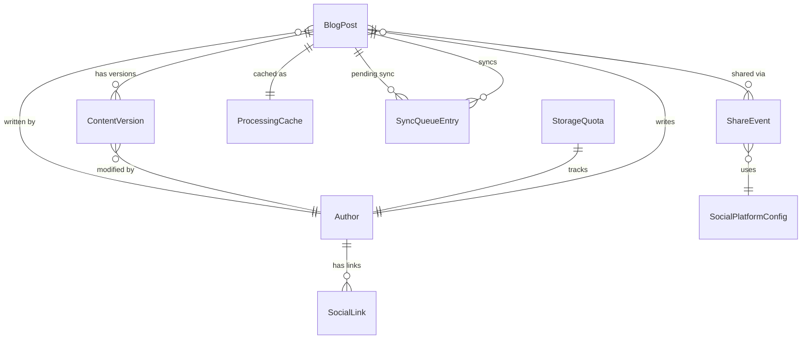
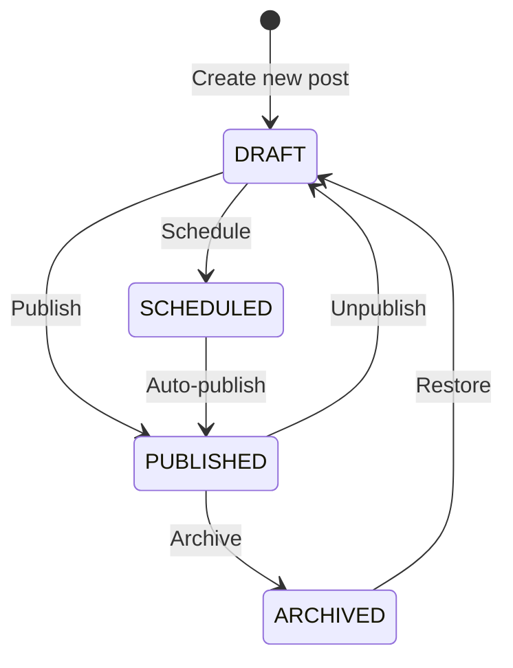
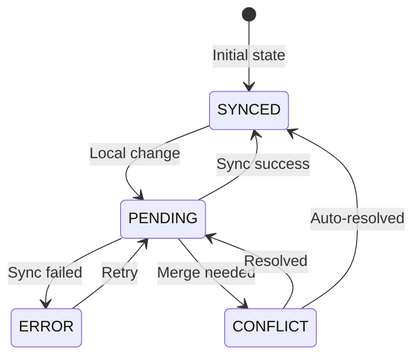

# Data Model: Blog System with Markdown Content Pipeline

**Feature**: 022-markdown-first-content
**Date**: 2025-01-25
**Status**: Design Complete

## Overview

This document defines the data structures, relationships, and validation rules for the blog system with markdown content pipeline, offline capabilities, and social features.

## Core Entities

### BlogPost

Represents a single blog article with content and metadata.

```typescript
interface BlogPost {
  id: string; // Unique identifier (slug-based)
  slug: string; // URL-friendly identifier
  title: string; // Post title
  content: string; // Markdown content
  contentHtml?: string; // Cached HTML output
  excerpt?: string; // Auto-generated or manual excerpt
  author: AuthorReference; // Author information
  metadata: PostMetadata; // Structured metadata
  status: PostStatus; // Publication status
  version: number; // Version for conflict detection
  createdAt: Date; // Creation timestamp
  updatedAt: Date; // Last modification timestamp
  publishedAt?: Date; // Publication timestamp
  syncStatus: SyncStatus; // Offline sync state
  checksum?: string; // Content integrity check
}

enum PostStatus {
  DRAFT = 'draft',
  PUBLISHED = 'published',
  SCHEDULED = 'scheduled',
  ARCHIVED = 'archived',
}

enum SyncStatus {
  SYNCED = 'synced',
  PENDING = 'pending',
  CONFLICT = 'conflict',
  ERROR = 'error',
}
```

### PostMetadata

Structured information about a post including display preferences and categorization.

```typescript
interface PostMetadata {
  tags: string[]; // Post tags
  categories: string[]; // Post categories
  featuredImage?: string; // Hero image URL
  featuredImageAlt?: string; // Alt text for accessibility
  showToc: boolean; // Display table of contents
  enableComments: boolean; // Allow comments
  readingTime?: number; // Estimated minutes to read
  seoTitle?: string; // SEO-optimized title
  seoDescription?: string; // SEO meta description
  socialImage?: string; // Open Graph image
  customCss?: string; // Post-specific styles
  codeTheme?: string; // Syntax highlighting theme
  relatedPosts?: string[]; // Related post IDs
  featured: boolean; // Featured post flag
}
```

### Author

Content creator with profile information and social presence.

```typescript
interface Author {
  id: string; // Unique identifier
  username: string; // Display username
  name: string; // Full name
  email?: string; // Contact email
  bio?: string; // Author biography
  avatar?: string; // Profile image URL
  socialLinks: SocialLink[]; // Social media accounts
  website?: string; // Personal website
  location?: string; // Geographic location
  joinedAt: Date; // Registration date
  postsCount?: number; // Total posts published
  hideSocial: boolean; // Hide social section flag
}

interface AuthorReference {
  id: string; // Author ID
  name: string; // Display name
  avatar?: string; // Avatar URL (denormalized for performance)
}
```

### SocialLink

Author's social media presence information.

```typescript
interface SocialLink {
  platform: SocialPlatform; // Platform identifier
  url: string; // Profile URL
  username?: string; // Username/handle
  displayOrder: number; // Display sequence
  isVerified: boolean; // Verification status
}

enum SocialPlatform {
  TWITTER = 'twitter',
  LINKEDIN = 'linkedin',
  GITHUB = 'github',
  FACEBOOK = 'facebook',
  INSTAGRAM = 'instagram',
  YOUTUBE = 'youtube',
  REDDIT = 'reddit',
  MASTODON = 'mastodon',
  WEBSITE = 'website',
  EMAIL = 'email',
}
```

### ContentVersion

Represents versions of content for conflict resolution.

```typescript
interface ContentVersion {
  postId: string; // Post identifier
  versionId: string; // Version identifier
  versionType: VersionType; // Version classification
  content: string; // Markdown content
  metadata: PostMetadata; // Version metadata
  author: AuthorReference; // Who made changes
  timestamp: Date; // When changed
  checksum: string; // Content hash
  changeDescription?: string; // What changed
}

enum VersionType {
  BASE = 'base', // Original version
  LOCAL = 'local', // Local changes
  REMOTE = 'remote', // Server changes
  MERGED = 'merged', // Resolved version
}
```

### SyncQueueEntry

Pending changes awaiting synchronization.

```typescript
interface SyncQueueEntry {
  id: string; // Queue entry ID
  postId: string; // Affected post
  action: SyncAction; // Operation type
  payload: any; // Change data
  timestamp: Date; // When queued
  retryCount: number; // Retry attempts
  lastError?: string; // Last error message
  priority: number; // Processing order
}

enum SyncAction {
  CREATE = 'create',
  UPDATE = 'update',
  DELETE = 'delete',
  RESOLVE_CONFLICT = 'resolve_conflict',
}
```

### ProcessingCache

Cached processed content for performance.

```typescript
interface ProcessingCache {
  postId: string; // Post identifier
  cacheKey: string; // Cache identifier
  contentHtml: string; // Processed HTML
  tableOfContents?: TOCItem[]; // Generated TOC
  codeBlocks?: CodeBlock[]; // Extracted code
  images?: ImageReference[]; // Image references
  links?: LinkReference[]; // External links
  readingTime: number; // Calculated time
  wordCount: number; // Word count
  createdAt: Date; // Cache creation
  expiresAt?: Date; // Cache expiration
}

interface TOCItem {
  id: string; // Heading ID
  text: string; // Heading text
  level: number; // Heading level (1-6)
  children?: TOCItem[]; // Nested headings
}

interface CodeBlock {
  id: string; // Block identifier
  language: string; // Programming language
  code: string; // Raw code
  highlighted?: string; // Syntax highlighted HTML
  lineNumbers: boolean; // Show line numbers
  startLine?: number; // Starting line number
}
```

### StorageQuota

Tracks storage usage and limits.

```typescript
interface StorageQuota {
  id: string; // Quota identifier
  userId?: string; // User identifier
  textUsed: number; // Bytes used for text
  textLimit: number; // Text storage limit (5MB)
  imagesUsed: number; // Bytes used for images
  imagesLimit: number; // Image storage limit (200MB)
  lastUpdated: Date; // Last calculation
  compressionEnabled: boolean; // Using compression
  cleanupScheduled?: Date; // Next cleanup date
}
```

### ShareEvent

Tracks social sharing interactions.

```typescript
interface ShareEvent {
  id: string; // Event identifier
  postId: string; // Shared post
  platform: SocialPlatform; // Share destination
  timestamp: Date; // When shared
  referrer?: string; // Source page
  userId?: string; // Who shared (if known)
  successful: boolean; // Share completed
}
```

### SocialPlatformConfig

Configuration for social sharing platforms.

```typescript
interface SocialPlatformConfig {
  platform: SocialPlatform; // Platform identifier
  displayName: string; // User-facing name
  icon: string; // Icon component name
  shareUrlTemplate: string; // URL template
  colorScheme: ColorScheme; // Brand colors
  requiresAuth: boolean; // Needs authentication
  metadataFields: string[]; // Required meta tags
  enabled: boolean; // Platform active
  displayOrder: number; // Sort order
}

interface ColorScheme {
  primary: string; // Primary color
  secondary?: string; // Secondary color
  hover: string; // Hover state color
  darkMode?: {
    // Dark mode colors
    primary: string;
    secondary?: string;
    hover: string;
  };
}
```

## Relationships

### Entity Relationships



## Validation Rules

### BlogPost Validation

```typescript
const blogPostValidation = {
  id: {
    required: true,
    pattern: /^[a-z0-9-]+$/,
    maxLength: 100,
  },
  slug: {
    required: true,
    pattern: /^[a-z0-9-]+$/,
    unique: true,
  },
  title: {
    required: true,
    minLength: 1,
    maxLength: 200,
  },
  content: {
    required: true,
    minLength: 1,
    maxLength: 1048576, // 1MB limit
  },
  author: {
    required: true,
    reference: 'Author',
  },
  metadata: {
    required: true,
    type: 'PostMetadata',
  },
  status: {
    required: true,
    enum: PostStatus,
  },
};
```

### Author Validation

```typescript
const authorValidation = {
  username: {
    required: true,
    unique: true,
    pattern: /^[a-zA-Z0-9_-]+$/,
    minLength: 3,
    maxLength: 30,
  },
  email: {
    required: false,
    pattern: /^[^\s@]+@[^\s@]+\.[^\s@]+$/,
  },
  bio: {
    required: false,
    maxLength: 500,
  },
  socialLinks: {
    required: false,
    maxItems: 10,
    validateEach: 'SocialLink',
  },
};
```

### PostMetadata Validation

```typescript
const postMetadataValidation = {
  tags: {
    required: false,
    maxItems: 10,
    itemPattern: /^[a-z0-9-]+$/,
    itemMaxLength: 30,
  },
  categories: {
    required: false,
    maxItems: 5,
    itemPattern: /^[a-z0-9-]+$/,
    itemMaxLength: 50,
  },
  featuredImage: {
    required: false,
    pattern: /^(https?:\/\/|\/)/,
    maxLength: 500,
  },
  showToc: {
    required: false,
    default: false,
    type: 'boolean',
  },
  readingTime: {
    required: false,
    min: 1,
    max: 999,
    type: 'number',
  },
};
```

## State Transitions

### Post Status Transitions



### Sync Status Transitions



## IndexedDB Schema

### Database Structure

```javascript
const dbSchema = {
  version: 1,
  stores: {
    posts: {
      keyPath: 'id',
      indexes: [
        { name: 'slug', unique: true },
        { name: 'status' },
        { name: 'author.id' },
        { name: 'syncStatus' },
        { name: 'updatedAt' },
      ],
    },
    authors: {
      keyPath: 'id',
      indexes: [
        { name: 'username', unique: true },
        { name: 'email', unique: true, sparse: true },
      ],
    },
    versions: {
      keyPath: 'versionId',
      indexes: [
        { name: 'postId' },
        { name: 'versionType' },
        { name: 'timestamp' },
      ],
    },
    syncQueue: {
      keyPath: 'id',
      autoIncrement: true,
      indexes: [
        { name: 'postId' },
        { name: 'action' },
        { name: 'priority' },
        { name: 'timestamp' },
      ],
    },
    cache: {
      keyPath: 'cacheKey',
      indexes: [{ name: 'postId' }, { name: 'expiresAt' }],
    },
    shareEvents: {
      keyPath: 'id',
      autoIncrement: true,
      indexes: [
        { name: 'postId' },
        { name: 'platform' },
        { name: 'timestamp' },
      ],
    },
  },
};
```

## Data Constraints

### Storage Limits

- Text content: 5MB total (compressed)
- Images: 200MB total
- Single post: 1MB maximum
- Cache entries: Auto-expire after 7 days
- Sync queue: Maximum 100 pending items

### Performance Constraints

- Maximum 1000 posts in IndexedDB
- TOC generation for posts < 50KB only
- Syntax highlighting for code blocks < 10KB
- Image optimization for files > 100KB
- Batch sync operations in groups of 10

### Business Rules

- Authors can only edit their own posts
- Slug must be unique across all posts
- Published posts cannot have empty content
- Scheduled posts require future publishedAt date
- Featured posts limited to 5 active at once
- Tags are normalized to lowercase with hyphens
- Categories follow hierarchical structure
- Social links validated for format only

## Migration Considerations

### From Existing Blog Data

1. Map existing fields to new schema
2. Generate missing required fields
3. Normalize tags and categories
4. Create author records from metadata
5. Initialize sync status as SYNCED
6. Generate slugs from titles if missing
7. Calculate reading time from content
8. Extract first paragraph as excerpt

### Schema Evolution

- Version migrations handled by Dexie
- Backward compatibility for 2 versions
- Data transformation functions for upgrades
- Rollback capability with backups
- Progressive migration for large datasets

## Security Considerations

### Data Validation

- Sanitize all markdown input
- Validate URLs for XSS prevention
- Escape HTML in user content
- Verify author permissions
- Rate limit sync operations

### Privacy Protection

- No personal data in IndexedDB without consent
- Anonymize share events
- Encrypt sensitive fields
- Clear data on logout
- Respect GDPR requirements
