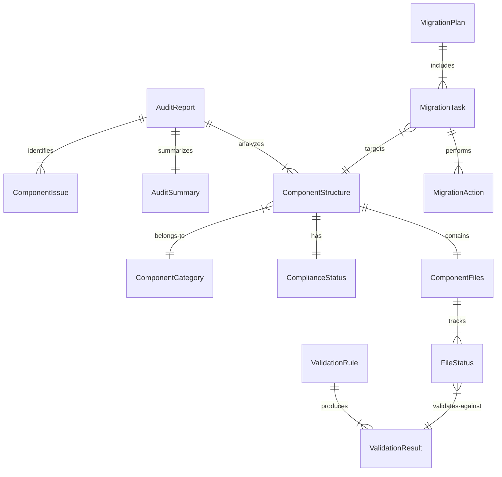

# Data Model: Component Structure

## Core Entities

### ComponentStructure

Represents the required structure for each React component.

```typescript
interface ComponentStructure {
  name: string; // Component name (PascalCase)
  path: string; // Absolute path to component directory
  category: ComponentCategory; // Atomic design level
  files: ComponentFiles; // Required files
  status: ComplianceStatus; // Current compliance state
}

interface ComponentFiles {
  index: FileStatus; // index.tsx barrel export
  component: FileStatus; // {Name}.tsx main file
  test: FileStatus; // {Name}.test.tsx tests
  story: FileStatus; // {Name}.stories.tsx storybook
}

interface FileStatus {
  exists: boolean; // File present
  path: string; // Full file path
  valid: boolean; // Meets requirements
  errors?: string[]; // Validation errors if any
}

enum ComponentCategory {
  SUBATOMIC = 'subatomic',
  ATOMIC = 'atomic',
  MOLECULAR = 'molecular',
  ORGANISMS = 'organisms',
  TEMPLATES = 'templates',
}

enum ComplianceStatus {
  COMPLIANT = 'compliant', // All 4 files present and valid
  NON_COMPLIANT = 'non_compliant', // Missing files or invalid
  IGNORED = 'ignored', // Not a component directory
}
```

### AuditReport

Results from analyzing the codebase for compliance.

```typescript
interface AuditReport {
  timestamp: Date; // When audit was run
  summary: AuditSummary; // High-level metrics
  components: ComponentStructure[]; // All components analyzed
  nonCompliant: ComponentIssue[]; // Components needing fixes
}

interface AuditSummary {
  total: number; // Total components found
  compliant: number; // Fully compliant count
  nonCompliant: number; // Need fixes count
  complianceRate: number; // Percentage compliant
  missingFiles: MissingFileSummary; // Breakdown by file type
}

interface MissingFileSummary {
  index: number; // Missing index.tsx count
  test: number; // Missing test files count
  story: number; // Missing story files count
  component: number; // Missing main component (rare)
}

interface ComponentIssue {
  component: string; // Component name
  path: string; // Component directory
  missing: string[]; // List of missing files
  fixable: boolean; // Can be auto-migrated
  priority: number; // Fix priority (1-3)
}
```

### MigrationPlan

Describes the changes needed to achieve compliance.

```typescript
interface MigrationPlan {
  version: string; // Migration tool version
  components: MigrationTask[]; // Components to migrate
  estimatedFiles: number; // New files to create
  backup: BackupConfig; // Backup strategy
}

interface MigrationTask {
  component: string; // Component to migrate
  actions: MigrationAction[]; // Steps to perform
  risk: RiskLevel; // Risk assessment
}

interface MigrationAction {
  type: ActionType; // What to do
  file: string; // Target file
  template: string; // Template to use
  content?: string; // Generated content
}

enum ActionType {
  CREATE_FILE = 'create_file', // New file creation
  UPDATE_FILE = 'update_file', // Modify existing
  RENAME_FILE = 'rename_file', // Rename operation
  DELETE_FILE = 'delete_file', // Remove file (rare)
}

enum RiskLevel {
  LOW = 'low', // Safe auto-migration
  MEDIUM = 'medium', // Review recommended
  HIGH = 'high', // Manual intervention needed
}

interface BackupConfig {
  enabled: boolean; // Create backups
  path: string; // Backup directory
  timestamp: Date; // Backup timestamp
}
```

### ValidationRule

Defines what makes a component structure valid.

```typescript
interface ValidationRule {
  id: string; // Rule identifier
  description: string; // Human-readable description
  filePattern: RegExp; // File naming pattern
  required: boolean; // Is this mandatory
  validator: (file: FileStatus) => ValidationResult;
}

interface ValidationResult {
  valid: boolean; // Passes validation
  errors: string[]; // Failure reasons
  warnings: string[]; // Non-critical issues
}

// Predefined Rules
const RULES: ValidationRule[] = [
  {
    id: 'index-export',
    description: 'Index file must export component',
    filePattern: /^index\.tsx$/,
    required: true,
    validator: validateIndexExport,
  },
  {
    id: 'component-name',
    description: 'Component file matches directory name',
    filePattern: /^[A-Z][a-zA-Z]+\.tsx$/,
    required: true,
    validator: validateComponentName,
  },
  {
    id: 'test-coverage',
    description: 'Test file has at least one test',
    filePattern: /^[A-Z][a-zA-Z]+\.test\.tsx$/,
    required: true,
    validator: validateTestCoverage,
  },
  {
    id: 'story-format',
    description: 'Story uses CSF 3.0 format',
    filePattern: /^[A-Z][a-zA-Z]+\.stories\.tsx$/,
    required: true,
    validator: validateStoryFormat,
  },
];
```

## State Transitions

### Component Compliance State Machine

```
UNKNOWN → ANALYZED → NON_COMPLIANT → MIGRATING → COMPLIANT
                  ↓                            ↓
              IGNORED                      FAILED → NON_COMPLIANT
```

States:

- **UNKNOWN**: Not yet analyzed
- **ANALYZED**: Structure checked
- **NON_COMPLIANT**: Missing required files
- **MIGRATING**: Auto-fix in progress
- **COMPLIANT**: All requirements met
- **IGNORED**: Not a component (e.g., **tests**, utils)
- **FAILED**: Migration failed, manual fix needed

## Relationships



## Validation Rules

### Required Files

1. **index.tsx**: Must exist and export the component
2. **{Name}.tsx**: Must match directory name in PascalCase
3. **{Name}.test.tsx**: Must contain at least one test
4. **{Name}.stories.tsx**: Must export default meta and one story

### Naming Conventions

- Directory: PascalCase (e.g., `Button`, `UserProfile`)
- Component file: `{DirectoryName}.tsx`
- Test file: `{DirectoryName}.test.tsx`
- Story file: `{DirectoryName}.stories.tsx`
- Index: Always `index.tsx`

### Content Requirements

#### index.tsx

```typescript
// Required: Default export
export { default } from './ComponentName';
// Optional: Type export
export type { ComponentNameProps } from './ComponentName';
```

#### Component.test.tsx

```typescript
// Required: At least one test
describe('ComponentName', () => {
  it('renders', () => {
    // Test implementation
  });
});
```

#### Component.stories.tsx

```typescript
// Required: Meta export
export default meta;
// Required: At least one story
export const Default: Story = {};
```

## Metrics & Reporting

### Key Metrics

- **Compliance Rate**: (compliant / total) \* 100
- **Migration Success Rate**: (migrated / attempted) \* 100
- **Average Files Per Component**: sum(files) / count(components)
- **Test Coverage**: components with tests / total

### Report Formats

1. **JSON**: Machine-readable for CI/CD
2. **Markdown**: Human-readable for PRs
3. **Console**: Interactive for development
4. **HTML**: Visual dashboard (optional)

## Data Persistence

### File System

- Components: `src/components/**/*`
- Reports: `component-audit-report.json`
- Backups: `.component-backup-{timestamp}/`
- Logs: `component-migration.log`

### Cache Strategy

- No persistent cache needed
- Runtime cache for performance
- Invalidate on file changes

## Error Handling

### Error Types

```typescript
enum ErrorCode {
  INVALID_PATH = 'E001', // Component path not found
  PARSE_ERROR = 'E002', // Cannot parse file
  WRITE_ERROR = 'E003', // Cannot write file
  VALIDATION_ERROR = 'E004', // Validation failed
  MIGRATION_ERROR = 'E005', // Migration failed
}

interface ComponentError {
  code: ErrorCode;
  message: string;
  component?: string;
  file?: string;
  stack?: string;
}
```

### Recovery Strategies

1. **Validation Errors**: Log and continue
2. **Write Errors**: Retry with backup
3. **Migration Errors**: Rollback changes
4. **Parse Errors**: Skip component, log issue
