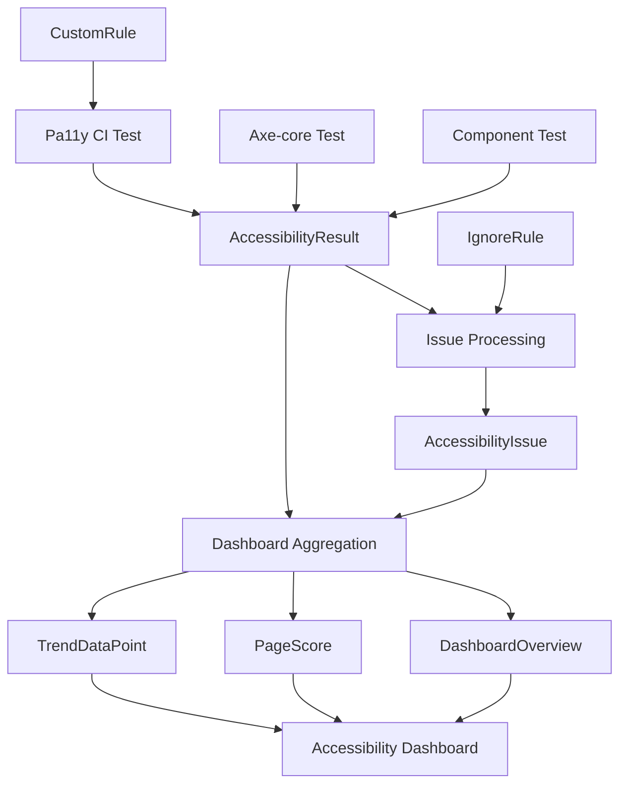

# WCAG AA Compliance Data Model

## Overview

This document defines the data structures, entities, and models required for the WCAG AA compliance system. The data model supports accessibility testing results, configuration management, and reporting across the CRUDkit application.

## Core Entities

### AccessibilityResult

Primary entity representing the outcome of accessibility testing for a specific page or component.

```typescript
interface AccessibilityResult {
  id: string; // Unique identifier (UUID)
  url: string; // Page URL or component identifier
  label: string; // Human-readable page/component name
  timestamp: string; // ISO 8601 timestamp
  standard: 'WCAG2AA' | 'WCAG2AAA'; // Testing standard used
  runner: 'pa11y' | 'axe' | 'htmlcs'; // Testing tool used

  // Overall results
  passed: boolean; // Whether all tests passed
  score: number; // Percentage score (0-100)

  // Issue breakdown
  issues: AccessibilityIssue[]; // Array of found issues

  // Test metadata
  testConfiguration: TestConfig; // Configuration used for this test
  environment: TestEnvironment; // Environment details

  // Additional context
  pageMetadata?: PageMetadata; // Optional page-specific data
  componentContext?: ComponentContext; // Optional component-specific data
}
```

### AccessibilityIssue

Represents a specific accessibility violation or warning found during testing.

```typescript
interface AccessibilityIssue {
  id: string; // Unique issue identifier
  type: 'error' | 'warning' | 'notice'; // Severity level
  code: string; // Rule code (e.g., 'color-contrast')
  message: string; // Human-readable description

  // Location information
  selector: string; // CSS selector where issue was found
  xpath?: string; // XPath to element (if available)

  // Issue details
  wcagCriterion: string; // WCAG criterion (e.g., '1.4.3')
  level: 'A' | 'AA' | 'AAA'; // WCAG conformance level
  impact: 'minor' | 'moderate' | 'serious' | 'critical';

  // Remediation guidance
  help: string; // How to fix the issue
  helpUrl: string; // Link to detailed guidance

  // Context
  element?: string; // HTML of problematic element
  tags: string[]; // Categorization tags

  // Tracking
  firstSeen: string; // When this issue was first detected
  lastSeen: string; // When this issue was last detected
  status: IssueStatus; // Current status
  ignored?: IgnoreRule; // If ignored, the rule that ignores it
}
```

### IssueStatus

Enumeration for tracking accessibility issue resolution status.

```typescript
type IssueStatus =
  | 'active' // Issue is currently present
  | 'resolved' // Issue has been fixed
  | 'ignored' // Issue is intentionally ignored
  | 'false_positive' // Issue was determined to be invalid
  | 'pending' // Issue is acknowledged but not yet addressed
  | 'wont_fix'; // Issue acknowledged but won't be fixed
```

### TestConfig

Configuration settings used for accessibility testing.

```typescript
interface TestConfig {
  standard: 'WCAG2A' | 'WCAG2AA' | 'WCAG2AAA';
  runners: ('pa11y' | 'axe' | 'htmlcs')[];

  // Browser configuration
  viewport: {
    width: number;
    height: number;
  };

  // Test behavior
  timeout: number; // Test timeout in milliseconds
  wait: number; // Wait time before testing

  // Element filtering
  hideElements?: string; // CSS selector for elements to hide
  includeElements?: string; // CSS selector for elements to include only

  // Rule configuration
  ignoreRules: string[]; // Rules to ignore globally
  customRules?: CustomRule[]; // Project-specific rules

  // Actions
  actions: TestAction[]; // Actions to perform before testing
}
```

### TestAction

Actions to perform during accessibility testing (e.g., clicking buttons, filling forms).

```typescript
interface TestAction {
  type: 'click' | 'set-field-value' | 'wait-for-element' | 'navigate';
  selector?: string; // CSS selector for target element
  value?: string; // Value to set (for set-field-value)
  timeout?: number; // Action-specific timeout
  description: string; // Human-readable description
}
```

### TestEnvironment

Details about the environment where testing was performed.

```typescript
interface TestEnvironment {
  userAgent: string; // Browser user agent
  viewport: {
    width: number;
    height: number;
  };
  colorScheme: 'light' | 'dark'; // Theme used during testing
  reducedMotion: boolean; // Whether reduced motion was enabled

  // Application state
  buildId?: string; // Build identifier
  deploymentId?: string; // Deployment identifier
  gitCommit?: string; // Git commit hash

  // System info
  platform: string; // OS platform
  nodeVersion?: string; // Node.js version
  testRunId: string; // Unique test run identifier
}
```

### PageMetadata

Additional information about pages being tested.

```typescript
interface PageMetadata {
  title: string; // Page title
  description?: string; // Page description
  route: string; // Next.js route
  layout?: string; // Layout component used

  // Page characteristics
  isPublic: boolean; // Whether page requires authentication
  hasInteractiveElements: boolean; // Whether page has forms, modals, etc.
  estimatedComplexity: 'low' | 'medium' | 'high'; // Complexity assessment

  // Dependencies
  requiredData?: string[]; // Data requirements for testing
  externalDependencies?: string[]; // External services required
}
```

### ComponentContext

Additional information for component-level testing.

```typescript
interface ComponentContext {
  componentName: string; // Component name (e.g., 'Button')
  componentType: 'subatomic' | 'atomic' | 'molecular' | 'organism';
  storyId?: string; // Storybook story identifier

  // Props used in test
  testProps: Record<string, any>;

  // Variants tested
  variants: ComponentVariant[];

  // Dependencies
  dependencies: string[]; // Other components this depends on
}
```

### ComponentVariant

Different states/configurations of a component that were tested.

```typescript
interface ComponentVariant {
  name: string; // Variant name (e.g., 'disabled', 'loading')
  props: Record<string, any>; // Props for this variant
  description: string; // Human-readable description
  passed: boolean; // Whether this variant passed
  issues: AccessibilityIssue[]; // Issues specific to this variant
}
```

### IgnoreRule

Configuration for ignoring specific accessibility issues.

```typescript
interface IgnoreRule {
  id: string; // Unique rule identifier
  ruleCode: string; // Accessibility rule code to ignore

  // Scope
  scope: 'global' | 'page' | 'component'; // Where this rule applies
  target?: string; // Specific page/component (if not global)
  selector?: string; // CSS selector (optional, for precision)

  // Justification
  reason: string; // Why this issue is being ignored
  category: IgnoreCategory; // Categorization of the ignore reason

  // Lifecycle
  createdBy: string; // Who created this ignore rule
  createdAt: string; // When it was created
  expiresAt?: string; // Optional expiration date
  reviewedAt?: string; // When it was last reviewed

  // Tracking
  issuesAffected: number; // How many issues this rule covers
  lastMatched?: string; // When this rule last matched an issue
}
```

### IgnoreCategory

Categorization for why accessibility issues are being ignored.

```typescript
type IgnoreCategory =
  | 'false_positive' // Tool incorrectly flagged this as an issue
  | 'technical_debt' // Known issue, planned to fix later
  | 'external_dependency' // Issue in third-party code we can't control
  | 'design_decision' // Intentional design choice
  | 'wcag_exception' // Legitimate WCAG exception
  | 'temporary' // Temporary ignore during development
  | 'wont_fix'; // Decided not to fix this issue
```

### CustomRule

Project-specific accessibility rules.

```typescript
interface CustomRule {
  id: string; // Unique rule identifier
  name: string; // Human-readable rule name
  description: string; // What this rule checks

  // Rule configuration
  severity: 'error' | 'warning' | 'notice';
  wcagCriterion?: string; // Associated WCAG criterion

  // Implementation
  selector: string; // CSS selector to check
  condition: RuleCondition; // What to validate

  // Metadata
  createdBy: string; // Who created this rule
  createdAt: string; // When it was created
  enabled: boolean; // Whether the rule is active
}
```

### RuleCondition

Condition for custom accessibility rules.

```typescript
interface RuleCondition {
  type: 'attribute' | 'text' | 'style' | 'javascript';

  // For attribute checks
  attribute?: string; // Attribute name to check
  expectedValue?: string; // Expected attribute value

  // For text checks
  textPattern?: string; // Regex pattern for text content

  // For style checks
  styleProperty?: string; // CSS property to check
  expectedStyleValue?: string; // Expected CSS value

  // For JavaScript checks
  jsFunction?: string; // JavaScript function to execute
}
```

## Aggregate Entities

### AccessibilityDashboard

Summary data for the accessibility dashboard.

```typescript
interface AccessibilityDashboard {
  overview: DashboardOverview;
  pageScores: PageScore[];
  trendData: TrendDataPoint[];
  recentIssues: AccessibilityIssue[];
  complianceStatus: ComplianceStatus;
  lastUpdated: string;
}
```

### DashboardOverview

High-level accessibility metrics.

```typescript
interface DashboardOverview {
  totalPages: number;
  pagesCompliant: number;
  compliancePercentage: number;

  totalIssues: number;
  criticalIssues: number;
  warningIssues: number;
  noticeIssues: number;

  averageScore: number;
  trendDirection: 'improving' | 'declining' | 'stable';
}
```

### PageScore

Accessibility score for a specific page.

```typescript
interface PageScore {
  url: string;
  label: string;
  score: number; // 0-100
  grade: 'A+' | 'A' | 'B' | 'C' | 'D' | 'F'; // Letter grade

  issues: {
    error: number;
    warning: number;
    notice: number;
  };

  lastTested: string;
  trend: 'up' | 'down' | 'same';

  // Quick links
  reportUrl?: string; // Link to detailed report
  fixGuideUrl?: string; // Link to fix guide
}
```

### TrendDataPoint

Time series data for accessibility trends.

```typescript
interface TrendDataPoint {
  date: string; // ISO 8601 date
  overallScore: number; // Average score across all pages
  totalIssues: number; // Total issues found
  criticalIssues: number; // Critical issues only
  pagesCompliant: number; // Number of compliant pages
  testRunId: string; // Associated test run
}
```

### ComplianceStatus

Overall compliance status for the project.

```typescript
interface ComplianceStatus {
  level: 'WCAG2A' | 'WCAG2AA' | 'WCAG2AAA' | 'non_compliant';
  achieved: boolean;

  // Requirements
  requiredScore: number; // Minimum score for compliance
  currentScore: number; // Current average score

  // Issues blocking compliance
  blockingIssues: number; // Number of issues preventing compliance
  criticalIssues: AccessibilityIssue[]; // Critical issues to fix

  // Progress tracking
  progressPercentage: number; // Progress toward compliance
  estimatedCompletionDate?: string; // Based on current fix rate

  // Certification
  lastAuditDate?: string; // Last manual audit date
  auditStatus?: 'pending' | 'passed' | 'failed';
  certificationExpiry?: string; // When certification expires
}
```

## Storage Strategy

### Development Environment

- **localStorage**: Store test results and dashboard data
- **File System**: JSON files for test reports and configuration
- **Memory**: Runtime caching of frequently accessed data

### CI/CD Environment

- **Artifacts**: Upload test results as GitHub Actions artifacts
- **JSON Files**: Store structured data for processing
- **Environment Variables**: Configuration and API keys

### Production Environment

- **API Routes**: Next.js API routes for data access
- **Static Files**: Pre-generated reports and data
- **External Storage**: Optional integration with external services

## Data Flow



## API Endpoints

### GET /api/accessibility/results

Returns paginated accessibility test results.

**Response:**

```typescript
{
  results: AccessibilityResult[];
  pagination: {
    page: number;
    limit: number;
    total: number;
    hasMore: boolean;
  };
}
```

### GET /api/accessibility/dashboard

Returns dashboard summary data.

**Response:**

```typescript
AccessibilityDashboard;
```

### GET /api/accessibility/issues

Returns filtered accessibility issues.

**Query Parameters:**

- `severity`: Filter by issue severity
- `page`: Specific page URL filter
- `status`: Issue status filter
- `limit`: Number of results per page

**Response:**

```typescript
{
  issues: AccessibilityIssue[];
  filters: {
    severities: string[];
    pages: string[];
    statuses: IssueStatus[];
  };
  pagination: PaginationInfo;
}
```

### POST /api/accessibility/ignore

Create or update ignore rules.

**Request:**

```typescript
{
  rule: Partial<IgnoreRule>;
}
```

**Response:**

```typescript
{
  success: boolean;
  rule: IgnoreRule;
}
```

## Configuration Files

### .pa11yci/config.json

Main Pa11y CI configuration following TestConfig interface.

### .pa11yci/ignore-list.json

Managed ignore rules following IgnoreRule interface.

### src/utils/accessibility/rules.ts

Custom rule definitions following CustomRule interface.

## Performance Considerations

### Data Volume

- **Estimated Results per Day**: 50-100 (development + CI)
- **Data Retention**: 90 days for detailed results, 1 year for trends
- **Storage Requirements**: ~10MB per month

### Query Optimization

- Index on timestamp for trend queries
- Filter on page URL for page-specific results
- Aggregate data pre-computation for dashboard
- Lazy loading for detailed issue information

This data model provides comprehensive tracking and reporting capabilities while maintaining performance and ease of use for the WCAG AA compliance system.
