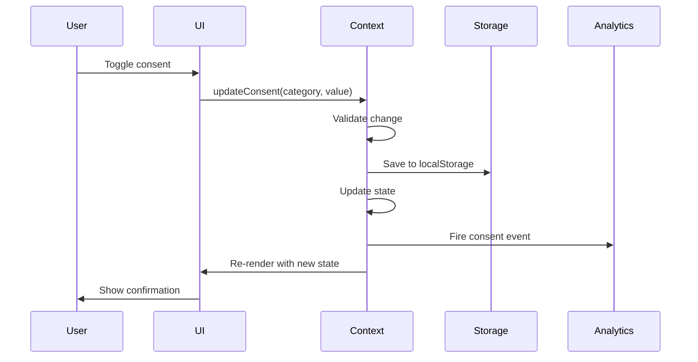
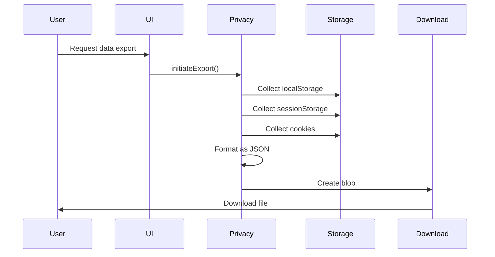

# Data Model: Cookie Consent & GDPR Compliance

## Core Data Structures

### 1. Cookie Categories

```typescript
// src/utils/consent-types.ts

/**
 * Enumeration of cookie categories as per GDPR guidelines
 */
export enum CookieCategory {
  NECESSARY = 'necessary', // Always enabled, no consent required
  FUNCTIONAL = 'functional', // User preferences, settings
  ANALYTICS = 'analytics', // Usage tracking, performance monitoring
  MARKETING = 'marketing', // Advertising, remarketing, social media
}

/**
 * Human-readable labels for cookie categories
 */
export const CATEGORY_LABELS: Record<CookieCategory, string> = {
  [CookieCategory.NECESSARY]: 'Strictly Necessary',
  [CookieCategory.FUNCTIONAL]: 'Functional',
  [CookieCategory.ANALYTICS]: 'Analytics',
  [CookieCategory.MARKETING]: 'Marketing',
};

/**
 * Detailed descriptions for each category
 */
export const CATEGORY_DESCRIPTIONS: Record<CookieCategory, string> = {
  [CookieCategory.NECESSARY]:
    'These cookies are essential for the website to function properly. They enable core functionality such as security, network management, and accessibility.',
  [CookieCategory.FUNCTIONAL]:
    'These cookies enable enhanced functionality and personalization, such as remembering your preferences, language, and region.',
  [CookieCategory.ANALYTICS]:
    'These cookies help us understand how visitors interact with our website by collecting and reporting information anonymously.',
  [CookieCategory.MARKETING]:
    'These cookies are used to deliver advertisements more relevant to you and your interests. They may also be used to limit the number of times you see an ad.',
};
```

### 2. Consent State

```typescript
/**
 * Main consent state structure
 */
export interface ConsentState {
  // Consent flags for each category
  necessary: boolean; // Always true
  functional: boolean; // User preference
  analytics: boolean; // User preference
  marketing: boolean; // User preference

  // Metadata
  timestamp: number; // When consent was given/updated
  version: string; // Consent version for migration
  lastUpdated: number; // Last modification timestamp

  // User interaction tracking
  method: ConsentMethod; // How consent was given
  bannerId?: string; // Which banner version was shown
}

/**
 * How the user provided consent
 */
export enum ConsentMethod {
  BANNER_ACCEPT_ALL = 'banner_accept_all',
  BANNER_REJECT_ALL = 'banner_reject_all',
  BANNER_CUSTOM = 'banner_custom',
  SETTINGS_PAGE = 'settings_page',
  IMPORTED = 'imported',
  DEFAULT = 'default',
}

/**
 * Default consent state for new users
 */
export const DEFAULT_CONSENT_STATE: ConsentState = {
  necessary: true,
  functional: false,
  analytics: false,
  marketing: false,
  timestamp: Date.now(),
  version: '1.0.0',
  lastUpdated: Date.now(),
  method: ConsentMethod.DEFAULT,
};
```

### 3. Consent Context

```typescript
/**
 * React Context value type
 */
export interface ConsentContextValue {
  // Current consent state
  consent: ConsentState;

  // UI state
  showBanner: boolean;
  showModal: boolean;

  // Actions
  updateConsent: (category: CookieCategory, enabled: boolean) => void;
  updateMultiple: (updates: Partial<ConsentState>) => void;
  acceptAll: () => void;
  rejectAll: () => void;
  savePreferences: (preferences: Partial<ConsentState>) => void;

  // UI controls
  setShowBanner: (show: boolean) => void;
  setShowModal: (show: boolean) => void;
  dismissBanner: () => void;

  // Utilities
  hasConsented: () => boolean;
  canUseCookies: (category: CookieCategory) => boolean;
  resetConsent: () => void;
}
```

### 4. Consent History

```typescript
/**
 * Track consent changes over time
 */
export interface ConsentHistoryEntry {
  id: string; // Unique identifier
  timestamp: number; // When the change occurred
  previousState: ConsentState; // State before change
  newState: ConsentState; // State after change
  trigger: ConsentTrigger; // What caused the change
  userAgent?: string; // Browser info
  ipHash?: string; // Hashed IP for audit
}

export enum ConsentTrigger {
  USER_ACTION = 'user_action',
  TIMEOUT = 'timeout',
  VERSION_MIGRATION = 'version_migration',
  ADMIN_RESET = 'admin_reset',
  DATA_IMPORT = 'data_import',
}

/**
 * Complete consent history
 */
export interface ConsentHistory {
  entries: ConsentHistoryEntry[];
  maxEntries: number; // Limit storage (default: 50)
}
```

### 5. Privacy Data Export

```typescript
/**
 * User data export format for GDPR compliance
 */
export interface UserDataExport {
  // Metadata
  exportId: string;
  timestamp: string; // ISO 8601 format
  version: string; // Export format version

  // Consent information
  consent: {
    current: ConsentState;
    history: ConsentHistoryEntry[];
  };

  // Browser storage
  localStorage: Record<string, any>;
  sessionStorage: Record<string, any>;
  cookies: CookieData[];

  // Application data
  preferences: {
    theme?: string;
    fontSize?: string;
    lineHeight?: string;
    fontFamily?: string;
    colorblindMode?: string;
  };

  // Analytics data (if consented)
  analytics?: {
    webVitals?: any[];
    customEvents?: any[];
    sessionData?: any;
  };
}

/**
 * Cookie data structure
 */
export interface CookieData {
  name: string;
  value: string;
  domain?: string;
  path?: string;
  expires?: string;
  secure?: boolean;
  sameSite?: 'Strict' | 'Lax' | 'None';
  category?: CookieCategory;
}
```

### 6. Privacy Requests

```typescript
/**
 * Data deletion request
 */
export interface DataDeletionRequest {
  id: string;
  timestamp: number;
  email: string;
  reason?: string;
  categories: CookieCategory[];
  status: RequestStatus;
  completedAt?: number;
  notes?: string;
}

export enum RequestStatus {
  PENDING = 'pending',
  IN_PROGRESS = 'in_progress',
  COMPLETED = 'completed',
  FAILED = 'failed',
  CANCELLED = 'cancelled',
}

/**
 * Data access request (GDPR Article 15)
 */
export interface DataAccessRequest {
  id: string;
  timestamp: number;
  email: string;
  purpose: string;
  status: RequestStatus;
  exportId?: string; // Link to UserDataExport
  expiresAt?: number; // Download link expiration
}
```

### 7. Cookie Configuration

```typescript
/**
 * Cookie definition for documentation
 */
export interface CookieDefinition {
  name: string;
  category: CookieCategory;
  purpose: string;
  duration: string; // e.g., "Session", "1 year", "30 days"
  provider: string; // e.g., "First-party", "Google", "Facebook"
  description: string;
  required: boolean;
}

/**
 * Complete cookie registry
 */
export const COOKIE_REGISTRY: CookieDefinition[] = [
  {
    name: 'consent',
    category: CookieCategory.NECESSARY,
    purpose: 'Store cookie consent preferences',
    duration: '1 year',
    provider: 'First-party',
    description: 'Remembers your cookie consent choices',
    required: true,
  },
  {
    name: 'theme',
    category: CookieCategory.FUNCTIONAL,
    purpose: 'Store theme preference',
    duration: '1 year',
    provider: 'First-party',
    description: 'Remembers your selected color theme',
    required: false,
  },
  {
    name: '_ga',
    category: CookieCategory.ANALYTICS,
    purpose: 'Google Analytics tracking',
    duration: '2 years',
    provider: 'Google',
    description: 'Used to distinguish users',
    required: false,
  },
  // ... more cookies
];
```

### 8. Storage Schema

```typescript
/**
 * localStorage schema
 */
export interface LocalStorageSchema {
  'cookie-consent': ConsentState;
  'consent-history'?: ConsentHistory;
  'privacy-requests'?: DataDeletionRequest[];
  'consent-banner-dismissed'?: boolean;
  'consent-banner-dismiss-timestamp'?: number;
}

/**
 * Storage keys enum for type safety
 */
export enum StorageKey {
  CONSENT = 'cookie-consent',
  HISTORY = 'consent-history',
  REQUESTS = 'privacy-requests',
  BANNER_DISMISSED = 'consent-banner-dismissed',
  BANNER_TIMESTAMP = 'consent-banner-dismiss-timestamp',
}
```

### 9. Validation Schemas

```typescript
import { z } from 'zod';

/**
 * Zod schema for consent state validation
 */
export const ConsentStateSchema = z.object({
  necessary: z.boolean(),
  functional: z.boolean(),
  analytics: z.boolean(),
  marketing: z.boolean(),
  timestamp: z.number(),
  version: z.string(),
  lastUpdated: z.number(),
  method: z.nativeEnum(ConsentMethod),
});

/**
 * Validate consent state from storage
 */
export const validateConsentState = (data: unknown): ConsentState | null => {
  try {
    return ConsentStateSchema.parse(data);
  } catch {
    return null;
  }
};
```

### 10. Event Types

```typescript
/**
 * Custom events for consent changes
 */
export interface ConsentChangeEvent extends CustomEvent {
  detail: {
    previousConsent: ConsentState;
    newConsent: ConsentState;
    changedCategories: CookieCategory[];
  };
}

/**
 * Event names
 */
export enum ConsentEvent {
  CONSENT_UPDATED = 'consentUpdated',
  CONSENT_ACCEPTED_ALL = 'consentAcceptedAll',
  CONSENT_REJECTED_ALL = 'consentRejectedAll',
  CONSENT_CUSTOMIZED = 'consentCustomized',
  BANNER_SHOWN = 'consentBannerShown',
  BANNER_DISMISSED = 'consentBannerDismissed',
  MODAL_OPENED = 'consentModalOpened',
  MODAL_CLOSED = 'consentModalClosed',
}
```

## Data Flow Diagrams

### Consent Update Flow



### Data Export Flow



## Migration Strategy

### Version 1.0.0 → 2.0.0

```typescript
export const migrateConsent = (oldConsent: any): ConsentState => {
  // Handle missing fields
  const migrated: ConsentState = {
    necessary: true,
    functional: oldConsent.functional ?? false,
    analytics: oldConsent.analytics ?? false,
    marketing: oldConsent.marketing ?? false,
    timestamp: oldConsent.timestamp ?? Date.now(),
    version: '2.0.0',
    lastUpdated: Date.now(),
    method: ConsentMethod.IMPORTED,
  };

  return migrated;
};
```

---

Data Model completed: 2025-09-15
Next: Generate contracts/README.md
