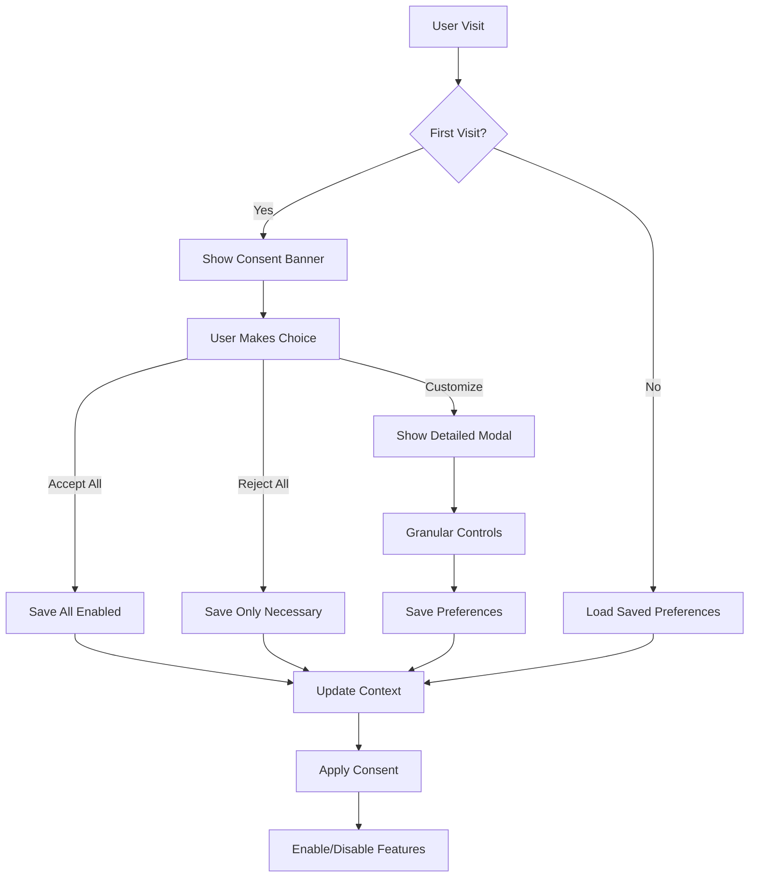

# Implementation Plan: Cookie Consent & GDPR Compliance

## Overview

This plan outlines the implementation of a comprehensive GDPR-compliant cookie consent system for the CRUDkit application. The feature will provide transparent user control over data collection while maintaining excellent UX and accessibility.

## Architecture Overview

## Implementation Phases

### Phase 1: Core Infrastructure (Day 1, Morning)

**Goal**: Establish the foundation for consent management

1. **Create type definitions** (`src/utils/consent-types.ts`)
   - CookieCategory enum
   - ConsentState interface
   - ConsentPreferences type
   - Privacy request types

2. **Implement consent utilities** (`src/utils/consent.ts`)
   - Default consent factory
   - Consent validation
   - Version migration logic
   - Cookie management helpers

3. **Build ConsentContext** (`src/contexts/ConsentContext.tsx`)
   - State management
   - localStorage persistence
   - Consent update methods
   - Banner visibility control

### Phase 2: UI Components (Day 1, Afternoon)

**Goal**: Create user-facing consent interfaces

1. **Cookie Consent Banner** (`src/components/privacy/CookieConsent/`)
   - Floating banner component
   - Accept/Reject/Customize buttons
   - Accessibility features (focus trap, ARIA)
   - Responsive design

2. **Consent Modal** (`src/components/privacy/ConsentModal/`)
   - Detailed category descriptions
   - Toggle switches for each category
   - Save preferences functionality
   - Cookie policy link

3. **Privacy Controls** (`src/components/privacy/PrivacyControls/`)
   - Settings page component
   - Current consent display
   - Modify preferences
   - Withdraw consent option

### Phase 3: Privacy Features (Day 2, Morning)

**Goal**: Implement data management capabilities

1. **Data Export** (`src/utils/privacy.ts`)
   - Collect all user data
   - Format as JSON
   - Download functionality
   - Include consent history

2. **Data Deletion**
   - Request form component
   - Clear localStorage
   - Clear sessionStorage
   - Reset preferences

3. **Consent History**
   - Track consent changes
   - Timestamp all updates
   - Version tracking

### Phase 4: Integration (Day 2, Afternoon)

**Goal**: Connect consent system with existing features

1. **Analytics Integration**
   - Check consent before loading
   - Google Consent Mode v2
   - Web Vitals conditional tracking

2. **Theme Persistence**
   - Functional cookies check
   - Fallback to session storage

3. **Accessibility Settings**
   - Functional cookies validation
   - Memory-only fallback

### Phase 5: Documentation & Legal (Day 3)

**Goal**: Complete legal requirements and documentation

1. **Legal Pages**
   - Privacy Policy (`/privacy`)
   - Cookie Policy (`/cookies`)
   - Terms of Service (`/terms`)

2. **Developer Documentation**
   - Integration guide
   - Testing procedures
   - Compliance checklist

## Technical Decisions

### State Management

- **React Context** for global consent state
- **localStorage** for persistence
- **Memory cache** for performance

### UI/UX Approach

- **Non-blocking banner** - doesn't prevent site usage
- **Progressive disclosure** - simple choices first, details on demand
- **Accessibility-first** - keyboard navigable, screen reader friendly

### Cookie Categories

| Category   | Description                 | Default   | Examples          |
| ---------- | --------------------------- | --------- | ----------------- |
| Necessary  | Essential for site function | Always On | Session, Security |
| Functional | Enhanced features           | Off       | Theme, Language   |
| Analytics  | Usage tracking              | Off       | GA4, Web Vitals   |
| Marketing  | Advertising/targeting       | Off       | Future use        |

### Performance Targets

- Banner render: < 100ms
- Zero CLS impact
- Lazy load detailed modal
- Cache consent checks

## Testing Strategy

### Unit Tests

- Context provider logic
- Consent utilities
- Privacy functions
- Component rendering

### Integration Tests

- Consent flow end-to-end
- Data export functionality
- Preference persistence
- Analytics blocking

### Accessibility Tests

- Keyboard navigation
- Screen reader compatibility
- Focus management
- ARIA attributes

### Compliance Tests

- GDPR requirements
- Cookie setting validation
- Consent recording
- Data portability

## Risk Mitigation

| Risk                    | Impact   | Mitigation             |
| ----------------------- | -------- | ---------------------- |
| Banner blocks content   | High     | Use overlay, not modal |
| Consent not compliant   | Critical | Follow ICO guidelines  |
| Performance degradation | Medium   | Cache consent state    |
| User confusion          | Medium   | Clear descriptions     |

## Success Metrics

- ✅ Banner appears on first visit
- ✅ Preferences persist across sessions
- ✅ No cookies before consent
- ✅ Data export works correctly
- ✅ Accessibility audit passes
- ✅ < 5% performance impact
- ✅ 100% test coverage

## Dependencies

### Internal

- Modal component pattern
- Theme persistence pattern
- Context provider setup

### External

- None (intentionally self-contained)

## Timeline

| Phase               | Duration | Deliverables              |
| ------------------- | -------- | ------------------------- |
| Core Infrastructure | 4 hours  | Context, types, utilities |
| UI Components       | 4 hours  | Banner, modal, controls   |
| Privacy Features    | 4 hours  | Export, deletion, history |
| Integration         | 4 hours  | Analytics, theme, a11y    |
| Documentation       | 4 hours  | Legal pages, guides       |

**Total Estimate**: 20 hours (2.5 days)

## Next Steps

1. Execute `/tasks` to generate detailed task breakdown
2. Begin with TDD approach (tests first)
3. Implement Phase 1 infrastructure
4. Progress through phases sequentially
5. Continuous testing and validation

---

Generated: 2025-09-15
PRP: 007-cookie-consent
Phase: 3 - Privacy & Analytics
