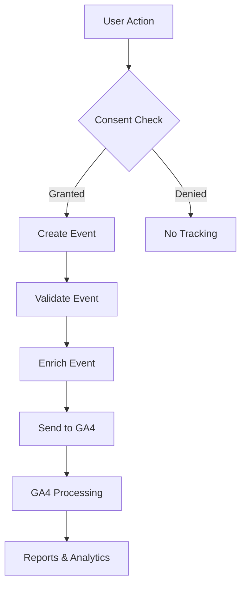

# PRP-008: Analytics Data Model

## Overview

This document defines the data structures, types, and event schemas for the Google Analytics 4 integration.

## Core Entities

### 1. Analytics Configuration

```typescript
interface AnalyticsConfig {
  measurementId: string; // GA4 Measurement ID (G-XXXXXXXXXX)
  debugMode: boolean; // Enable debug mode for development
  sendPageView: boolean; // Auto-send page views
  anonymizeIp: boolean; // IP anonymization (GDPR)
  cookieFlags: string; // Cookie settings (SameSite, Secure)
  cookieDomain: string; // Cookie domain scope
  cookieExpires: number; // Cookie expiration in seconds
}
```

### 2. Consent State (from PRP-007)

```typescript
interface ConsentState {
  necessary: boolean; // Always true
  functional: boolean; // User preference
  analytics: boolean; // Controls GA4 loading
  marketing: boolean; // Future use
  timestamp: number; // When consent was given
  version: string; // Consent version
}
```

### 3. Event Structures

#### Base Event

```typescript
interface AnalyticsEvent {
  action: string; // Event action (e.g., 'click', 'view', 'submit')
  category: string; // Event category (e.g., 'UI', 'Forms', 'Navigation')
  label?: string; // Optional label for additional context
  value?: number; // Optional numeric value
  timestamp?: number; // When event occurred
  userId?: string; // Optional user identifier (hashed)
  sessionId?: string; // Session identifier
}
```

#### Web Vitals Event

```typescript
interface WebVitalEvent extends AnalyticsEvent {
  metric: {
    name: 'FCP' | 'LCP' | 'CLS' | 'FID' | 'TTFB' | 'INP';
    value: number;
    rating: 'good' | 'needs-improvement' | 'poor';
    delta?: number;
    id?: string;
    navigationType?: string;
  };
}
```

#### Page View Event

```typescript
interface PageViewEvent {
  page_path: string; // Current URL path
  page_title: string; // Page title
  page_location: string; // Full URL
  page_referrer?: string; // Previous page
  timestamp: number; // When viewed
}
```

#### Custom Events

```typescript
// Theme Change Event
interface ThemeChangeEvent extends AnalyticsEvent {
  action: 'theme_change';
  category: 'UI';
  label: string; // Theme name
  previousTheme?: string; // Previous theme
}

// Form Submission Event
interface FormSubmitEvent extends AnalyticsEvent {
  action: 'form_submit';
  category: 'Forms';
  label: string; // Form name/ID
  value?: number; // Form fields count
  success: boolean; // Submission result
}

// PWA Install Event
interface PWAInstallEvent extends AnalyticsEvent {
  action: 'pwa_install';
  category: 'PWA';
  label: 'accepted' | 'dismissed' | 'deferred';
  platform?: string; // iOS, Android, Desktop
}

// Error Event
interface ErrorEvent extends AnalyticsEvent {
  action: 'exception';
  category: 'Errors';
  label: string; // Error message
  fatal: boolean; // Is fatal error
  stackTrace?: string; // Stack trace (dev only)
}
```

## Event Taxonomy

### Categories

| Category    | Description                 | Example Events                                   |
| ----------- | --------------------------- | ------------------------------------------------ |
| UI          | User interface interactions | theme_change, toggle_click, modal_open           |
| Forms       | Form interactions           | form_submit, field_focus, validation_error       |
| Navigation  | Page navigation             | page_view, link_click, back_button               |
| PWA         | Progressive Web App events  | pwa_install, offline_usage, sync_complete        |
| Performance | Performance metrics         | web_vitals, resource_timing, api_latency         |
| Errors      | Error tracking              | exception, 404_error, api_error                  |
| Consent     | Consent management          | consent_granted, consent_denied, consent_updated |

### Standard Event Properties

All events should include:

- `timestamp`: Unix timestamp
- `page_path`: Current page path
- `user_agent`: Browser user agent (for debugging)
- `viewport_size`: Viewport dimensions
- `screen_resolution`: Screen resolution
- `language`: User language preference

## Data Flow



## Privacy Considerations

### PII Protection

Never track:

- Email addresses
- Phone numbers
- Full names
- Credit card info
- Passwords
- Social security numbers
- Exact addresses

### Data Minimization

Only collect:

- Anonymous user interactions
- Performance metrics
- Error information (sanitized)
- Aggregated behavior patterns

### User Control

Users can:

- Opt out anytime via privacy controls
- Request data deletion
- Export their data
- View what's being tracked

## Storage Schema

### Local Storage

```typescript
interface AnalyticsStorage {
  // Consent state (from ConsentContext)
  consent_state: ConsentState;

  // Analytics preferences
  analytics_preferences: {
    debugMode: boolean;
    verboseLogging: boolean;
  };

  // Session data
  analytics_session: {
    sessionId: string;
    startTime: number;
    pageViews: number;
    events: number;
  };
}
```

### Session Storage

```typescript
interface AnalyticsSessionStorage {
  // Temporary event queue (before consent)
  pending_events: AnalyticsEvent[];

  // Current page data
  current_page: {
    path: string;
    title: string;
    entryTime: number;
  };
}
```

## Measurement Protocol

### Event Batching

```typescript
interface EventBatch {
  events: AnalyticsEvent[];
  batchId: string;
  timestamp: number;
  retry: number;
}
```

Events are batched:

- Every 10 seconds
- Or when 10 events accumulate
- Or on page unload

### Retry Logic

Failed events are retried:

- 3 attempts maximum
- Exponential backoff: 1s, 2s, 4s
- Stored in session storage during retry
- Discarded after max retries

## Reporting Dimensions

### Custom Dimensions

| Dimension     | Type    | Description                 |
| ------------- | ------- | --------------------------- |
| theme_name    | string  | Current theme               |
| font_size     | string  | Accessibility font size     |
| color_mode    | string  | Light/Dark mode             |
| pwa_installed | boolean | PWA install status          |
| consent_level | string  | Consent categories accepted |

### Custom Metrics

| Metric               | Type   | Description               |
| -------------------- | ------ | ------------------------- |
| form_completion_time | number | Time to complete form     |
| theme_changes        | number | Theme changes per session |
| api_response_time    | number | API latency               |
| offline_duration     | number | Time spent offline        |

## Data Retention

- **Raw events**: 14 months (GA4 default)
- **Aggregated data**: 26 months
- **User-level data**: Deleted on consent withdrawal
- **Local storage**: Cleared on logout or consent change

## Export Formats

### CSV Export

```csv
timestamp,event_action,event_category,event_label,event_value
1234567890,theme_change,UI,dark,1
1234567891,page_view,Navigation,/home,0
```

### JSON Export

```json
{
  "events": [
    {
      "timestamp": 1234567890,
      "action": "theme_change",
      "category": "UI",
      "label": "dark",
      "value": 1
    }
  ]
}
```

## Validation Rules

1. **Event Action**: Required, max 100 chars, alphanumeric + underscore
2. **Event Category**: Required, max 100 chars
3. **Event Label**: Optional, max 500 chars
4. **Event Value**: Optional, must be positive integer
5. **Page Path**: Must start with `/`
6. **Timestamp**: Must be valid Unix timestamp

## Future Considerations

- Enhanced ecommerce tracking
- User properties and segments
- Conversion tracking
- Funnel analysis
- Cohort definitions
- Server-side tracking
- BigQuery export
