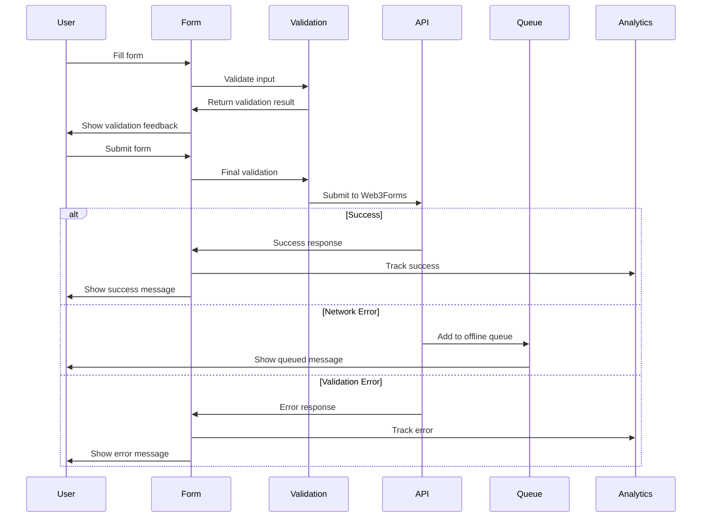
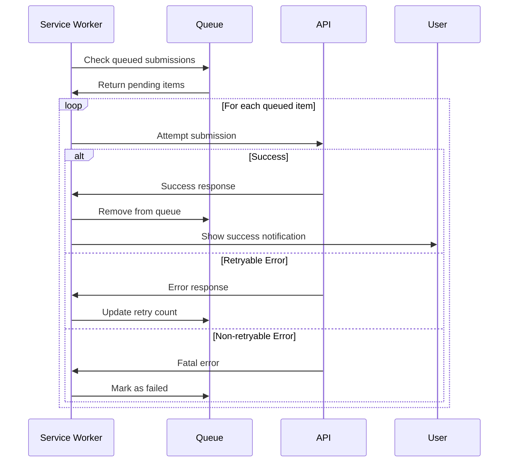

# Data Model: Web3Forms Integration

## Core Data Structures

### 1. Contact Form Schema

```typescript
// src/schemas/contact.schema.ts

import { z } from 'zod';

/**
 * Primary contact form validation schema
 * Follows existing form validation patterns in the codebase
 */
export const contactSchema = z.object({
  name: z
    .string()
    .min(2, 'Name must be at least 2 characters')
    .max(100, 'Name must be less than 100 characters')
    .regex(/^[a-zA-Z\s\-'\.]+$/, 'Name contains invalid characters')
    .transform((str) => str.trim()),

  email: z
    .string()
    .email('Please enter a valid email address')
    .max(254, 'Email address is too long')
    .transform((str) => str.toLowerCase().trim()),

  subject: z
    .string()
    .min(5, 'Subject must be at least 5 characters')
    .max(200, 'Subject must be less than 200 characters')
    .transform((str) => str.trim()),

  message: z
    .string()
    .min(10, 'Message must be at least 10 characters')
    .max(5000, 'Message must be less than 5000 characters')
    .transform((str) => str.trim()),

  // Honeypot field for spam protection (should remain empty)
  _gotcha: z.string().max(0, 'Bot detected').optional(),
});

/**
 * TypeScript type derived from schema
 */
export type ContactFormData = z.infer<typeof contactSchema>;

/**
 * Form data for Web3Forms API submission
 * Includes required Web3Forms fields
 */
export interface Web3FormsSubmission extends ContactFormData {
  access_key: string;
  from_name?: string;
  _replyto?: string;
  _template?: string;
  _next?: string;
  _cc?: string;
}

/**
 * Sanitized form data ready for submission
 */
export interface SanitizedFormData {
  name: string;
  email: string;
  subject: string;
  message: string;
  metadata: {
    timestamp: number;
    userAgent: string;
    referrer: string;
    formVersion: string;
  };
}
```

### 2. Web3Forms API Types

```typescript
// src/types/web3forms.types.ts

/**
 * Web3Forms API response structure
 */
export interface Web3FormsResponse {
  success: boolean;
  message: string;
  data?: {
    access_key: string;
    from_name: string;
    from_email: string;
    date: string;
    subject: string;
    message: string;
    ip?: string;
    user_agent?: string;
  };
}

/**
 * Web3Forms API error response
 */
export interface Web3FormsError {
  success: false;
  message: string;
  errors?: {
    field: string;
    message: string;
  }[];
}

/**
 * Web3Forms configuration
 */
export interface Web3FormsConfig {
  accessKey: string;
  apiUrl: string;
  timeout: number;
  retryAttempts: number;
  retryDelay: number;
}

/**
 * Default configuration
 */
export const DEFAULT_WEB3FORMS_CONFIG: Web3FormsConfig = {
  accessKey: process.env.NEXT_PUBLIC_WEB3FORMS_ACCESS_KEY || '',
  apiUrl: 'https://api.web3forms.com/submit',
  timeout: 10000, // 10 seconds
  retryAttempts: 3,
  retryDelay: 1000, // 1 second base delay
};
```

### 3. Form Submission State

```typescript
// src/hooks/useWeb3Forms.ts

/**
 * Form submission states
 */
export enum SubmissionStatus {
  IDLE = 'idle',
  VALIDATING = 'validating',
  SUBMITTING = 'submitting',
  SUCCESS = 'success',
  ERROR = 'error',
  RETRYING = 'retrying',
  QUEUED = 'queued', // For offline submissions
}

/**
 * Error types for form submission
 */
export enum FormErrorType {
  VALIDATION = 'validation',
  NETWORK = 'network',
  RATE_LIMIT = 'rate_limit',
  SPAM_DETECTED = 'spam_detected',
  SERVER_ERROR = 'server_error',
  TIMEOUT = 'timeout',
  UNKNOWN = 'unknown',
}

/**
 * Form error details
 */
export interface FormError {
  type: FormErrorType;
  message: string;
  details?: unknown;
  retryable: boolean;
  userMessage: string;
  timestamp: number;
}

/**
 * Form submission state
 */
export interface FormSubmissionState {
  status: SubmissionStatus;
  isSubmitting: boolean;
  isSuccess: boolean;
  isError: boolean;
  isRetrying: boolean;
  error: FormError | null;
  retryCount: number;
  submissionId?: string;
  submittedAt?: number;
}

/**
 * Default form submission state
 */
export const DEFAULT_SUBMISSION_STATE: FormSubmissionState = {
  status: SubmissionStatus.IDLE,
  isSubmitting: false,
  isSuccess: false,
  isError: false,
  isRetrying: false,
  error: null,
  retryCount: 0,
};
```

### 4. Offline Queue Management

```typescript
// src/utils/offline-queue.types.ts

/**
 * Queued form submission for offline support
 */
export interface QueuedSubmission {
  id: string;
  formData: ContactFormData;
  timestamp: number;
  retryCount: number;
  maxRetries: number;
  nextRetryAt: number;
  createdAt: number;
  status: QueuedSubmissionStatus;
}

/**
 * Queued submission status
 */
export enum QueuedSubmissionStatus {
  PENDING = 'pending',
  RETRYING = 'retrying',
  FAILED = 'failed',
  EXPIRED = 'expired',
}

/**
 * Queue metadata
 */
export interface SubmissionQueue {
  submissions: QueuedSubmission[];
  lastProcessedAt: number;
  totalSubmissions: number;
  successfulSubmissions: number;
  failedSubmissions: number;
}

/**
 * Queue configuration
 */
export interface QueueConfig {
  maxQueueSize: number;
  maxRetries: number;
  retryInterval: number;
  expirationTime: number; // How long to keep failed submissions
  storageKey: string;
}

/**
 * Default queue configuration
 */
export const DEFAULT_QUEUE_CONFIG: QueueConfig = {
  maxQueueSize: 100,
  maxRetries: 5,
  retryInterval: 60000, // 1 minute
  expirationTime: 86400000, // 24 hours
  storageKey: 'contact-form-queue',
};
```

### 5. Form Draft System

```typescript
// src/utils/form-drafts.types.ts

/**
 * Form draft for auto-save functionality
 */
export interface FormDraft {
  id: string;
  formData: Partial<ContactFormData>;
  createdAt: number;
  updatedAt: number;
  expiresAt: number;
  version: string;
}

/**
 * Draft manager state
 */
export interface DraftState {
  currentDraft: FormDraft | null;
  hasDraft: boolean;
  isAutoSaving: boolean;
  lastSavedAt: number | null;
}

/**
 * Draft configuration
 */
export interface DraftConfig {
  autoSaveInterval: number; // How often to auto-save (ms)
  maxDraftAge: number; // How long to keep drafts (ms)
  storageKey: string;
  minFieldsForDraft: number; // Minimum fields filled to save draft
}

/**
 * Default draft configuration
 */
export const DEFAULT_DRAFT_CONFIG: DraftConfig = {
  autoSaveInterval: 10000, // 10 seconds
  maxDraftAge: 86400000, // 24 hours
  storageKey: 'contact-form-draft',
  minFieldsForDraft: 2, // Need at least name + email or name + message
};
```

### 6. Analytics & Tracking Types

```typescript
// src/utils/form-analytics.types.ts

/**
 * Form interaction events for analytics
 */
export enum FormAnalyticsEvent {
  FORM_STARTED = 'form_started',
  FIELD_FOCUSED = 'field_focused',
  FIELD_COMPLETED = 'field_completed',
  VALIDATION_ERROR = 'validation_error',
  FORM_SUBMITTED = 'form_submitted',
  SUBMISSION_SUCCESS = 'submission_success',
  SUBMISSION_ERROR = 'submission_error',
  DRAFT_SAVED = 'draft_saved',
  DRAFT_RESTORED = 'draft_restored',
  RETRY_ATTEMPTED = 'retry_attempted',
}

/**
 * Analytics event data
 */
export interface FormAnalyticsData {
  event: FormAnalyticsEvent;
  timestamp: number;
  formId: string;
  fieldName?: string;
  errorType?: FormErrorType;
  retryCount?: number;
  submissionTime?: number;
  validationErrors?: string[];
  metadata?: Record<string, any>;
}

/**
 * Form performance metrics
 */
export interface FormPerformanceMetrics {
  formLoadTime: number;
  firstFieldFocusTime: number;
  formCompletionTime: number;
  submissionResponseTime: number;
  validationCount: number;
  retryCount: number;
  abandonmentPoint?: string; // Which field user left on
}
```

### 7. Rate Limiting Types

```typescript
// src/utils/rate-limiting.types.ts

/**
 * Rate limiting configuration
 */
export interface RateLimitConfig {
  maxSubmissions: number;
  timeWindow: number; // Time window in milliseconds
  storageKey: string;
  blockDuration: number; // How long to block after limit exceeded
}

/**
 * Rate limit state
 */
export interface RateLimitState {
  submissions: number[];
  isBlocked: boolean;
  blockExpiresAt: number | null;
  remainingSubmissions: number;
  resetTime: number;
}

/**
 * Default rate limit configuration
 */
export const DEFAULT_RATE_LIMIT_CONFIG: RateLimitConfig = {
  maxSubmissions: 5,
  timeWindow: 300000, // 5 minutes
  storageKey: 'contact-form-rate-limit',
  blockDuration: 900000, // 15 minutes
};
```

### 8. Component Props Interfaces

```typescript
// src/components/forms/ContactForm/ContactForm.types.ts

/**
 * ContactForm component props
 */
export interface ContactFormProps {
  /** Custom CSS classes */
  className?: string;
  /** Callback when form is successfully submitted */
  onSuccess?: (data: ContactFormData) => void;
  /** Callback when form submission fails */
  onError?: (error: FormError) => void;
  /** Initial form data */
  initialData?: Partial<ContactFormData>;
  /** Whether to show success message inline */
  showInlineSuccess?: boolean;
  /** Whether to enable auto-save drafts */
  enableDrafts?: boolean;
  /** Whether to track analytics */
  enableAnalytics?: boolean;
  /** Custom submit button text */
  submitButtonText?: string;
  /** Additional form fields (for future extension) */
  additionalFields?: React.ReactNode;
}

/**
 * Form field configuration
 */
export interface FormFieldConfig {
  name: keyof ContactFormData;
  label: string;
  type: string;
  placeholder?: string;
  required: boolean;
  helpText?: string;
  maxLength?: number;
  rows?: number; // For textarea
}

/**
 * Complete form configuration
 */
export const CONTACT_FORM_FIELDS: FormFieldConfig[] = [
  {
    name: 'name',
    label: 'Full Name',
    type: 'text',
    placeholder: 'Enter your full name',
    required: true,
    helpText: 'Your first and last name',
    maxLength: 100,
  },
  {
    name: 'email',
    label: 'Email Address',
    type: 'email',
    placeholder: 'Enter your email address',
    required: true,
    helpText: 'We will use this to respond to your message',
    maxLength: 254,
  },
  {
    name: 'subject',
    label: 'Subject',
    type: 'text',
    placeholder: 'Brief description of your inquiry',
    required: true,
    helpText: 'What is your message about?',
    maxLength: 200,
  },
  {
    name: 'message',
    label: 'Message',
    type: 'textarea',
    placeholder: 'Enter your message here...',
    required: true,
    helpText: 'Please provide details about your inquiry',
    rows: 6,
    maxLength: 5000,
  },
];
```

### 9. Storage Schema

```typescript
// src/utils/storage.types.ts

/**
 * localStorage schema for form-related data
 */
export interface ContactFormStorageSchema {
  'contact-form-draft': FormDraft | null;
  'contact-form-queue': SubmissionQueue;
  'contact-form-rate-limit': RateLimitState;
  'contact-form-analytics': FormAnalyticsData[];
  'contact-form-preferences': FormPreferences;
}

/**
 * User preferences for contact form
 */
export interface FormPreferences {
  enableDrafts: boolean;
  enableAnalytics: boolean;
  notificationPreferences: {
    showSuccessToast: boolean;
    showErrorToast: boolean;
    showOfflineNotice: boolean;
  };
  accessibilityPreferences: {
    highContrast: boolean;
    announceValidation: boolean;
    extendedTimeout: boolean;
  };
}

/**
 * Storage keys enum for type safety
 */
export enum FormStorageKey {
  DRAFT = 'contact-form-draft',
  QUEUE = 'contact-form-queue',
  RATE_LIMIT = 'contact-form-rate-limit',
  ANALYTICS = 'contact-form-analytics',
  PREFERENCES = 'contact-form-preferences',
}
```

### 10. Validation Schemas

```typescript
// src/schemas/form-validation.schemas.ts

/**
 * Email validation with enhanced checks
 */
export const emailSchema = z
  .string()
  .email('Please enter a valid email address')
  .max(254, 'Email address is too long')
  .refine(
    (email) => {
      // Additional email validation
      const domain = email.split('@')[1];
      return domain && !domain.includes('..');
    },
    { message: 'Invalid email domain' }
  );

/**
 * Name validation with internationalization support
 */
export const nameSchema = z
  .string()
  .min(2, 'Name must be at least 2 characters')
  .max(100, 'Name must be less than 100 characters')
  .regex(
    /^[a-zA-Z\u00C0-\u017F\u0100-\u024F\u1E00-\u1EFF\s\-'\.]+$/,
    'Name contains invalid characters'
  );

/**
 * Message validation with content filtering
 */
export const messageSchema = z
  .string()
  .min(10, 'Message must be at least 10 characters')
  .max(5000, 'Message must be less than 5000 characters')
  .refine(
    (message) => {
      // Basic spam detection - no excessive repeated characters
      return !/(.)\1{10,}/.test(message);
    },
    { message: 'Message appears to be spam' }
  )
  .refine(
    (message) => {
      // No excessive URLs
      const urlCount = (message.match(/https?:\/\/\S+/g) || []).length;
      return urlCount <= 2;
    },
    { message: 'Too many URLs in message' }
  );
```

## Data Flow Diagrams

### Form Submission Flow



### Offline Queue Processing



## Migration Strategy

### Version 1.0.0 → 2.0.0

```typescript
/**
 * Migrate legacy form data structures
 */
export const migrateFormData = (legacyData: any): ContactFormData => {
  return {
    name: legacyData.name || legacyData.fullName || '',
    email: legacyData.email || legacyData.emailAddress || '',
    subject: legacyData.subject || legacyData.topic || 'General Inquiry',
    message: legacyData.message || legacyData.content || legacyData.body || '',
  };
};

/**
 * Migrate queue format
 */
export const migrateQueue = (legacyQueue: any[]): SubmissionQueue => {
  const submissions = legacyQueue.map((item) => ({
    id: item.id || crypto.randomUUID(),
    formData: migrateFormData(item.data || item),
    timestamp: item.timestamp || Date.now(),
    retryCount: item.retryCount || 0,
    maxRetries: DEFAULT_QUEUE_CONFIG.maxRetries,
    nextRetryAt: item.nextRetryAt || Date.now(),
    createdAt: item.createdAt || item.timestamp || Date.now(),
    status: item.status || QueuedSubmissionStatus.PENDING,
  }));

  return {
    submissions,
    lastProcessedAt: Date.now(),
    totalSubmissions: submissions.length,
    successfulSubmissions: 0,
    failedSubmissions: submissions.filter(
      (s) => s.status === QueuedSubmissionStatus.FAILED
    ).length,
  };
};
```

---

Data model completed: 2025-09-15
Next: Generate contracts/ directory and API specifications
