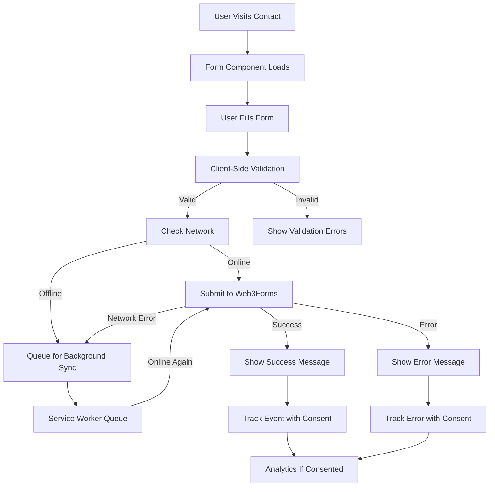

# Implementation Plan: Web3Forms Email Integration

## Overview

This plan outlines the implementation of a serverless contact form integration using Web3Forms as the email provider. The feature will provide secure form submission with comprehensive validation, error handling, and privacy-conscious analytics tracking, all integrated with the existing consent management system.

## Architecture Overview



## Implementation Phases

### Phase 1: Core Infrastructure (Day 1, Hours 1-3)

**Goal**: Establish the foundation for form submission and validation

1. **Create form schema** (`src/schemas/contact.schema.ts`)
   - Zod validation schema for all form fields
   - Type-safe form data interfaces
   - Validation rules and error messages
   - Sanitization utilities

2. **Implement Web3Forms utilities** (`src/utils/web3forms.ts`)
   - API submission function with retry logic
   - Response parsing and error handling
   - Rate limiting protection
   - Honeypot spam protection

3. **Build custom hook** (`src/hooks/useWeb3Forms.ts`)
   - Form submission state management
   - Integration with useFormValidation
   - Success/error callback handling
   - Loading states and user feedback

### Phase 2: Contact Form Component (Day 1, Hours 3-6)

**Goal**: Create the user-facing contact form interface

1. **Generate ContactForm component**

   ```bash
   # Use component generator for 4-file structure
   docker compose exec scripthammer pnpm run generate:component
   # Select: forms
   # Name: ContactForm
   # Path: forms/ContactForm
   ```

2. **Implement ContactForm component** (`src/components/forms/ContactForm/`)
   - Form layout with accessibility features
   - Integration with existing FormField components
   - Real-time validation feedback
   - Loading states and submit button management
   - Success/error message display

3. **Create contact page** (`src/app/contact/page.tsx`)
   - Page layout with ContactForm
   - SEO metadata for contact page
   - Responsive design implementation
   - Navigation breadcrumbs

### Phase 3: PWA & Offline Support (Day 1, Hours 6-7)

**Goal**: Enable offline form submission with background sync

1. **Update Service Worker** (`public/sw.js`)
   - Background sync registration for forms
   - Failed submission queuing
   - Retry logic for offline submissions
   - Success notification when sync completes

2. **Implement offline detection**
   - Network status monitoring
   - User feedback for offline state
   - Queue status display
   - Manual retry options

### Phase 4: Integration & Privacy (Day 2, Hours 1-2)

**Goal**: Connect with existing systems and ensure privacy compliance

1. **Analytics Integration**
   - Form interaction tracking (with consent)
   - Submission success/failure events
   - Validation error tracking
   - Performance metrics

2. **Consent System Integration**
   - Check analytics consent before tracking
   - Respect functional cookie preferences
   - Privacy-first form handling
   - GDPR compliance verification

### Phase 5: Testing & Documentation (Day 2, Hours 2-4)

**Goal**: Comprehensive testing and user documentation

1. **Unit & Integration Tests**
   - Form validation testing
   - Submission flow testing
   - Error handling verification
   - Accessibility testing

2. **E2E Testing**
   - Complete form submission flow
   - Offline submission scenarios
   - Error recovery testing
   - Cross-browser compatibility

3. **Documentation**
   - Usage instructions
   - Web3Forms setup guide
   - Troubleshooting guide
   - Security considerations

## Technical Decisions

### Form Architecture

- **React Hook Form + Zod**: Leveraging existing patterns for consistency
- **Atomic Components**: Reusing FormField and FormError components
- **Progressive Enhancement**: Works without JavaScript for basic submission
- **TypeScript First**: Full type safety throughout the form flow

### Submission Strategy

- **Client-Side Validation**: Immediate feedback with Zod schemas
- **Server-Side Backup**: Web3Forms handles final validation
- **Retry Logic**: Exponential backoff for failed submissions
- **Spam Protection**: Honeypot fields and rate limiting

### PWA Integration

- **Background Sync**: Queue submissions when offline
- **Notification API**: Alert users when queued submissions complete
- **Storage API**: Persist form drafts locally
- **Service Worker**: Handle all background processing

### Security Measures

| Layer     | Implementation           | Purpose                |
| --------- | ------------------------ | ---------------------- |
| Client    | Input sanitization       | Prevent XSS            |
| Transport | HTTPS only               | Secure transmission    |
| API       | Web3Forms validation     | Server-side validation |
| Spam      | Honeypot + rate limiting | Prevent abuse          |

## Performance Targets

- Form render: < 200ms
- Validation feedback: < 100ms
- Submission response: < 3 seconds
- Bundle size impact: < 8KB (excluding existing deps)
- Offline queue: 100 submissions max

## Testing Strategy

### Unit Tests

- Form validation schemas
- Web3Forms utility functions
- useWeb3Forms hook behavior
- Component rendering and interactions

### Integration Tests

- Form submission end-to-end
- Offline queue functionality
- Analytics tracking with consent
- Error handling scenarios

### Accessibility Tests

- Keyboard navigation
- Screen reader compatibility
- Form field associations
- Error message announcements

### Performance Tests

- Form interaction metrics
- Validation performance
- Submission time tracking
- Bundle size analysis

## Risk Mitigation

| Risk             | Impact | Mitigation                            |
| ---------------- | ------ | ------------------------------------- |
| API key exposure | Low    | Web3Forms designed for public keys    |
| Spam submissions | Medium | Honeypot + rate limiting + validation |
| Network failures | Medium | Retry logic + offline queue           |
| Form abandonment | Low    | Auto-save drafts + restore            |
| CSP violations   | High   | Configure headers for Web3Forms       |

## Dependencies

### External Dependencies

- Web3Forms account and access key
- Existing react-hook-form and zod packages
- Consent system (PRP-007) ✅ Completed

### Internal Dependencies

- FormField and FormError components ✅ Available
- useFormValidation hook ✅ Available
- ConsentContext ✅ Available
- Service Worker infrastructure ✅ Available

### Environment Requirements

- `NEXT_PUBLIC_WEB3FORMS_ACCESS_KEY` environment variable
- Web3Forms account configured with proper settings

## Success Metrics

### Technical Metrics

- [ ] 100% TypeScript coverage
- [ ] Zero accessibility violations
- [ ] < 5% performance impact
- [ ] 95%+ test coverage

### Business Metrics

- [ ] Forms submit successfully
- [ ] Validation prevents invalid data
- [ ] Offline submissions work
- [ ] Error recovery functional

### User Experience Metrics

- [ ] Clear validation feedback
- [ ] Responsive design working
- [ ] Loading states informative
- [ ] Success/error messages helpful

## Timeline

**Estimated Duration**: 10-12 hours (1.5 days)

| Phase                   | Duration | Deliverables              |
| ----------------------- | -------- | ------------------------- |
| Core Infrastructure     | 3 hours  | Schema, utilities, hook   |
| Contact Form Component  | 3 hours  | Form UI, validation, page |
| PWA & Offline Support   | 1 hour   | Service worker, sync      |
| Integration & Privacy   | 2 hours  | Analytics, consent        |
| Testing & Documentation | 3 hours  | Tests, docs, guides       |

## Security Considerations

### Data Protection

- **No sensitive data storage**: Form data not persisted locally
- **HTTPS enforcement**: All submissions over secure connections
- **Input sanitization**: Prevent injection attacks
- **Rate limiting**: Prevent abuse and spam

### Privacy Compliance

- **Consent integration**: Respect user privacy choices
- **Minimal data collection**: Only necessary form fields
- **Transparent usage**: Clear privacy policy references
- **User control**: Easy opt-out mechanisms

## Next Steps

After plan approval:

1. Execute `/tasks` to generate detailed task breakdown
2. Set up Web3Forms account and obtain access key
3. Begin TDD implementation with schema and utilities
4. Progress through phases with continuous testing
5. Document setup process for future developers

---

Generated: 2025-09-15
PRP: 009-web3forms-integration
Phase: 2 - Forms & Integrations
