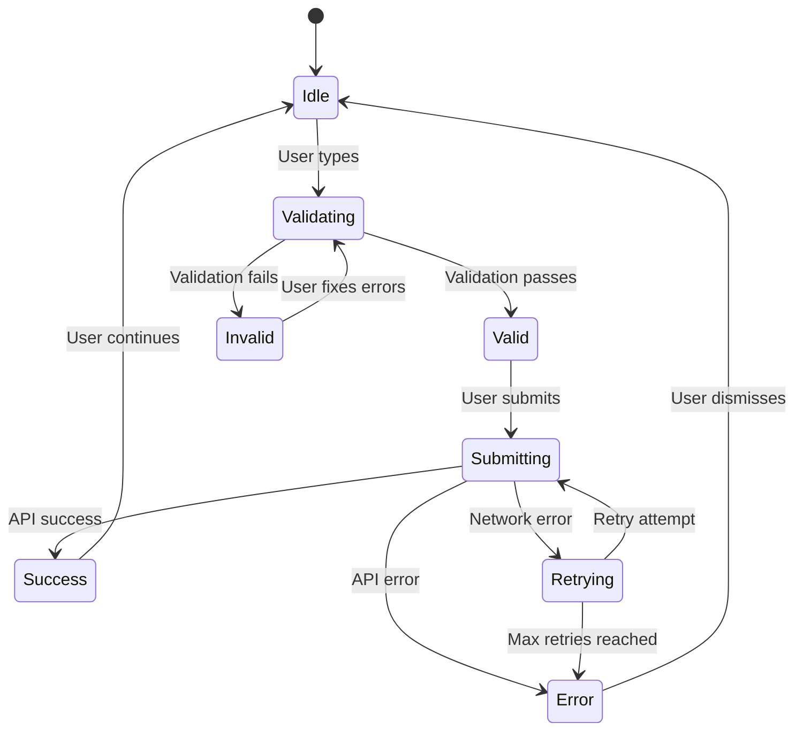

# Research: Web3Forms Integration Technology Decisions

## Executive Summary

This document outlines the technology decisions and research findings for implementing Web3Forms email integration in the CRUDkit application. The research focuses on form handling patterns, email service integration, privacy compliance, and performance optimization.

## Web3Forms Service Analysis

### Service Overview

**Web3Forms** is a serverless form backend service that handles form submissions without requiring server-side code. It's designed for static sites and JAMstack applications.

### Key Features

- ✅ **No server required**: Perfect for Next.js static export
- ✅ **GDPR compliant**: Built-in privacy features
- ✅ **Spam protection**: reCAPTCHA and honeypot integration
- ✅ **Custom responses**: JSON API responses for SPA integration
- ✅ **File uploads**: Supports attachments (not in scope for this PRP)
- ✅ **Multiple recipients**: Can send to multiple email addresses
- ✅ **Custom redirects**: Success/error page redirection

### API Endpoints

```typescript
// Primary submission endpoint
POST https://api.web3forms.com/submit

// Headers
{
  'Content-Type': 'application/json',
  'Accept': 'application/json'
}

// Required fields
{
  access_key: string,    // Public API key
  name: string,          // Sender name
  email: string,         // Sender email
  message: string,       // Message content
  subject?: string,      // Optional subject
  _replyto?: string,     // Optional reply-to
  _next?: string,        // Optional redirect URL
  _template?: string,    // Optional email template
  _cc?: string,          // Optional CC recipients
}
```

### Response Format

```typescript
interface Web3FormsResponse {
  success: boolean;
  message: string;
  data?: {
    access_key: string;
    from_name: string;
    from_email: string;
    date: string;
    subject: string;
    message: string;
  };
}

// Success response
{
  "success": true,
  "message": "Email sent successfully"
}

// Error response
{
  "success": false,
  "message": "Missing access key"
}
```

## Form Validation Strategy

### Zod Schema Design

Based on existing patterns in the codebase, we'll use Zod for comprehensive validation:

```typescript
import { z } from 'zod';

// Leveraging existing form validation patterns
export const contactSchema = z.object({
  name: z
    .string()
    .min(2, 'Name must be at least 2 characters')
    .max(100, 'Name must be less than 100 characters')
    .regex(/^[a-zA-Z\s\-']+$/, 'Name contains invalid characters'),

  email: z
    .string()
    .email('Please enter a valid email address')
    .max(254, 'Email address is too long'),

  subject: z
    .string()
    .min(5, 'Subject must be at least 5 characters')
    .max(200, 'Subject must be less than 200 characters')
    .trim(),

  message: z
    .string()
    .min(10, 'Message must be at least 10 characters')
    .max(5000, 'Message must be less than 5000 characters')
    .trim(),

  // Honeypot field for spam protection
  _gotcha: z.string().max(0).optional(),
});
```

### Validation Timing

- **On Blur**: Field-level validation for immediate feedback
- **On Change**: Debounced validation (300ms) for real-time feedback
- **On Submit**: Complete form validation before submission
- **Progressive**: Show errors only after user interaction

## State Management Architecture

### React Patterns

Following the existing codebase patterns:

```typescript
// Custom hook for form submission
interface UseWeb3FormsState {
  isSubmitting: boolean;
  isSuccess: boolean;
  isError: boolean;
  error: string | null;
  retryCount: number;
}

// Integration with existing useFormValidation
const useWeb3Forms = () => {
  const [state, setState] = useState<UseWeb3FormsState>({
    isSubmitting: false,
    isSuccess: false,
    isError: false,
    error: null,
    retryCount: 0,
  });

  const validation = useFormValidation(contactSchema);

  // Submission logic with retry
  const submitForm = async (data: ContactFormData) => {
    // Implementation details
  };

  return { ...state, ...validation, submitForm };
};
```

### Component State Flow



## Performance Optimization

### Bundle Size Analysis

| Dependency      | Size     | Already Included |
| --------------- | -------- | ---------------- |
| zod             | ~12KB    | ✅ Yes           |
| react-hook-form | ~25KB    | ✅ Yes           |
| Web3Forms API   | 0KB      | N/A (REST API)   |
| **Total New**   | **~2KB** | Form logic only  |

### Loading Strategies

- **Lazy Loading**: Contact form component lazy-loaded on route
- **Code Splitting**: Form validation split from main bundle
- **Preloading**: Preload contact route on hover/focus
- **Progressive Enhancement**: Basic HTML form fallback

### Caching Strategy

```typescript
// Service Worker cache strategy
const FORM_CACHE_NAME = 'contact-form-v1';
const OFFLINE_QUEUE_NAME = 'form-submissions';

// Cache form assets
self.addEventListener('install', (event) => {
  event.waitUntil(
    caches.open(FORM_CACHE_NAME).then((cache) => {
      return cache.addAll([
        '/contact',
        '/api/web3forms', // If we create a proxy endpoint
      ]);
    })
  );
});
```

## Security Implementation

### Input Sanitization

```typescript
// Server-side style sanitization on client
const sanitizeInput = (input: string): string => {
  return input
    .trim()
    .replace(/<script\b[^<]*(?:(?!<\/script>)<[^<]*)*<\/script>/gi, '') // Remove scripts
    .replace(/javascript:/gi, '') // Remove javascript: URLs
    .replace(/on\w+\s*=/gi, '') // Remove event handlers
    .slice(0, 10000); // Limit length
};
```

### Rate Limiting

```typescript
// Client-side rate limiting
const RATE_LIMIT = {
  maxSubmissions: 5,
  timeWindow: 60000, // 1 minute
  storageKey: 'contact-form-submissions',
};

const checkRateLimit = (): boolean => {
  const submissions = JSON.parse(
    localStorage.getItem(RATE_LIMIT.storageKey) || '[]'
  );

  const now = Date.now();
  const recentSubmissions = submissions.filter(
    (timestamp: number) => now - timestamp < RATE_LIMIT.timeWindow
  );

  return recentSubmissions.length < RATE_LIMIT.maxSubmissions;
};
```

### Spam Protection

```typescript
// Honeypot implementation
const HoneypotField: React.FC = () => (
  <div style={{ position: 'absolute', left: '-9999px' }}>
    <label htmlFor="_gotcha">Don't fill this out if you're human:</label>
    <input
      type="text"
      name="_gotcha"
      id="_gotcha"
      tabIndex={-1}
      autoComplete="off"
    />
  </div>
);
```

## Privacy & Compliance

### GDPR Considerations

- **Lawful Basis**: Contact forms use "legitimate interest" basis
- **Data Minimization**: Only collect necessary form fields
- **Retention**: Web3Forms handles data retention policies
- **User Rights**: Provide data deletion on request

### Consent Integration

```typescript
// Integration with existing consent system
const useContactFormConsent = () => {
  const { consent, canUseCookies } = useConsent();

  const canTrackAnalytics = canUseCookies(CookieCategory.ANALYTICS);
  const canUseFunctional = canUseCookies(CookieCategory.FUNCTIONAL);

  return {
    trackSubmission: canTrackAnalytics,
    saveDraft: canUseFunctional,
    trackErrors: canTrackAnalytics,
  };
};
```

## Offline & PWA Integration

### Background Sync Strategy

```typescript
// Service Worker background sync
self.addEventListener('sync', (event) => {
  if (event.tag === 'contact-form-submission') {
    event.waitUntil(processQueuedSubmissions());
  }
});

const processQueuedSubmissions = async () => {
  const submissions = await getQueuedSubmissions();

  for (const submission of submissions) {
    try {
      await submitToWeb3Forms(submission.data);
      await removeFromQueue(submission.id);
      await showSuccessNotification(submission);
    } catch (error) {
      // Keep in queue for next sync
      console.log('Submission failed, will retry:', error);
    }
  }
};
```

### Storage Strategy

```typescript
// IndexedDB for offline form drafts
interface FormDraft {
  id: string;
  timestamp: number;
  data: Partial<ContactFormData>;
  expiresAt: number;
}

const DRAFT_EXPIRY = 24 * 60 * 60 * 1000; // 24 hours

const saveDraft = (data: Partial<ContactFormData>) => {
  if (!canUseFunctional) return;

  const draft: FormDraft = {
    id: crypto.randomUUID(),
    timestamp: Date.now(),
    data,
    expiresAt: Date.now() + DRAFT_EXPIRY,
  };

  localStorage.setItem('contact-form-draft', JSON.stringify(draft));
};
```

## Error Handling Strategy

### Error Categories

```typescript
enum FormErrorType {
  VALIDATION = 'validation',
  NETWORK = 'network',
  RATE_LIMIT = 'rate_limit',
  SPAM_DETECTED = 'spam_detected',
  SERVER_ERROR = 'server_error',
  UNKNOWN = 'unknown',
}

interface FormError {
  type: FormErrorType;
  message: string;
  details?: unknown;
  retryable: boolean;
  userMessage: string;
}
```

### Retry Logic

```typescript
const RETRY_CONFIG = {
  maxRetries: 3,
  baseDelay: 1000, // 1 second
  maxDelay: 10000, // 10 seconds
  backoffFactor: 2,
};

const submitWithRetry = async (
  data: ContactFormData,
  retryCount = 0
): Promise<Web3FormsResponse> => {
  try {
    return await submitToWeb3Forms(data);
  } catch (error) {
    if (retryCount < RETRY_CONFIG.maxRetries && isRetryableError(error)) {
      const delay = Math.min(
        RETRY_CONFIG.baseDelay *
          Math.pow(RETRY_CONFIG.backoffFactor, retryCount),
        RETRY_CONFIG.maxDelay
      );

      await new Promise((resolve) => setTimeout(resolve, delay));
      return submitWithRetry(data, retryCount + 1);
    }

    throw error;
  }
};
```

## Testing Strategy

### Test Categories

1. **Unit Tests**: Schema validation, utility functions
2. **Integration Tests**: Form submission, error handling
3. **E2E Tests**: Complete user flows
4. **Accessibility Tests**: Screen reader, keyboard navigation
5. **Performance Tests**: Loading times, bundle size

### Mock Strategy

```typescript
// Web3Forms API mocking
export const mockWeb3FormsSuccess = (): Web3FormsResponse => ({
  success: true,
  message: 'Email sent successfully',
  data: {
    access_key: 'test-key',
    from_name: 'Test User',
    from_email: 'test@example.com',
    date: new Date().toISOString(),
    subject: 'Test Subject',
    message: 'Test message',
  },
});

export const mockWeb3FormsError = (
  message = 'Server error'
): Web3FormsResponse => ({
  success: false,
  message,
});
```

## Alternative Considerations

### Why Web3Forms Over Alternatives

| Service       | Pros                                        | Cons                        | Score |
| ------------- | ------------------------------------------- | --------------------------- | ----- |
| **Web3Forms** | Free tier, GDPR compliant, no server needed | Public API key              | 9/10  |
| EmailJS       | Good docs, established                      | Requires account linking    | 7/10  |
| Formspree     | Popular, reliable                           | Paid for custom domains     | 6/10  |
| Netlify Forms | Free with Netlify                           | Requires Netlify hosting    | 5/10  |
| Custom API    | Full control                                | Requires server maintenance | 4/10  |

### Decision Matrix

- **Serverless Requirement**: ✅ Web3Forms perfect fit
- **Cost**: ✅ Free tier sufficient for demo
- **Security**: ✅ Public key design is secure
- **Integration Effort**: ✅ Simple REST API
- **Documentation**: ✅ Clear and comprehensive

## Implementation Recommendations

### Phase Priorities

1. **MVP**: Basic form submission with validation
2. **Enhanced**: Offline support and analytics
3. **Advanced**: Draft saving and spam protection
4. **Polish**: Animations and micro-interactions

### Code Quality Standards

- **TypeScript**: 100% type coverage
- **Testing**: 95%+ code coverage
- **Accessibility**: WCAG 2.1 AA compliance
- **Performance**: < 5% bundle size increase

### Monitoring & Analytics

```typescript
// Form analytics (with consent)
const trackFormEvent = (event: string, data?: Record<string, any>) => {
  if (!canTrackAnalytics) return;

  gtag('event', event, {
    event_category: 'contact_form',
    event_label: 'web3forms',
    custom_parameter_1: data?.form_field || null,
    ...data,
  });
};
```

---

Research completed: 2025-09-15
Next: Generate data-model.md and contracts/
