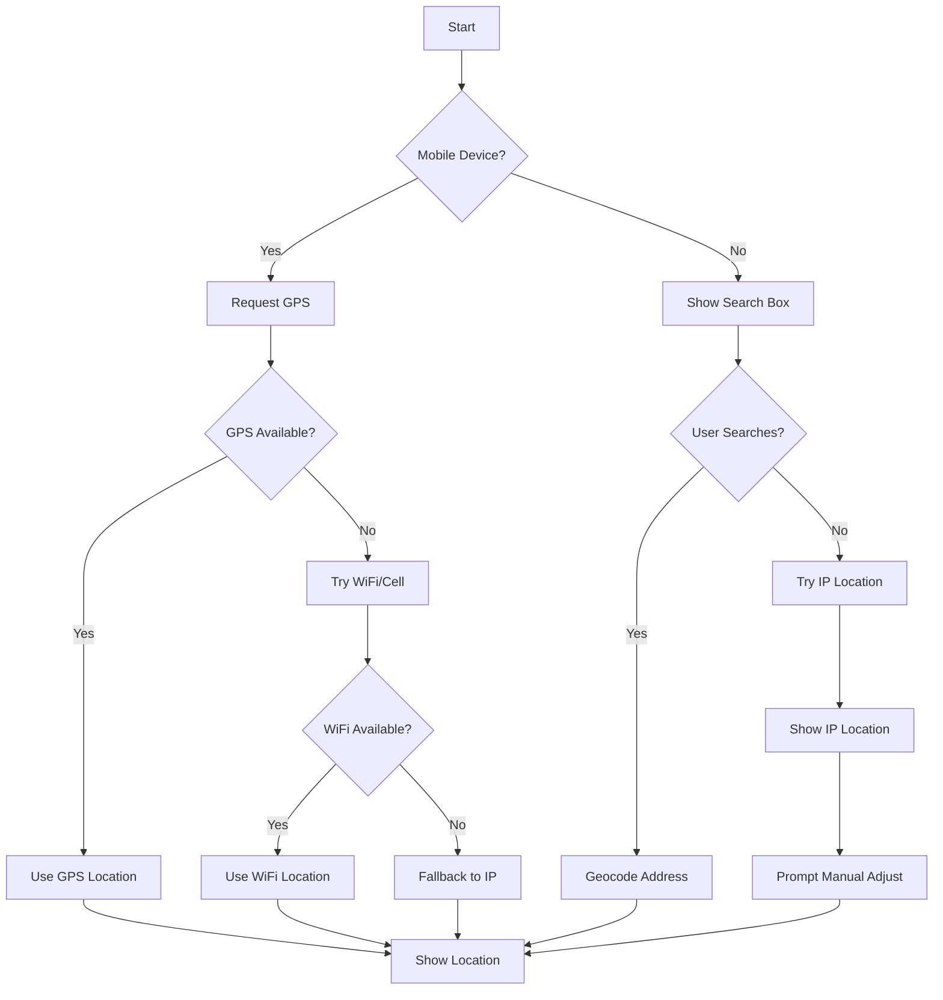

# PRP-015: Enhanced Geolocation Accuracy Constitution

## Executive Summary

This constitution defines the enhanced geolocation feature that addresses accuracy limitations of browser-based geolocation, particularly for desktop users, while maintaining optimal mobile experiences. The implementation follows a hybrid approach with multiple fallback strategies.

## Problem Statement

Current browser geolocation on desktop computers relies primarily on IP-based location services, which provide only 50-75% accuracy at city level. Users may appear "several cities away" from their actual location. Mobile devices with GPS don't face this issue but need optimization for battery efficiency.

## Core Principles

1. **Platform-Appropriate Strategies** - Different approaches for mobile vs desktop
2. **Progressive Enhancement** - Start with basic, add advanced features
3. **User Control** - Always allow manual correction
4. **Transparency** - Show accuracy level and location source
5. **Privacy First** - GDPR compliant with clear consent

## Technical Architecture

### Location Strategy Chain

```typescript
enum LocationSource {
  GPS = 'gps', // Mobile GPS (±5-10m)
  WIFI = 'wifi', // WiFi positioning (±20-100m)
  CELL = 'cell', // Cell tower (±100-1000m)
  IP = 'ip', // IP geolocation (±1-50km)
  MANUAL = 'manual', // User input (exact)
  SEARCH = 'search', // Address search (exact)
}

interface LocationStrategy {
  source: LocationSource;
  accuracy: number; // meters
  confidence: number; // 0-1
  timestamp: Date;
}
```

### Platform Detection & Strategy Selection

```typescript
interface PlatformStrategy {
  mobile: {
    primary: 'gps';
    fallback: ['wifi', 'cell', 'ip', 'manual'];
    watchPosition: true;
    highAccuracy: true;
    maxAge: 5000;
  };
  desktop: {
    primary: 'manual-search';
    fallback: ['ip', 'manual-click'];
    watchPosition: false;
    highAccuracy: false; // Saves resources since GPS unlikely
    maxAge: 30000;
  };
}
```

## Feature Components

### 1. Address Search (Desktop Primary)

- **Service**: OpenStreetMap Nominatim API (no key required)
- **Interface**: Search box above map with autocomplete
- **Geocoding**: Convert address → coordinates
- **Reverse**: Click on map → address display

### 2. Manual Map Interaction

- **Click-to-Set**: Click anywhere on map to set location
- **Drag Marker**: Drag existing marker to refine
- **Coordinate Input**: Direct lat/long entry for power users

### 3. Accuracy Indicators

```typescript
interface AccuracyDisplay {
  visual: {
    circle: boolean; // Show accuracy radius
    opacity: number; // Based on confidence
    color: string; // Red (poor) → Yellow → Green (good)
  };
  textual: {
    source: string; // "GPS", "WiFi", "IP estimate"
    accuracy: string; // "±10m", "±1km", "City level"
    confidence: string; // "High", "Medium", "Low"
  };
}
```

### 4. Smart Fallback Logic



## Implementation Phases

### Phase 1: Core Infrastructure (Week 1)

- Platform detection utility
- Location source enum and interfaces
- Accuracy calculation helpers
- Storage for manual corrections

### Phase 2: Desktop Enhancements (Week 2)

- Address search component with Nominatim
- Click-to-set map interaction
- Manual coordinate input
- Location persistence

### Phase 3: Mobile Optimizations (Week 3)

- Continuous tracking with battery management
- Accuracy threshold monitoring
- Background location updates
- Geofencing capabilities

### Phase 4: Visual Feedback (Week 4)

- Accuracy radius circles
- Confidence indicators
- Source attribution
- Animation transitions

## User Experience Flows

### Desktop Flow

1. Page loads → Show search box prominently
2. IP location loads in background → Show as semi-transparent
3. User searches address → Geocode and center map
4. Alternative: User clicks map → Set precise location
5. Location persisted for future visits

### Mobile Flow

1. Page loads → Request GPS permission
2. Show loading with accuracy improving
3. GPS lock → Smooth pan to location
4. Monitor accuracy → Update if significantly better
5. Battery optimization after stable fix

## Privacy & Compliance

### GDPR Requirements

- Explicit consent before any location access
- Clear explanation of each location method
- Option to use without location features
- Data deletion on request
- Location data never sent to third parties

### Storage Strategy

```typescript
interface StoredLocation {
  coords: [number, number];
  source: LocationSource;
  timestamp: number;
  userCorrected: boolean;
  consentVersion: string;
}

// localStorage keys
const LOCATION_KEYS = {
  MANUAL: 'user-corrected-location',
  CONSENT: 'geolocation-consent',
  HISTORY: 'location-history', // Last 5 locations
};
```

## Performance Targets

| Metric           | Mobile        | Desktop       |
| ---------------- | ------------- | ------------- |
| Initial location | < 3s          | < 1s (search) |
| GPS accuracy     | ± 10m         | N/A           |
| IP accuracy      | Fallback only | ± 50km        |
| Search results   | N/A           | < 500ms       |
| Battery impact   | < 2% / hour   | None          |

## Testing Strategy

### Unit Tests

- Platform detection logic
- Accuracy calculations
- Fallback chain progression
- Storage operations

### Integration Tests

- Nominatim API integration
- Geolocation API mocking
- Cross-browser compatibility
- Permission handling

### E2E Tests (Playwright)

- Desktop search flow
- Mobile GPS flow
- Fallback scenarios
- Error handling

## Dependencies

### External Services

- OpenStreetMap Nominatim (geocoding)
- No API keys required
- No vendor lock-in

### Packages

```json
{
  "dependencies": {
    // None - use fetch API for Nominatim
  },
  "devDependencies": {
    "@types/geojson": "^7946.0.10" // For accuracy circles
  }
}
```

## Migration Plan

1. Current implementation remains unchanged
2. Add new components alongside existing
3. Feature flag for gradual rollout
4. A/B test desktop search vs IP-only
5. Full migration after validation

## Success Metrics

- **Accuracy Improvement**: > 90% within 100m (mobile), > 95% correct city (desktop)
- **User Satisfaction**: < 5% manual corrections needed
- **Performance**: No regression in load times
- **Adoption**: > 80% use search on desktop

## Security Considerations

- Nominatim rate limiting (1 req/sec)
- Sanitize search inputs
- Validate coordinates bounds
- Prevent location spoofing
- No server-side storage of locations

## Future Enhancements

- Indoor positioning with WiFi fingerprinting
- Bluetooth beacon support
- AR navigation integration
- Route planning
- Location sharing
- Geofenced notifications

## References

- [Nominatim API](https://nominatim.org/release-docs/latest/api/Search/)
- [Geolocation API Spec](https://www.w3.org/TR/geolocation/)
- [IP Geolocation Accuracy Research](https://doi.org/10.1145/3419394.3423625)
- [Battery Efficient Location](https://developer.android.com/training/location/battery)

## Constitution Version

- **Version**: 1.0.0
- **Date**: 2025-09-18
- **Author**: CRUDkit Team
- **Status**: Proposed
- **Target Release**: v0.4.0
