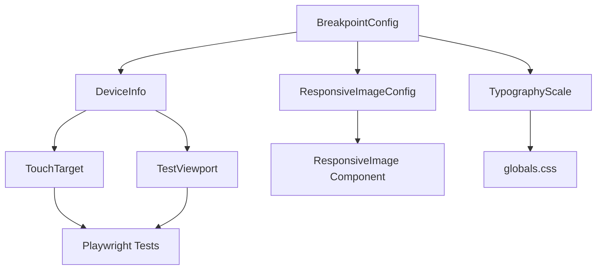

# Data Model: Mobile-First Design

**Feature**: PRP-017 Mobile-First Design Overhaul
**Date**: 2025-10-01

## Overview

This document defines the data entities, types, and structures for implementing mobile-first responsive design. Since this is primarily a CSS/layout feature, the "data model" focuses on configuration objects, breakpoint definitions, and device detection types rather than traditional database entities.

---

## 1. Breakpoint Configuration

### Entity: BreakpointConfig

**Description**: Defines responsive breakpoint boundaries and their associated device categories.

**TypeScript Definition**:

```typescript
export interface BreakpointConfig {
  /** Breakpoint name */
  name: 'xs' | 'sm' | 'md' | 'lg' | 'xl' | '2xl';

  /** Minimum width in pixels */
  minWidth: number;

  /** Maximum width in pixels (optional) */
  maxWidth?: number;

  /** Device category this breakpoint targets */
  category: DeviceCategory;

  /** Human-readable description */
  description: string;

  /** Example devices */
  examples: string[];
}

export type DeviceCategory = 'mobile' | 'tablet' | 'desktop';

export const BREAKPOINTS: Record<string, BreakpointConfig> = {
  xs: {
    name: 'xs',
    minWidth: 320,
    maxWidth: 427,
    category: 'mobile',
    description: 'Extra small phones',
    examples: ['iPhone SE', 'Small Android devices'],
  },
  sm: {
    name: 'sm',
    minWidth: 428,
    maxWidth: 767,
    category: 'mobile',
    description: 'Standard phones',
    examples: ['iPhone 14 Pro Max', 'Most Android phones'],
  },
  md: {
    name: 'md',
    minWidth: 768,
    maxWidth: 1023,
    category: 'tablet',
    description: 'Tablets',
    examples: ['iPad Mini', 'iPad portrait'],
  },
  lg: {
    name: 'lg',
    minWidth: 1024,
    maxWidth: 1279,
    category: 'desktop',
    description: 'Small desktop / iPad landscape',
    examples: ['iPad landscape', 'Small laptops'],
  },
  xl: {
    name: 'xl',
    minWidth: 1280,
    maxWidth: 1535,
    category: 'desktop',
    description: 'Desktop',
    examples: ['HD displays', 'Most laptops'],
  },
  '2xl': {
    name: '2xl',
    minWidth: 1536,
    category: 'desktop',
    description: 'Large desktop',
    examples: ['2K/4K displays', 'Large monitors'],
  },
};
```

**Validation Rules**:

- `minWidth` must be ≥ 320 (minimum supported width)
- `maxWidth` must be > `minWidth` if provided
- Breakpoints must not overlap (next `minWidth` = previous `maxWidth` + 1)
- `name` must match Tailwind CSS conventions

**Usage Context**:

- Tailwind configuration
- Media query generation
- Device type detection
- Test viewport selection

---

## 2. Device Detection

### Entity: DeviceInfo

**Description**: Runtime device detection information combining viewport dimensions, orientation, and touch capabilities.

**TypeScript Definition**:

```typescript
export interface DeviceInfo {
  /** Physical device type (not just viewport width) */
  type: DeviceType;

  /** Current device orientation */
  orientation: Orientation;

  /** Whether device supports touch */
  isTouchDevice: boolean;

  /** Current viewport width in pixels */
  viewportWidth: number;

  /** Current viewport height in pixels */
  viewportHeight: number;

  /** Maximum touch points supported */
  maxTouchPoints: number;

  /** Detection method used */
  detectionMethod: 'userAgent' | 'dimensions' | 'touchPoints' | 'hybrid';

  /** Timestamp of detection */
  detectedAt: number;
}

export type DeviceType = 'mobile' | 'tablet' | 'desktop';
export type Orientation = 'portrait' | 'landscape';
```

**State Transitions**:

```
Initial:
  SSR → { type: 'desktop', orientation: 'portrait' } (safe default)

Client Hydration:
  SSR → detectDevice() → { type: 'mobile', orientation: 'portrait' }

Orientation Change:
  { orientation: 'portrait' } → user rotates → { orientation: 'landscape' }
  Note: 'type' remains constant (mobile stays mobile in landscape)

Window Resize:
  Desktop only: { viewportWidth: 1920 } → resize → { viewportWidth: 1200 }
  Mobile/Tablet: Orientation change (not resize)
```

**Validation Rules**:

- `viewportWidth` must be ≥ 320 (minimum supported)
- `viewportHeight` must be > 0
- `maxTouchPoints` must be ≥ 0
- If `isTouchDevice` is true, `maxTouchPoints` must be > 0
- `detectedAt` must be valid Unix timestamp

**Usage Context**:

- React `useDeviceType` hook
- Conditional rendering based on device type
- Orientation-specific styling
- Analytics/debugging

---

## 3. Touch Target Specification

### Entity: TouchTarget

**Description**: Defines minimum touch target size requirements and validation.

**TypeScript Definition**:

```typescript
export interface TouchTarget {
  /** Unique identifier for this interactive element */
  id: string;

  /** Element type */
  elementType: InteractiveElementType;

  /** Minimum width in pixels */
  minWidth: number;

  /** Minimum height in pixels */
  minHeight: number;

  /** Minimum spacing from adjacent targets in pixels */
  minSpacing: number;

  /** WCAG compliance level */
  complianceLevel: 'AA' | 'AAA';

  /** Whether this target meets minimum requirements */
  isCompliant: boolean;

  /** Measured dimensions */
  measured?: {
    width: number;
    height: number;
    adjacentSpacing: number;
  };
}

export type InteractiveElementType =
  | 'button'
  | 'link'
  | 'input'
  | 'select'
  | 'checkbox'
  | 'radio'
  | 'toggle'
  | 'icon-button'
  | 'menu-item';

export const TOUCH_TARGET_STANDARDS = {
  AA: {
    minWidth: 24,
    minHeight: 24,
    minSpacing: 0,
    standard: 'WCAG 2.2 Level AA',
  },
  AAA: {
    minWidth: 44,
    minHeight: 44,
    minSpacing: 8,
    standard: 'WCAG 2.2 Level AAA / Apple HIG',
  },
} as const;
```

**Validation Rules**:

- `minWidth` must be ≥ 24 (WCAG AA minimum)
- `minHeight` must be ≥ 24 (WCAG AA minimum)
- For AAA: `minWidth` and `minHeight` must be ≥ 44
- `minSpacing` must be ≥ 8 for adjacent interactive elements
- `isCompliant` = true if measured dimensions meet standards

**Computed Properties**:

```typescript
function validateTouchTarget(target: TouchTarget): boolean {
  const standard = TOUCH_TARGET_STANDARDS[target.complianceLevel];

  if (!target.measured) return false;

  return (
    target.measured.width >= standard.minWidth &&
    target.measured.height >= standard.minHeight &&
    target.measured.adjacentSpacing >= standard.minSpacing
  );
}
```

**Usage Context**:

- Playwright test assertions
- Component accessibility tests
- Visual regression validation
- Developer guidelines

---

## 4. Responsive Image Configuration

### Entity: ResponsiveImageConfig

**Description**: Configuration for responsive image generation and serving.

**TypeScript Definition**:

```typescript
export interface ResponsiveImageConfig {
  /** Base image name (without extension or size suffix) */
  baseName: string;

  /** Directory path relative to /public */
  dir: string;

  /** Image category (determines available sizes and quality) */
  category: ImageCategory;

  /** Alt text for accessibility */
  alt: string;

  /** Available formats in preference order */
  formats: ImageFormat[];

  /** Available sizes (widths) in pixels */
  sizes: number[];

  /** Quality settings per format */
  quality: Record<ImageFormat, number>;

  /** Loading strategy */
  loading: 'lazy' | 'eager';

  /** Fetch priority for LCP images */
  fetchPriority?: 'high' | 'low' | 'auto';

  /** Generated srcset string */
  srcset?: string;

  /** Sizes attribute for responsive images */
  sizesAttr?: string;
}

export type ImageCategory = 'hero' | 'thumbnail' | 'og' | 'icon';
export type ImageFormat = 'avif' | 'webp' | 'png' | 'jpg';

export const IMAGE_OPTIMIZATION_CONFIG = {
  hero: {
    sizes: [428, 768, 1440],
    formats: ['avif', 'webp', 'png'],
    quality: { avif: 90, webp: 90, png: 95, jpg: 90 },
    sizesAttr: '100vw',
  },
  thumbnail: {
    sizes: [428, 768],
    formats: ['avif', 'webp', 'png'],
    quality: { avif: 80, webp: 80, png: 85, jpg: 85 },
    sizesAttr: '(max-width: 640px) 100vw, (max-width: 1024px) 50vw, 33vw',
  },
  og: {
    sizes: [1200],
    formats: ['png'],
    quality: { avif: 0, webp: 0, png: 90, jpg: 0 },
    sizesAttr: '1200px',
    fixedHeight: 630,
  },
  icon: {
    sizes: [32, 64, 128],
    formats: ['png'],
    quality: { avif: 0, webp: 0, png: 95, jpg: 0 },
    sizesAttr: '128px',
  },
} as const;
```

**Validation Rules**:

- `baseName` must not contain file extension
- `dir` must be valid path relative to /public
- `alt` must not be empty (WCAG requirement)
- `formats` must be ordered by preference (AVIF → WebP → PNG)
- `sizes` must be sorted ascending
- `quality` must be 0-100
- `loading="eager"` required if `fetchPriority="high"` (LCP images)

**File Naming Convention**:

```
{baseName}-{width}w.{format}

Examples:
- countdown-banner-428w.avif
- countdown-banner-768w.webp
- countdown-banner-1440w.png
- featured-og.png (special case for OG images)
```

**Usage Context**:

- ResponsiveImage component
- Image optimization script
- Build-time asset generation

---

## 5. Typography Scale

### Entity: TypographyScale

**Description**: Fluid typography scale configuration for mobile-first text sizing.

**TypeScript Definition**:

```typescript
export interface TypographyScale {
  /** Scale level name */
  name: TypographyLevel;

  /** Minimum size in rem */
  minSize: number;

  /** Preferred size (responsive, viewport-based) */
  preferredSize: string;

  /** Maximum size in rem */
  maxSize: number;

  /** CSS clamp() expression */
  clampExpression: string;

  /** Scale factor multiplier (for accessibility) */
  scaleFactor: number;

  /** Recommended line height */
  lineHeight: number;

  /** Use cases */
  useCases: string[];
}

export type TypographyLevel =
  | 'xs'
  | 'sm'
  | 'base'
  | 'lg'
  | 'xl'
  | '2xl'
  | '3xl'
  | '4xl'
  | '5xl'
  | '6xl'
  | '7xl'
  | '8xl'
  | '9xl';

export const TYPOGRAPHY_SCALE: Record<TypographyLevel, TypographyScale> = {
  xs: {
    name: 'xs',
    minSize: 0.625,
    preferredSize: '0.5rem + 0.5vw',
    maxSize: 0.75,
    clampExpression: 'clamp(0.625rem, 0.5rem + 0.5vw, 0.75rem)',
    scaleFactor: 1,
    lineHeight: 1.5,
    useCases: ['Captions', 'Fine print'],
  },
  sm: {
    name: 'sm',
    minSize: 0.75,
    preferredSize: '0.65rem + 0.5vw',
    maxSize: 0.875,
    clampExpression: 'clamp(0.75rem, 0.65rem + 0.5vw, 0.875rem)',
    scaleFactor: 1,
    lineHeight: 1.5,
    useCases: ['Small text', 'Metadata'],
  },
  base: {
    name: 'base',
    minSize: 0.875,
    preferredSize: '0.8rem + 0.5vw',
    maxSize: 1,
    clampExpression: 'clamp(0.875rem, 0.8rem + 0.5vw, 1rem)',
    scaleFactor: 1,
    lineHeight: 1.5,
    useCases: ['Body text', 'Paragraphs'],
  },
  lg: {
    name: 'lg',
    minSize: 1,
    preferredSize: '0.9rem + 0.5vw',
    maxSize: 1.125,
    clampExpression: 'clamp(1rem, 0.9rem + 0.5vw, 1.125rem)',
    scaleFactor: 1,
    lineHeight: 1.5,
    useCases: ['Lead text', 'Subtitles'],
  },
  '2xl': {
    name: '2xl',
    minSize: 1.25,
    preferredSize: '1.1rem + 0.75vw',
    maxSize: 1.5,
    clampExpression: 'clamp(1.25rem, 1.1rem + 0.75vw, 1.5rem)',
    scaleFactor: 1,
    lineHeight: 1.4,
    useCases: ['H4', 'Large body text'],
  },
  '3xl': {
    name: '3xl',
    minSize: 1.5,
    preferredSize: '1.2rem + 1.5vw',
    maxSize: 1.875,
    clampExpression: 'clamp(1.5rem, 1.2rem + 1.5vw, 1.875rem)',
    scaleFactor: 1,
    lineHeight: 1.3,
    useCases: ['H3', 'Section headings'],
  },
  '4xl': {
    name: '4xl',
    minSize: 1.75,
    preferredSize: '1.4rem + 1.75vw',
    maxSize: 2.25,
    clampExpression: 'clamp(1.75rem, 1.4rem + 1.75vw, 2.25rem)',
    scaleFactor: 1,
    lineHeight: 1.2,
    useCases: ['H2', 'Page headings'],
  },
  '5xl': {
    name: '5xl',
    minSize: 2,
    preferredSize: '1.5rem + 2.5vw',
    maxSize: 3,
    clampExpression: 'clamp(2rem, 1.5rem + 2.5vw, 3rem)',
    scaleFactor: 1,
    lineHeight: 1.2,
    useCases: ['H1', 'Hero headings'],
  },
  // ... (xl, 6xl-9xl follow same pattern)
};
```

**Validation Rules**:

- `minSize` must be ≥ 0.625rem (10px minimum)
- `maxSize` must be > `minSize`
- `preferredSize` must use rem + vw units
- `scaleFactor` must be ≥ 1
- `lineHeight` must be ≥ 1.2
- Base text (`name: 'base'`) must have `minSize` ≥ 0.875rem (14px) for mobile readability

**Font Size Capping** (from FR-005a):

```typescript
// On screens <375px, cap at 'large' (1.125rem)
const MAX_FONT_SIZE_SMALL_SCREENS = {
  maxLevel: 'lg',
  breakpoint: 375,
  reasoning: 'Prevents x-large selection from breaking narrow layouts',
};
```

**Usage Context**:

- `globals.css` CSS custom properties
- Typography component sizing
- Responsive text scaling
- Accessibility font size controls

---

## 6. Test Viewport Configuration

### Entity: TestViewport

**Description**: Defines test viewports for Playwright and visual regression testing.

**TypeScript Definition**:

```typescript
export interface TestViewport {
  /** Test configuration name */
  name: string;

  /** Device category this tests */
  category: DeviceCategory;

  /** Viewport width in pixels */
  width: number;

  /** Viewport height in pixels */
  height: number;

  /** Orientation */
  orientation: Orientation;

  /** Device pixel ratio */
  devicePixelRatio: number;

  /** Whether device has touch capability */
  hasTouch: boolean;

  /** Whether device is mobile */
  isMobile: boolean;

  /** Example real device this represents */
  exampleDevice: string;

  /** User agent string (optional) */
  userAgent?: string;
}

export const TEST_VIEWPORTS: TestViewport[] = [
  {
    name: 'iPhone SE',
    category: 'mobile',
    width: 375,
    height: 667,
    orientation: 'portrait',
    devicePixelRatio: 2,
    hasTouch: true,
    isMobile: true,
    exampleDevice: 'iPhone SE (2020), iPhone 8',
  },
  {
    name: 'iPhone 12',
    category: 'mobile',
    width: 390,
    height: 844,
    orientation: 'portrait',
    devicePixelRatio: 3,
    hasTouch: true,
    isMobile: true,
    exampleDevice: 'iPhone 12/13/14',
  },
  {
    name: 'iPhone 12 Landscape',
    category: 'mobile',
    width: 844,
    height: 390,
    orientation: 'landscape',
    devicePixelRatio: 3,
    hasTouch: true,
    isMobile: true,
    exampleDevice: 'iPhone 12/13/14 rotated',
  },
  {
    name: 'iPhone 14 Pro Max',
    category: 'mobile',
    width: 428,
    height: 926,
    orientation: 'portrait',
    devicePixelRatio: 3,
    hasTouch: true,
    isMobile: true,
    exampleDevice: 'iPhone 14 Pro Max',
  },
  {
    name: 'iPad Mini',
    category: 'tablet',
    width: 768,
    height: 1024,
    orientation: 'portrait',
    devicePixelRatio: 2,
    hasTouch: true,
    isMobile: false,
    exampleDevice: 'iPad Mini',
  },
  {
    name: 'iPad Mini Landscape',
    category: 'tablet',
    width: 1024,
    height: 768,
    orientation: 'landscape',
    devicePixelRatio: 2,
    hasTouch: true,
    isMobile: false,
    exampleDevice: 'iPad Mini rotated',
  },
  {
    name: 'Extreme Narrow (320px)',
    category: 'mobile',
    width: 320,
    height: 568,
    orientation: 'portrait',
    devicePixelRatio: 2,
    hasTouch: true,
    isMobile: true,
    exampleDevice: 'Minimum supported width',
  },
];
```

**Validation Rules**:

- `width` must be ≥ 320 (minimum supported)
- `height` must be > 0
- `devicePixelRatio` must be ≥ 1 (typically 1, 2, or 3)
- If `orientation` is 'landscape', `width` > `height`
- If `orientation` is 'portrait', `width` < `height`
- Mobile devices must have `hasTouch: true` and `isMobile: true`

**Usage Context**:

- Playwright test configuration
- Visual regression test matrix
- Device emulation in tests
- CI/CD test runs

---

## Relationships



**Key Relationships**:

1. **BreakpointConfig → DeviceInfo**: Breakpoints determine which device type is detected
2. **DeviceInfo → TouchTarget**: Device type affects touch target validation (mobile requires stricter)
3. **BreakpointConfig → ResponsiveImageConfig**: Image sizes align with breakpoint widths
4. **BreakpointConfig → TypographyScale**: Text sizes scale based on breakpoint ranges
5. **DeviceInfo → TestViewport**: Test viewports simulate real device detection
6. **TestViewport → Playwright Tests**: Tests iterate through all test viewports

---

## Configuration Files

### Tailwind Config (`tailwind.config.ts`)

```typescript
import type { Config } from 'tailwindcss';
import { BREAKPOINTS } from './src/config/breakpoints';

const config: Config = {
  theme: {
    screens: Object.entries(BREAKPOINTS).reduce(
      (acc, [key, value]) => {
        acc[key] = `${value.minWidth}px`;
        return acc;
      },
      {} as Record<string, string>
    ),
  },
};
```

### Playwright Config (`playwright.config.ts`)

```typescript
import { defineConfig, devices } from '@playwright/test';
import { TEST_VIEWPORTS } from './src/config/test-viewports';

export default defineConfig({
  projects: TEST_VIEWPORTS.map((viewport) => ({
    name: viewport.name,
    use: {
      viewport: { width: viewport.width, height: viewport.height },
      deviceScaleFactor: viewport.devicePixelRatio,
      hasTouch: viewport.hasTouch,
      isMobile: viewport.isMobile,
    },
  })),
});
```

---

## Summary

This data model provides:

- Type-safe configuration for breakpoints, devices, and touch targets
- Consistent validation rules across all entities
- Clear relationships between configuration objects
- Integration points with Tailwind, Playwright, and React components
- Foundation for automated testing and quality gates

All entities are immutable configuration objects (no database persistence required) used at build time and runtime for responsive behavior.
