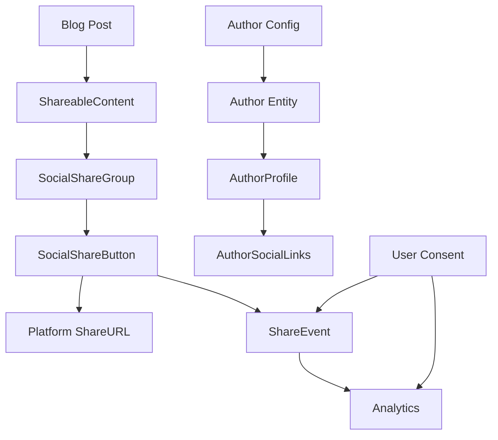

# Data Model: Blog Social Media Features

## Core Entities

### Author

Represents content creators with social media presence.

```typescript
interface Author {
  id: string; // Unique identifier (slug-friendly)
  name: string; // Display name
  role: string; // Professional role/title
  bio: string; // Short biography (max 500 chars)
  avatar?: string; // Path to avatar image
  social: AuthorSocialLinks; // Social media profiles
  preferences: AuthorPreferences; // Display preferences
}

interface AuthorSocialLinks {
  github?: string; // GitHub profile URL
  twitter?: string; // Twitter/X profile URL
  linkedin?: string; // LinkedIn profile URL
  website?: string; // Personal website URL
  email?: string; // Contact email
  mastodon?: string; // Mastodon handle (future)
  bluesky?: string; // Bluesky handle (future)
}

interface AuthorPreferences {
  showSocialLinks: boolean; // Toggle social links visibility
  showEmail: boolean; // Toggle email visibility
  showBio: boolean; // Toggle bio visibility
}
```

**Validation Rules**:

- `id`: Required, alphanumeric with hyphens only
- `name`: Required, 2-100 characters
- `role`: Required, 2-100 characters
- `bio`: Optional, max 500 characters
- `social` URLs: Must be valid URLs when provided
- `email`: Must be valid email format when provided

### SocialPlatform

Configuration for supported sharing platforms.

```typescript
interface SocialPlatform {
  id: string; // Platform identifier
  name: string; // Display name
  icon: string; // SVG icon path or inline SVG
  color: string; // Brand color (hex)
  shareUrl: string; // URL template for sharing
  ariaLabel: string; // Accessibility label
  enabled: boolean; // Platform availability
}

const PLATFORMS: Record<string, SocialPlatform> = {
  twitter: {
    id: 'twitter',
    name: 'Twitter/X',
    icon: 'twitter-icon-svg',
    color: '#1DA1F2',
    shareUrl:
      'https://twitter.com/intent/tweet?url={url}&text={title}&hashtags={tags}',
    ariaLabel: 'Share on Twitter',
    enabled: true,
  },
  linkedin: {
    id: 'linkedin',
    name: 'LinkedIn',
    icon: 'linkedin-icon-svg',
    color: '#0A66C2',
    shareUrl:
      'https://www.linkedin.com/sharing/share-offsite/?url={url}&title={title}&summary={description}',
    ariaLabel: 'Share on LinkedIn',
    enabled: true,
  },
  facebook: {
    id: 'facebook',
    name: 'Facebook',
    icon: 'facebook-icon-svg',
    color: '#1877F2',
    shareUrl: 'https://www.facebook.com/sharer/sharer.php?u={url}',
    ariaLabel: 'Share on Facebook',
    enabled: true,
  },
  reddit: {
    id: 'reddit',
    name: 'Reddit',
    icon: 'reddit-icon-svg',
    color: '#FF4500',
    shareUrl: 'https://reddit.com/submit?url={url}&title={title}',
    ariaLabel: 'Share on Reddit',
    enabled: true,
  },
  email: {
    id: 'email',
    name: 'Email',
    icon: 'email-icon-svg',
    color: '#757575',
    shareUrl: 'mailto:?subject={title}&body={description}%0A%0A{url}',
    ariaLabel: 'Share via Email',
    enabled: true,
  },
};
```

### ShareableContent

Content that can be shared on social media.

```typescript
interface ShareableContent {
  url: string; // Full URL to content
  title: string; // Content title
  description?: string; // Brief description
  image?: string; // OG image URL
  tags?: string[]; // Hashtags/keywords
  author?: string; // Author ID reference
}
```

### ShareEvent

Analytics tracking for share interactions.

```typescript
interface ShareEvent {
  id: string; // Event ID (UUID)
  platform: string; // Platform ID
  contentUrl: string; // Shared content URL
  contentType: string; // 'blog-post' | 'page' | 'component'
  timestamp: Date; // When shared
  sessionId?: string; // Anonymous session ID
  consentGiven: boolean; // GDPR consent status
}
```

**Validation Rules**:

- `consentGiven` must be `true` for event to be recorded
- `sessionId` must be anonymized (no PII)
- Events older than 90 days are auto-deleted

### SocialShareConfig

Global configuration for social sharing features.

```typescript
interface SocialShareConfig {
  enabledPlatforms: string[]; // Active platform IDs
  defaultHashtags: string[]; // Default tags for sharing
  siteTwitterHandle?: string; // Site's Twitter account
  analyticsEnabled: boolean; // Track share events
  showShareCounts: boolean; // Display share counts
  openInNewTab: boolean; // Link behavior
  mobileNativeShare: boolean; // Use Web Share API on mobile
}
```

## State Management

### ShareState

Runtime state for sharing functionality.

```typescript
interface ShareState {
  isSharing: boolean; // Share in progress
  lastShared?: ShareEvent; // Last share event
  clipboardCopied: boolean; // URL copied to clipboard
  error?: string; // Last error message
}
```

### AuthorState

Runtime state for author features.

```typescript
interface AuthorState {
  currentAuthor?: Author; // Active author profile
  authors: Map<string, Author>; // Cached author data
  loading: boolean; // Loading state
  error?: string; // Error message
}
```

## Component Props Interfaces

### SocialShareButtonProps

```typescript
interface SocialShareButtonProps {
  platform: SocialPlatform;
  content: ShareableContent;
  variant?: 'icon' | 'text' | 'both';
  size?: 'sm' | 'md' | 'lg';
  className?: string;
  onClick?: (event: ShareEvent) => void;
}
```

### AuthorProfileProps

```typescript
interface AuthorProfileProps {
  authorId: string;
  variant?: 'compact' | 'full' | 'minimal';
  showAvatar?: boolean;
  showSocial?: boolean;
  showBio?: boolean;
  className?: string;
}
```

### SocialShareGroupProps

```typescript
interface SocialShareGroupProps {
  content: ShareableContent;
  platforms?: string[]; // Platform IDs to show
  layout?: 'horizontal' | 'vertical' | 'grid';
  showCopyLink?: boolean;
  className?: string;
  onShare?: (event: ShareEvent) => void;
}
```

## Data Flow



## Storage

### localStorage Schema

```typescript
interface LocalStorageSchema {
  'blog-share-preferences': {
    consentGiven: boolean;
    timestamp: string;
  };
  'blog-share-analytics': ShareEvent[];
  'blog-author-preferences': {
    [authorId: string]: AuthorPreferences;
  };
}
```

## Migration Strategy

No database migrations required as this is a static configuration system. Author data will be stored in:

- `/src/config/authors.ts` - Author definitions
- `/src/config/social.ts` - Platform configuration

## Relationships

- **Author** ← has many → **BlogPost** (existing)
- **BlogPost** → generates → **ShareableContent**
- **ShareableContent** → uses → **SocialPlatform**
- **User interaction** → creates → **ShareEvent**
- **ShareEvent** → requires → **Consent**

## Constraints

1. All social URLs must be HTTPS
2. Author IDs must be unique across the system
3. Platform IDs must match configuration keys
4. Share events require explicit user consent
5. Email addresses are never exposed in client-side code
6. Avatar images must be optimized (< 100KB)
7. Bio text must be plain text (no HTML/markdown)
