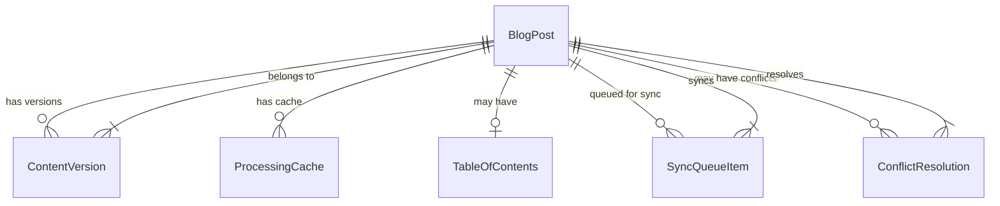

# Data Model: Unified Blog Content Pipeline

## Core Entities

### BlogPost

Primary entity representing a blog article with unified metadata for both file system and IndexedDB storage.

```typescript
interface BlogPost {
  // Identity
  id: string; // UUID for IndexedDB, derived from slug
  slug: string; // URL-safe identifier from filename

  // Content
  title: string;
  content: string; // Raw markdown content
  processedContent?: string; // Cached HTML output
  excerpt: string; // First 160 chars or custom

  // Metadata
  author: string;
  status: 'draft' | 'published' | 'scheduled';
  publishDate?: Date;
  scheduledDate?: Date;

  // Categorization
  categories: string[];
  tags: string[];
  featured: boolean;

  // Metrics
  viewCount: number;
  readTime: number; // Minutes, calculated from word count

  // System
  createdAt: Date;
  updatedAt: Date;
  version: number; // For conflict detection
  hash: string; // MD5 of content for change detection

  // Storage
  originalSize: number; // Bytes before compression
  compressedSize: number; // Bytes after compression
  lastAccessed: Date; // For cleanup decisions

  // Display
  ogImage?: string; // Open Graph image
  showToc: boolean; // Table of contents flag
}
```

### PostMetadata

Frontmatter schema for validation with Zod.

```typescript
interface PostMetadata {
  title: string;
  author: string;
  publishDate?: string; // ISO date string
  status?: 'draft' | 'published' | 'scheduled';
  categories?: string[];
  tags?: string[];
  excerpt?: string;
  featured?: boolean;
  showToc?: boolean;
  ogImage?: string;
}
```

### SyncQueueItem

Tracks pending synchronization operations between systems.

```typescript
interface SyncQueueItem {
  id: string; // Queue item ID
  operation: 'create' | 'update' | 'delete';
  source: 'filesystem' | 'indexeddb';
  target: 'filesystem' | 'indexeddb';
  postId: string;
  postSlug: string;
  timestamp: Date;
  attempts: number;
  lastAttempt?: Date;
  error?: string;
  version: number; // Version at queue time
  content?: string; // Snapshot for conflict resolution
}
```

### ContentVersion

Represents a specific version for conflict tracking.

```typescript
interface ContentVersion {
  id: string;
  postId: string;
  version: number;
  hash: string; // Content hash
  timestamp: Date;
  source: 'filesystem' | 'indexeddb' | 'user';
  content: string; // Full content snapshot
  metadata: PostMetadata;
}
```

### ProcessingCache

Cached processed content for performance.

```typescript
interface ProcessingCache {
  postId: string;
  slug: string;
  hash: string; // Source content hash
  processedContent: string; // HTML output
  toc?: TableOfContents; // Generated TOC if applicable
  createdAt: Date;
  expiresAt: Date; // TTL for cache invalidation
}
```

### TableOfContents

Structure for generated table of contents.

```typescript
interface TableOfContents {
  items: TocItem[];
}

interface TocItem {
  id: string; // Heading anchor ID
  text: string; // Heading text
  level: number; // H1=1, H2=2, etc.
  children: TocItem[]; // Nested headings
}
```

### ConflictResolution

Tracks conflicts requiring user intervention.

```typescript
interface ConflictResolution {
  id: string;
  postId: string;
  detectedAt: Date;
  localVersion: ContentVersion;
  remoteVersion: ContentVersion;
  baseVersion?: ContentVersion; // Common ancestor if available
  resolution?: 'local' | 'remote' | 'merged';
  mergedContent?: string;
  resolvedAt?: Date;
  resolvedBy?: string;
}
```

### StorageQuota

Tracks storage usage and limits.

```typescript
interface StorageQuota {
  used: number; // Bytes used
  available: number; // Bytes available
  quota: number; // Total quota
  textUsed: number; // Text content bytes
  imagesUsed: number; // Image bytes
  cacheUsed: number; // Cache bytes
  lastUpdated: Date;
  warnings: QuotaWarning[];
}

interface QuotaWarning {
  level: 'info' | 'warning' | 'critical';
  message: string;
  timestamp: Date;
  percentage: number; // Usage percentage
}
```

## Relationships



## Validation Schemas (Zod)

```typescript
import { z } from 'zod';

export const PostMetadataSchema = z.object({
  title: z.string().min(1).max(200),
  author: z.string().min(1).max(100),
  publishDate: z.string().datetime().optional(),
  status: z.enum(['draft', 'published', 'scheduled']).default('draft'),
  categories: z.array(z.string()).default([]),
  tags: z.array(z.string()).default([]),
  excerpt: z.string().max(500).optional(),
  featured: z.boolean().default(false),
  showToc: z.boolean().default(false),
  ogImage: z.string().url().optional(),
});

export const BlogPostSchema = PostMetadataSchema.extend({
  id: z.string().uuid(),
  slug: z.string().regex(/^[a-z0-9-]+$/),
  content: z.string().min(1),
  processedContent: z.string().optional(),
  version: z.number().int().positive(),
  hash: z.string().length(32),
  createdAt: z.date(),
  updatedAt: z.date(),
  lastAccessed: z.date(),
  originalSize: z.number().positive(),
  compressedSize: z.number().positive(),
  viewCount: z.number().int().nonnegative(),
  readTime: z.number().int().positive(),
});
```

## State Transitions

### Post Status Flow

```
draft → published
draft → scheduled → published
published → draft (unpublish)
scheduled → draft (cancel)
```

### Sync State Flow

```
idle → queued → syncing → completed
         ↓         ↓
      failed ← retrying
```

### Conflict Resolution Flow

```
detected → pending → resolving → resolved
                ↓
            abandoned (timeout)
```

## Data Constraints

1. **Uniqueness**: Slug must be unique across all posts
2. **Versioning**: Version increments on every update
3. **Size Limits**:
   - Post content: Max 500KB uncompressed
   - Total storage: 5MB text (compressed)
   - Cache: Max 10MB
4. **Retention**:
   - Active posts: No limit
   - Inactive posts: 90 days since last access
   - Cache: 24 hours TTL
5. **Sync Queue**:
   - Max 100 items
   - Max 3 retry attempts
   - Exponential backoff: 1s, 5s, 30s
